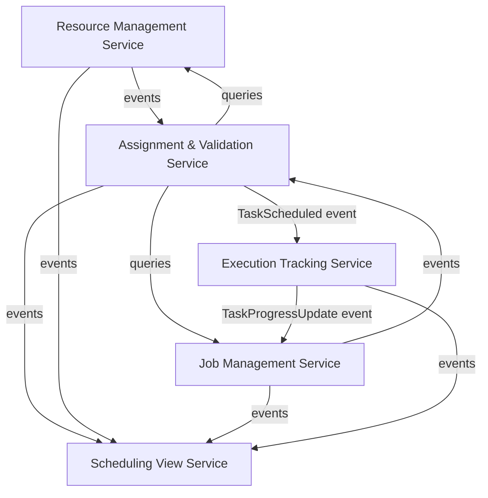
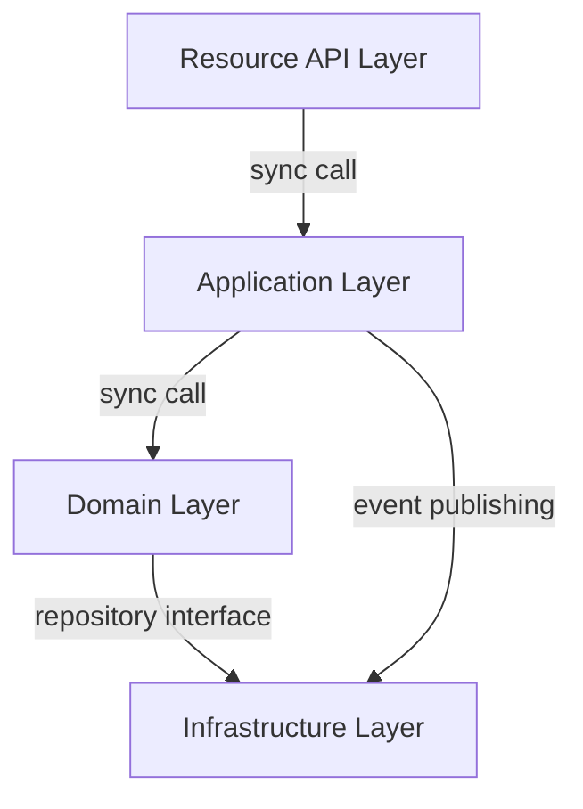
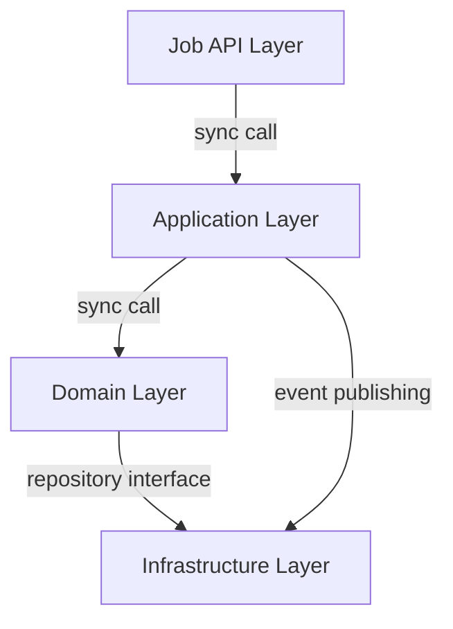
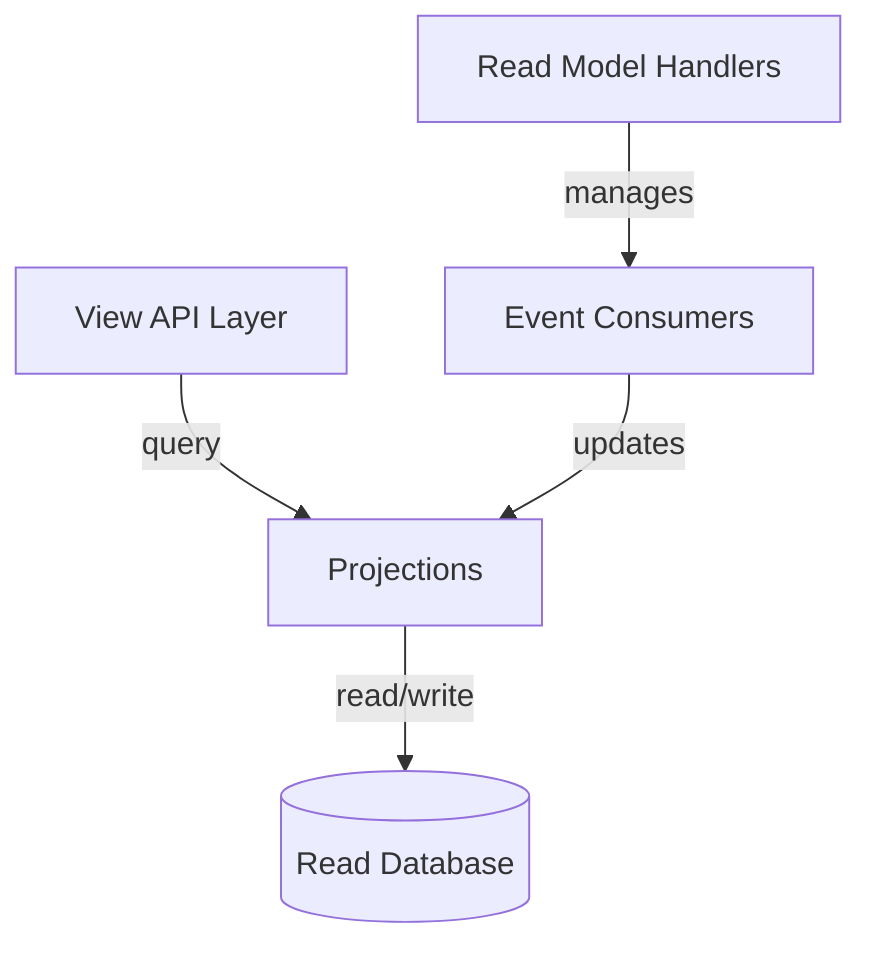
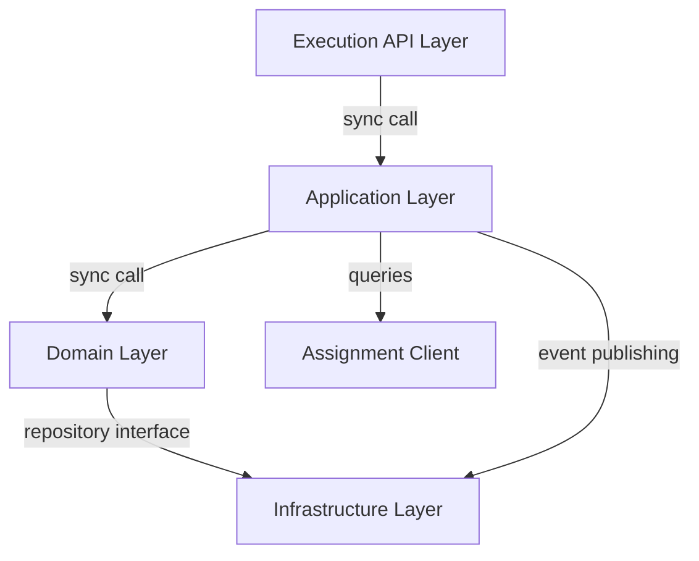
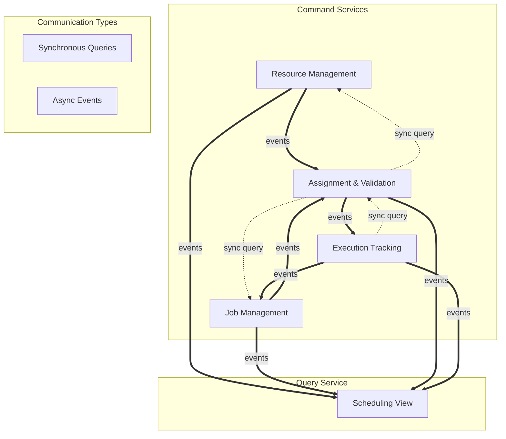
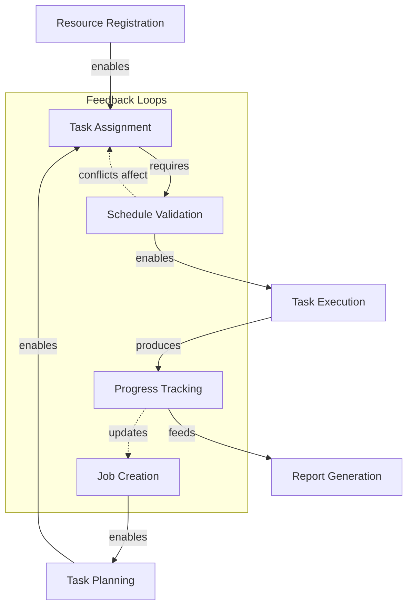
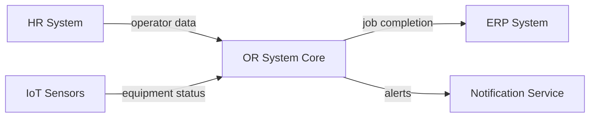
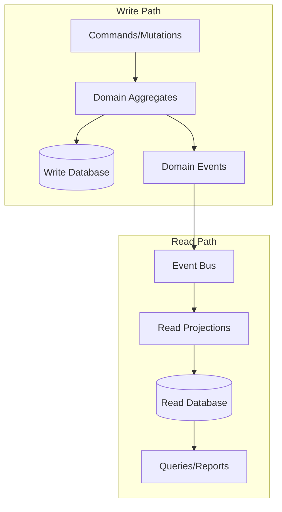
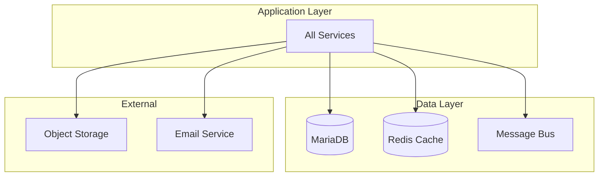

---
tags:
  - specification
  - architecture
---

# Dependency Graphs — Operations Research System

This document illustrates how to document service‑ and module‑level dependencies in a format that is stable, AI‑friendly, and consistent with the Dependency Graph Guidelines.

It shows:
- all components involved,
- the types and directions of dependencies,
- how services collaborate through synchronous calls and integration events.

## Components

- **Resource Management Service** — manages operators, equipment, skills, and availability
- **Job Management Service** — manages jobs, tasks, and dependencies
- **Assignment & Validation Service** — performs scheduling, validation, and conflict detection
- **Scheduling View Service** — provides read-optimized views and reports
- **Execution Tracking Service** — tracks actual task execution and variances

Internal modules (API, Application Layer, Domain, Infrastructure) are shown inside each service.

---

## 1. Service-Level Dependency Graph

### Mermaid Diagram (Service-Level)



### Textual Representation

```
[Assignment & Validation Service] --(synchronous query)--> [Resource Management Service]
[Assignment & Validation Service] --(synchronous query)--> [Job Management Service]

[Resource Management Service] --(publishes event: ResourceManagement.OperatorAvailabilityChanged)--> [Assignment & Validation Service]
[Resource Management Service] --(publishes event: ResourceManagement.EquipmentStatusChanged)--> [Assignment & Validation Service]

[Job Management Service] --(publishes event: JobManagement.TaskStructureChanged)--> [Assignment & Validation Service]

[Assignment & Validation Service] --(publishes event: Assignment.TaskScheduled)--> [Execution Tracking Service]
[Assignment & Validation Service] --(publishes event: Assignment.ConflictDetected)--> [Scheduling View Service]

[Execution Tracking Service] --(publishes event: Execution.TaskProgressUpdate)--> [Job Management Service]

[All Services] --(publish domain events)--> [Scheduling View Service]
```

**Interpretation:**
- Assignment Service has **synchronous read dependencies** on Resource and Job services
- All other communication is through **asynchronous events**
- Scheduling View Service consumes events from all services (CQRS read model)
- No circular dependencies exist
- Clear separation between command and query paths

---

## 2. Module-Level Dependencies Inside Each Service

### 2.1 Resource Management Service

#### Mermaid Diagram (Resource Management Modules)



```
Resource API Layer (REST Controllers)
   ↓ sync call
Application Layer (RegisterOperatorHandler, UpdateAvailabilityHandler)
   ↓ sync call
Domain Layer (Operator Aggregate, Equipment Aggregate, OperatorSkill VO)
   ↓ repository interface
Infrastructure Layer (OperatorRepositoryImpl, EquipmentRepositoryImpl, EventPublisher)
```

Dependency types:
- API → Application: command/query handling
- Application → Domain: business logic execution
- Domain → Infrastructure: persistence abstraction
- Application → Infrastructure: event publishing

---

### 2.2 Job Management Service

#### Mermaid Diagram (Job Management Modules)



```
Job API Layer (REST Controllers)
   ↓ sync call
Application Layer (CreateJobHandler, AddTaskHandler, SetDependencyHandler)
   ↓ sync call
Domain Layer (Job Aggregate, Task Entity, TaskDependency VO, Critical Path Calculator)
   ↓ repository interface
Infrastructure Layer (JobRepositoryImpl, EventPublisher)
```

---

### 2.3 Assignment & Validation Service

#### Mermaid Diagram (Assignment & Validation Modules)


```
Assignment API Layer (REST Controllers)
   ↓ sync call
Application Layer (AssignResourcesHandler, ValidateScheduleHandler, SchedulingService)
   ↓ sync call                          ↓ queries
Domain Layer (Schedule Aggregate,        External Service Clients
ValidatedAssignment VO,                  (ResourceClient, JobClient)
ScheduleConflict VO)
   ↓ repository interface
Infrastructure Layer (ScheduleRepositoryImpl, EventPublisher)
```

This service has additional external dependencies for querying other services.

---

### 2.4 Scheduling View Service

#### Mermaid Diagram (Scheduling View Modules)



```
View API Layer (REST Controllers for Reports)
   ↓ query
Projections (GanttView, CalendarView, UtilizationReport)
   ↑ updates
Event Consumers (listening to all domain events)
   ↓ read/write
Read Database (Optimized for queries)
```

This is a pure read model with no domain logic, only projections.

---

### 2.5 Execution Tracking Service

#### Mermaid Diagram (Execution Tracking Modules)



---

## 3. Cross-Service Dependency Rules

### Mermaid Diagram (Cross-Service Communication Patterns)



Constraints:
- **No reverse dependencies** (e.g., Resource Service cannot query Assignment Service)
- **No circular dependencies** between services
- **No cross-service database access** - each service owns its data
- **Synchronous calls only for queries**, never for state changes
- **All state changes through events** to maintain consistency
- **View Service is event-only** - no synchronous dependencies

---

## 4. Business Capability Dependency Graph

### Mermaid Diagram (Business Capability Flow)



### Textual Business Flow

```
Resource Registration (Operators & Equipment)
   ↓ enables
Job Creation (with deadline)
   ↓ enables
Task Planning (dependencies, durations)
   ↓ enables
Task Assignment (operator + equipment + timing)
   ↓ requires
Schedule Validation (conflict detection)
   ↓ enables
Task Execution (actual work)
   ↓ produces
Progress Tracking (variances, quality)
   ↓ feeds
Report Generation (Gantt, utilization)
```

This describes the **business flow**, independent of technical services.

---

## 5. External System Dependencies

### Mermaid Diagram (External Integrations)



External Dependencies:
- **HR System** → Resource Management (operator master data)
- **IoT Sensors** → Resource Management (equipment status updates)
- **ERP System** ← Job Management (job completion notifications)
- **Email/SMS** ← All Services (notifications and alerts)

---

## 6. Data Flow Dependencies

### Mermaid Diagram (Data Flow)



This shows the CQRS separation and event-driven synchronization.

---

## 7. Deployment Dependencies

### Mermaid Diagram (Infrastructure Dependencies)



Infrastructure dependencies that affect deployment and operations.

---

## Notes

- These diagrams reflect **intended architecture**, not accidental code dependencies
- All arrows are directional and represent explicit, allowed dependencies
- The Assignment & Validation Service is the central orchestrator but depends on others for data
- The Scheduling View Service has no outbound dependencies (pure read model)
- External systems are integrated through well-defined interfaces
- The architecture supports both monolithic and microservice deployment
