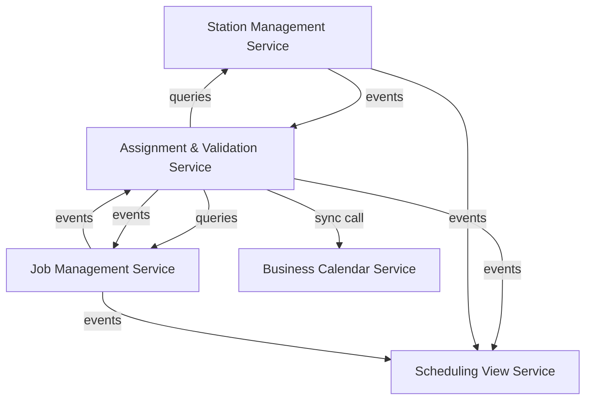
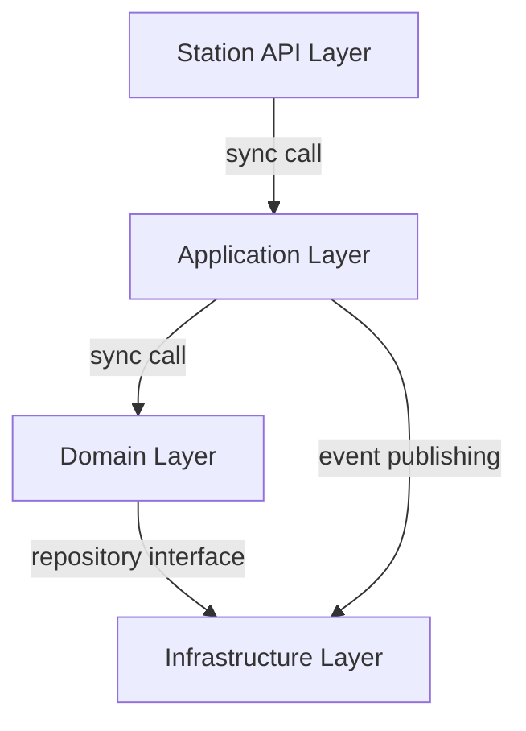
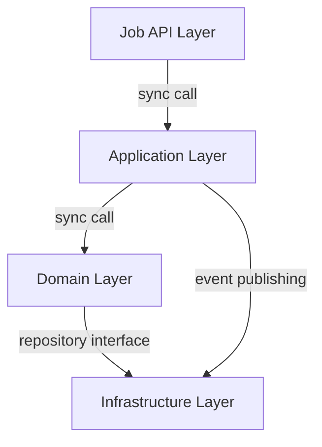
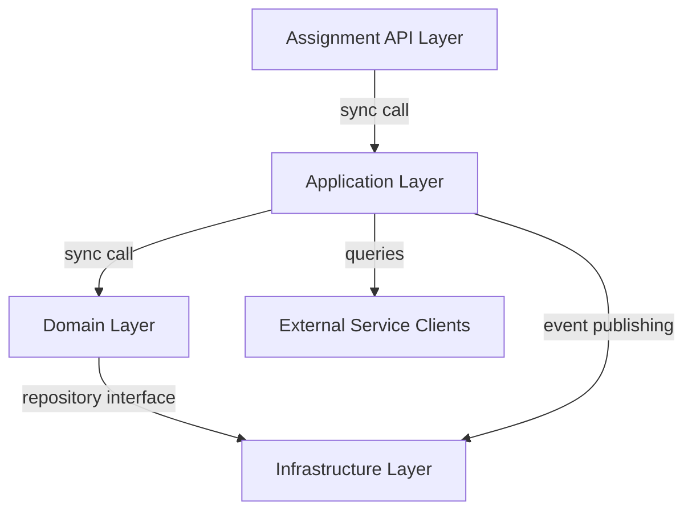
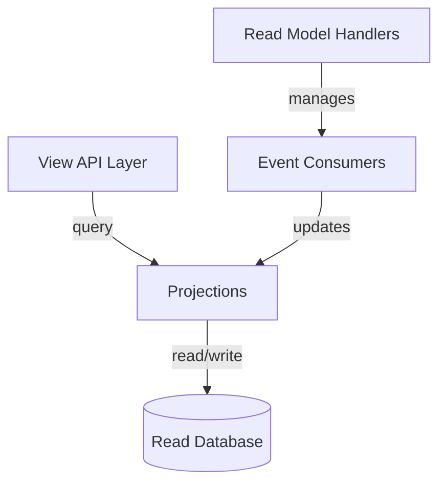
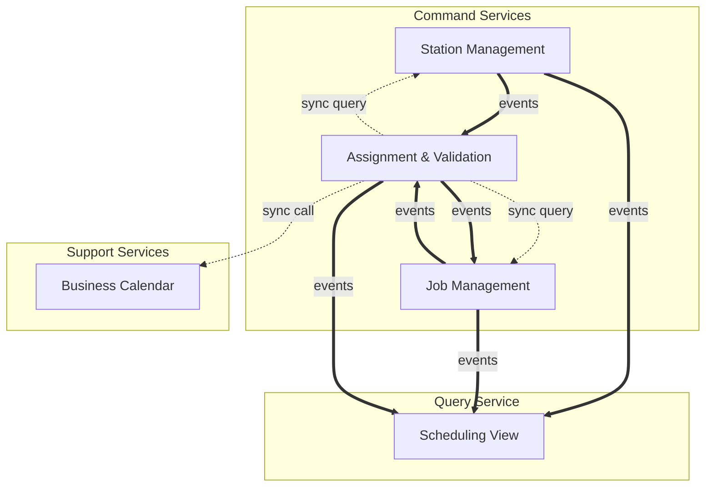
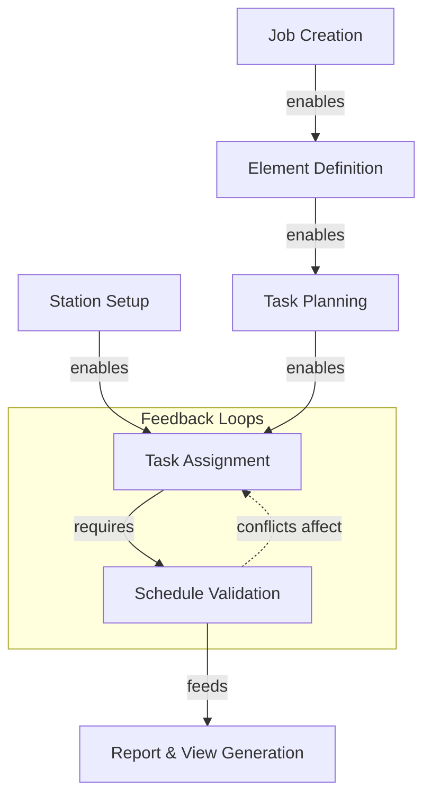
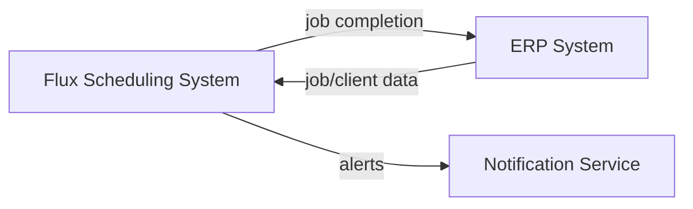
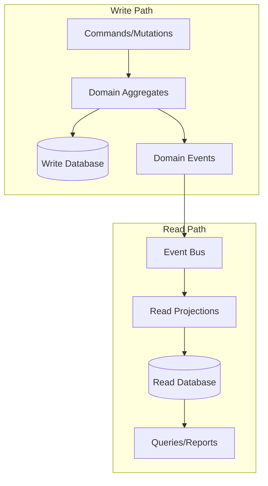
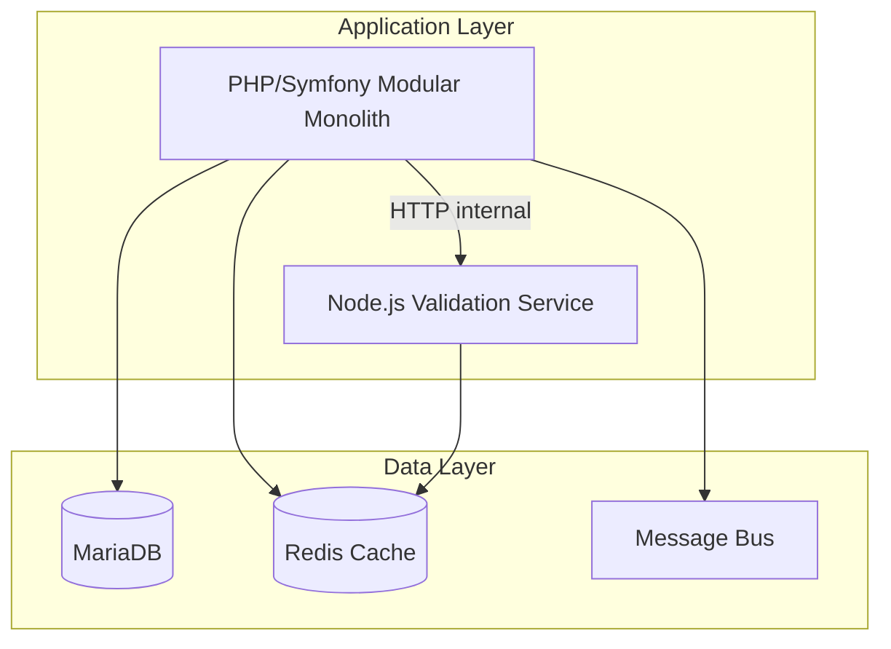

---
tags:
  - specification
  - architecture
---

# Dependency Graphs — Flux Print Shop Scheduling System

This document illustrates service‑ and module‑level dependencies in a format that is stable, AI‑friendly, and consistent with the Dependency Graph Guidelines.

It shows:
- all components involved,
- the types and directions of dependencies,
- how services collaborate through synchronous calls and integration events.

## Components

- **Station Management Service** — manages stations, station categories, station groups, outsourced providers, and operating schedules
- **Job Management Service** — manages jobs, elements, tasks, approval gates, and comments
- **Assignment & Validation Service** — performs scheduling, validation (element-scoped and cross-element precedence), and conflict detection
- **Scheduling View Service** — provides read-optimized views, snapshots, similarity indicators, and reports
- **Business Calendar Service** — calculates open days (business days) for outsourced task durations

Internal modules (API, Application Layer, Domain, Infrastructure) are shown inside each service.

> **Note:** Execution Tracking Service is planned for post-MVP and is not included in current dependency graphs.

---

## 1. Service-Level Dependency Graph

### Mermaid Diagram (Service-Level)


```mermaid
flowchart TD
    Station[Station Management Service]
    Job[Job Management Service]
    Assignment[Assignment & Validation Service]
    View[Scheduling View Service]
    Calendar[Business Calendar Service]

    Assignment -->|queries| Station
    Assignment -->|queries| Job
    Assignment -->|sync call| Calendar
    Assignment -->|events| View
    Station -->|events| Assignment
    Station -->|events| View
    Job -->|events| Assignment
    Job -->|events| View
    Assignment -->|events| Job
```

### Textual Representation

```
[Assignment & Validation Service] --(synchronous query)--> [Station Management Service]
[Assignment & Validation Service] --(synchronous query)--> [Job Management Service]
[Assignment & Validation Service] --(synchronous call)--> [Business Calendar Service]

[Station Management Service] --(publishes event: StationManagement.StationScheduleUpdated)--> [Assignment & Validation Service]
[Station Management Service] --(publishes event: StationManagement.StationExceptionAdded)--> [Assignment & Validation Service]
[Station Management Service] --(publishes event: StationManagement.StationStatusChanged)--> [Assignment & Validation Service]

[Job Management Service] --(publishes event: JobManagement.TaskStructureChanged)--> [Assignment & Validation Service]
[Job Management Service] --(publishes event: JobManagement.ElementCreated)--> [Assignment & Validation Service]
[Job Management Service] --(publishes event: JobManagement.ElementDependencyAdded)--> [Assignment & Validation Service]
[Job Management Service] --(publishes event: JobManagement.ApprovalGateChanged)--> [Assignment & Validation Service]

[Assignment & Validation Service] --(publishes event: Assignment.TaskAssigned)--> [Job Management Service]
[Assignment & Validation Service] --(publishes event: Assignment.ConflictDetected)--> [Scheduling View Service]
[Assignment & Validation Service] --(publishes event: Assignment.ScheduleSnapshotUpdated)--> [Scheduling View Service]

[All Services] --(publish domain events)--> [Scheduling View Service]
```

**Interpretation:**
- Assignment Service has **synchronous read dependencies** on Station and Job services
- Assignment Service uses Business Calendar for open day calculations (outsourced tasks)
- All other communication is through **asynchronous events**
- Scheduling View Service consumes events from all services (CQRS read model)
- No circular dependencies exist
- Clear separation between command and query paths

---

## 2. Module-Level Dependencies Inside Each Service

### 2.1 Station Management Service

#### Mermaid Diagram (Station Management Modules)


```mermaid
flowchart TD
    API[Station API Layer]
    App[Application Layer]
    Domain[Domain Layer]
    Infra[Infrastructure Layer]

    API -->|sync call| App
    App -->|sync call| Domain
    Domain -->|repository interface| Infra
    App -->|event publishing| Infra
```

```
Station API Layer (REST Controllers)
   ↓ sync call
Application Layer (RegisterStationHandler, UpdateScheduleHandler, RegisterProviderHandler)
   ↓ sync call
Domain Layer (Station Aggregate, StationCategory Aggregate, StationGroup Aggregate, OutsourcedProvider Aggregate)
   ↓ repository interface
Infrastructure Layer (StationRepositoryImpl, StationCategoryRepositoryImpl, StationGroupRepositoryImpl, OutsourcedProviderRepositoryImpl, EventPublisher)
```

Dependency types:
- API → Application: command/query handling
- Application → Domain: business logic execution
- Domain → Infrastructure: persistence abstraction
- Application → Infrastructure: event publishing

---

### 2.2 Job Management Service

#### Mermaid Diagram (Job Management Modules)


```mermaid
flowchart TD
    API[Job API Layer]
    App[Application Layer]
    Domain[Domain Layer]
    Infra[Infrastructure Layer]

    API -->|sync call| App
    App -->|sync call| Domain
    Domain -->|repository interface| Infra
    App -->|event publishing| Infra
```

```
Job API Layer (REST Controllers)
   ↓ sync call
Application Layer (CreateJobHandler, CreateElementHandler, AddTaskHandler, AddElementDependencyHandler)
   ↓ sync call
Domain Layer (Job Aggregate, Element Entity, Task Entity)
   ↓ repository interface
Infrastructure Layer (JobRepositoryImpl, EventPublisher)
```

---

### 2.3 Assignment & Validation Service

#### Mermaid Diagram (Assignment & Validation Modules)


```mermaid
flowchart TD
    API[Assignment API Layer]
    App[Application Layer]
    Domain[Domain Layer]
    Infra[Infrastructure Layer]
    External[External Service Clients]

    API -->|sync call| App
    App -->|sync call| Domain
    Domain -->|repository interface| Infra
    App -->|event publishing| Infra
    App -->|queries| External
```

```
Assignment API Layer (REST Controllers)
   ↓ sync call
Application Layer (AssignTaskHandler, ValidateScheduleHandler, SchedulingService)
   ↓ sync call                          ↓ queries
Domain Layer (Schedule Aggregate,        External Service Clients
TaskAssignment VO,                       (StationClient, JobClient,
ScheduleConflict VO,                      BusinessCalendarClient)
Element-scoped & cross-element
precedence validation)
   ↓ repository interface
Infrastructure Layer (ScheduleRepositoryImpl, EventPublisher)
```

This service has additional external dependencies for querying other services.

---

### 2.4 Scheduling View Service

#### Mermaid Diagram (Scheduling View Modules)


```mermaid
flowchart TD
    API[View API Layer]
    App[Read Model Handlers]
    Projections[Projections]
    EventConsumer[Event Consumers]
    ReadDB[(Read Database)]

    API -->|query| Projections
    EventConsumer -->|updates| Projections
    Projections -->|read/write| ReadDB
    App -->|manages| EventConsumer
```

```
View API Layer (REST Controllers for Reports)
   ↓ query
Projections (ScheduleSnapshot, TileView, SimilarityIndicator, LateJobReport)
   ↑ updates
Event Consumers (listening to all domain events)
   ↓ read/write
Read Database (Optimized for queries)
```

This is a pure read model with no domain logic, only projections.

---

### 2.5 Business Calendar Service

```
Calendar API Layer (synchronous request/response)
   ↓ sync call
Open Day Calculator (weekend exclusion, future: French holidays)
```

This is a lightweight, stateless, foundational service with no external dependencies.

---

## 3. Cross-Service Dependency Rules

### Mermaid Diagram (Cross-Service Communication Patterns)


```mermaid
flowchart TB
    subgraph Command Services
        Station[Station Management]
        Job[Job Management]
        Assignment[Assignment & Validation]
    end

    subgraph Query Service
        View[Scheduling View]
    end

    subgraph Support Services
        Calendar[Business Calendar]
    end

    Assignment -.->|sync query| Station
    Assignment -.->|sync query| Job
    Assignment -.->|sync call| Calendar

    Station ==>|events| Assignment
    Job ==>|events| Assignment
    Assignment ==>|events| Job

    Station ==>|events| View
    Job ==>|events| View
    Assignment ==>|events| View
```

Constraints:
- **No reverse dependencies** (e.g., Station Service cannot query Assignment Service)
- **No circular synchronous dependencies** between services
- **No cross-service database access** — each service owns its data
- **Synchronous calls only for queries and stateless computations**, never for state changes
- **All state changes through events** to maintain consistency
- **View Service is event-only** — no synchronous dependencies
- **Support Services are stateless** — Business Calendar has no persistence

---

## 4. Business Capability Dependency Graph

### Mermaid Diagram (Business Capability Flow)


```mermaid
flowchart TD
    SS[Station Setup]
    JC[Job Creation]
    ED[Element Definition]
    TP[Task Planning]
    TA[Task Assignment]
    SV[Schedule Validation]
    RC[Report & View Generation]

    SS -->|enables| TA
    JC -->|enables| ED
    ED -->|enables| TP
    TP -->|enables| TA
    TA -->|requires| SV
    SV -->|feeds| RC

    subgraph Feedback Loops
        SV -.->|conflicts affect| TA
    end
```

### Textual Business Flow

```
Station Setup (Stations, Categories, Groups, Providers)
   ↓ enables
Job Creation (with deadline, client, description)
   ↓ enables
Element Definition (single or multi-element with cross-element dependencies)
   ↓ enables
Task Planning (element-scoped task sequences, durations)
   ↓ enables
Task Assignment (station + timing, element-scoped & cross-element precedence)
   ↓ requires
Schedule Validation (conflict detection, dry time, approval gates)
   ↓ feeds
Report & View Generation (schedule snapshots, similarity indicators, late jobs)
```

This describes the **business flow**, independent of technical services.

---

## 5. External System Dependencies

### Mermaid Diagram (External Integrations)


```mermaid
flowchart LR
    System[Flux Scheduling System]
    ERP[ERP System]
    Email[Notification Service]

    ERP -->|job/client data| System
    System -->|job completion| ERP
    System -->|alerts| Email
```

External Dependencies:
- **ERP System** → Job Management (job/client master data import — future)
- **ERP System** ← Job Management (job completion notifications — future)
- **Email/SMS** ← All Services (notifications and alerts — future)

> **Note:** External system integrations are planned for post-MVP. The MVP operates as a standalone scheduling system.

---

## 6. Data Flow Dependencies

### Mermaid Diagram (Data Flow)


```mermaid
flowchart TD
    subgraph Write Path
        Commands[Commands/Mutations]
        Aggregates[Domain Aggregates]
        WriteDB[(Write Database)]
        Events[Domain Events]
    end

    subgraph Read Path
        EventStore[Event Bus]
        Projections[Read Projections]
        ReadDB[(Read Database)]
        Queries[Queries/Reports]
    end

    Commands --> Aggregates
    Aggregates --> WriteDB
    Aggregates --> Events
    Events --> EventStore
    EventStore --> Projections
    Projections --> ReadDB
    ReadDB --> Queries
```

This shows the CQRS separation and event-driven synchronization.

---

## 7. Deployment Dependencies

### Mermaid Diagram (Infrastructure Dependencies)


```mermaid
flowchart TD
    subgraph Application Layer
        PHP[PHP/Symfony Modular Monolith]
        Node[Node.js Validation Service]
    end

    subgraph Data Layer
        MariaDB[(MariaDB)]
        Redis[(Redis Cache)]
        MessageBus[Message Bus]
    end

    PHP --> MariaDB
    PHP --> Redis
    PHP --> MessageBus
    PHP -->|HTTP internal| Node
    Node --> Redis
```

Infrastructure dependencies that affect deployment and operations.

---

## Notes

- These diagrams reflect **intended architecture**, not accidental code dependencies
- All arrows are directional and represent explicit, allowed dependencies
- The Assignment & Validation Service is the central orchestrator but depends on others for data
- The Scheduling View Service has no outbound dependencies (pure read model)
- Business Calendar is a stateless support service
- External system integrations are post-MVP
- The architecture supports both monolithic and microservice deployment
