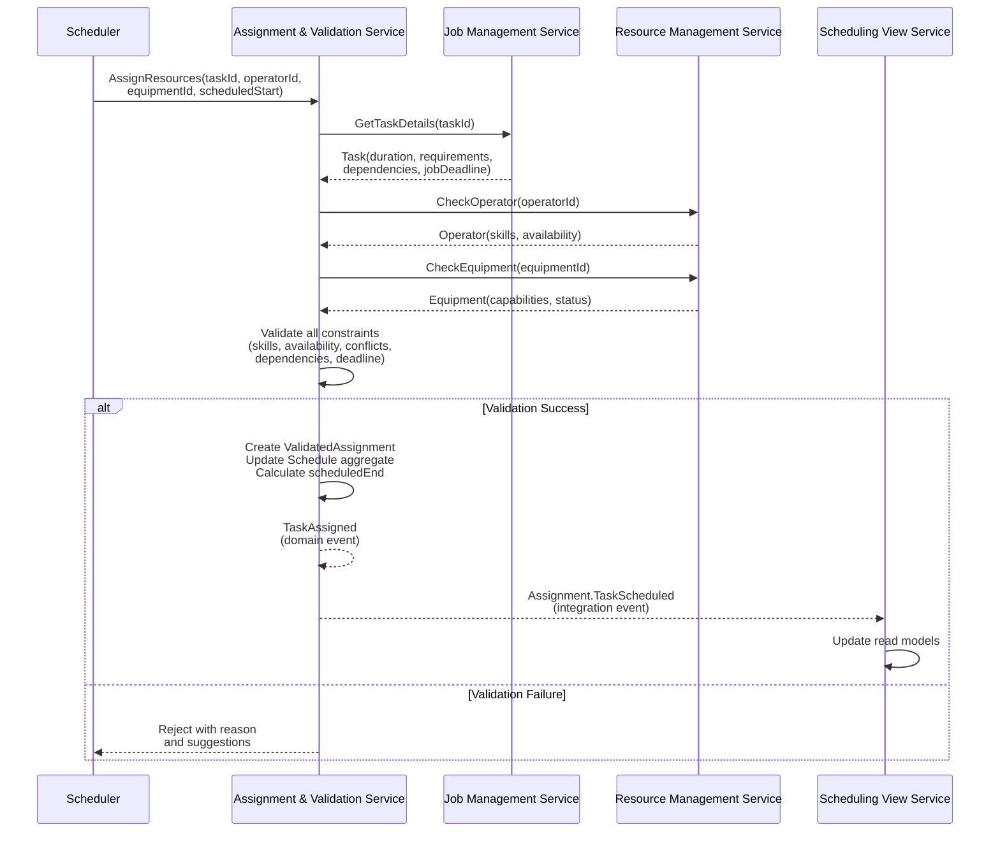
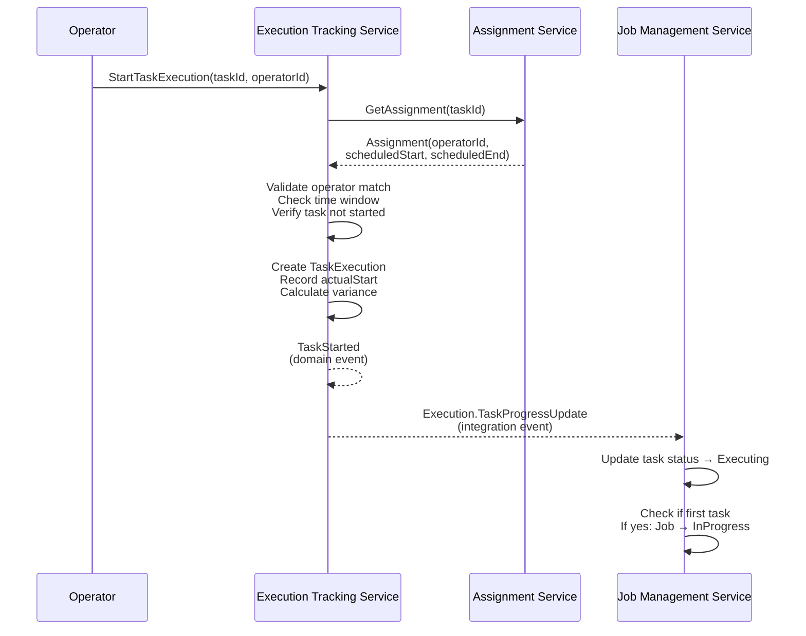
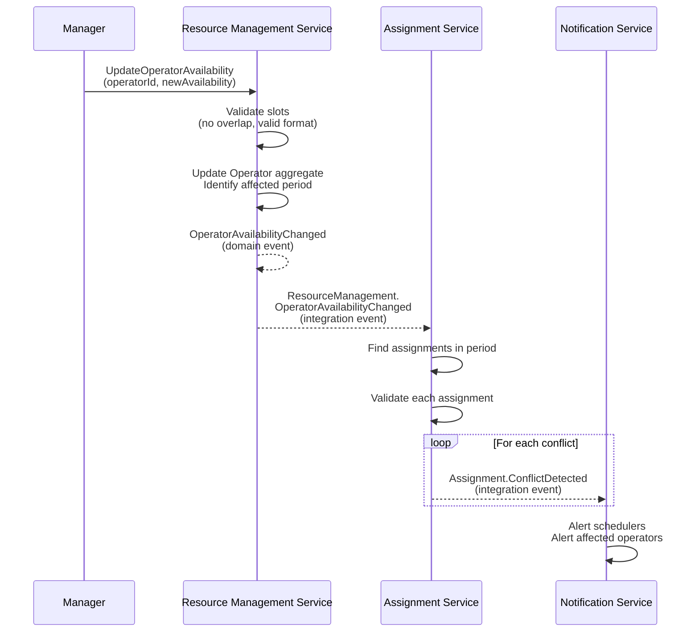
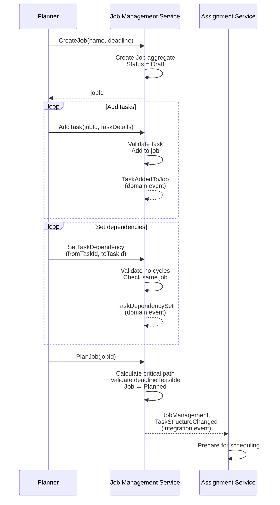
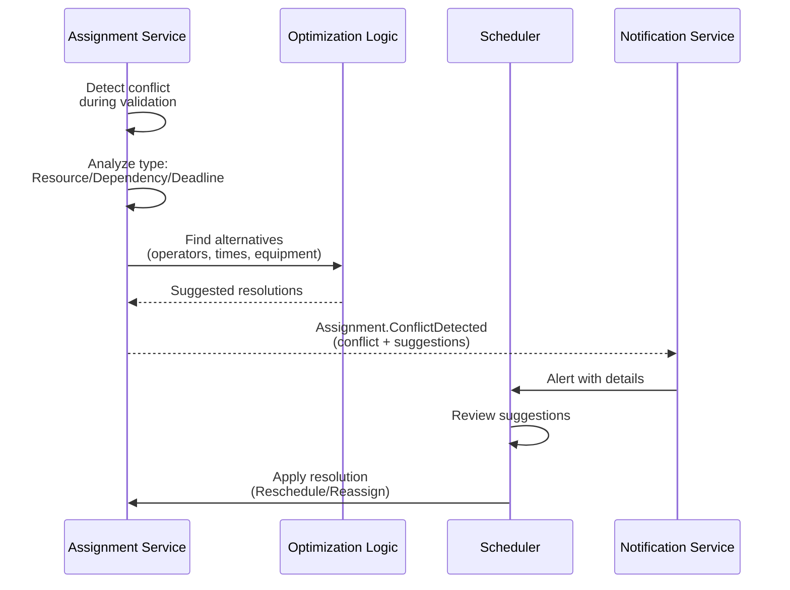
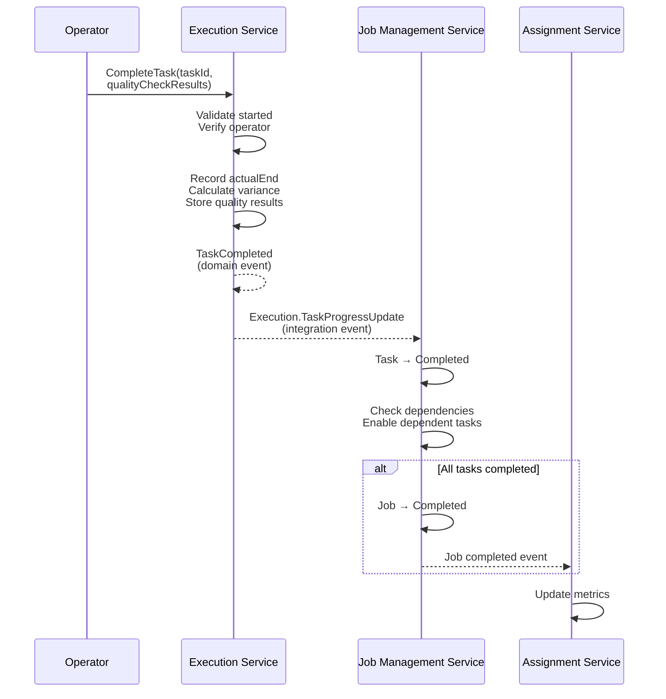

# Sequence Design — Operations Research System

This document provides both **textual** and **Mermaid‑based** sequence specifications for key interactions in the Equipment → Operator → Job → Task assignment and validation workflow.

Each sequence describes:
- **Trigger** — what starts the interaction
- **Participants** — components involved in the sequence
- **Validation & state transitions**
- **Domain events** emitted internally
- **Integration events** published for other services
- **Outcome** — the resulting system state
- **Visual representation** — a Mermaid sequence diagram aligned with the textual steps

---

## 1. Task Assignment and Scheduling

**Trigger:** Scheduler requests to assign resources and set timing for a task.

**Participants:**
- Production Scheduler (user)
- Assignment & Validation Service
- Resource Management Service
- Job Management Service
- Scheduling View Service

**Sequence:**
1. Scheduler sends `AssignResources(taskId, operatorId, equipmentId, scheduledStart)` to **Assignment & Validation Service**.
2. Assignment Service queries **Job Management Service** for task details:
   - Task requirements (duration, equipment type)
   - Task dependencies
   - Job deadline
3. Assignment Service queries **Resource Management Service**:
   - Operator skills and availability
   - Equipment capabilities and status
4. Assignment Service validates:
   - Operator has required skills for equipment
   - Resources available at scheduled time
   - No scheduling conflicts exist
   - Dependencies satisfied (prerequisites completed)
   - Job deadline can be met
5. If valid:
   - Assignment Service creates ValidatedAssignment
   - Updates Schedule aggregate
   - Calculates scheduledEnd = scheduledStart + duration
6. Assignment Service emits domain event `TaskAssigned`.
7. Assignment Service publishes integration event **`Assignment.TaskScheduled`**.
8. Scheduling View Service receives event and updates read models.

**Outcome:**
Task is successfully scheduled with resources and timing, visible in all views.

**Exceptions:**
- **SkillMismatch:** Operator lacks certification → Reject with suggested operators
- **ResourceConflict:** Double-booking detected → Show conflicting assignments
- **DependencyViolation:** Prerequisites incomplete → Show blocking tasks

---

## 2. Task Execution Start

**Trigger:** Operator begins executing an assigned task.

**Participants:**
- Operator (user)
- Execution Tracking Service
- Assignment & Validation Service
- Job Management Service

**Sequence:**
1. Operator sends `StartTaskExecution(taskId, operatorId)` to **Execution Tracking Service**.
2. Execution Service queries **Assignment Service** for task assignment:
   - Verify operator is assigned
   - Get scheduled start time
3. Execution Service validates:
   - Current time within allowed window (±15 minutes of scheduled)
   - Task status is Assigned (not already started)
4. Execution Service creates TaskExecution:
   - Records actual start time
   - Calculates start variance
5. Execution Service emits domain event `TaskStarted`.
6. Execution Service publishes integration event **`Execution.TaskProgressUpdate`**.
7. Job Management Service receives event:
   - Updates task status to Executing
   - Checks if job should transition to InProgress

**Outcome:**
Task execution is tracked with actual timing, job status updated if needed.

---

## 3. Resource Availability Change

**Trigger:** Operator's availability schedule is modified.

**Participants:**
- HR System or Manager
- Resource Management Service
- Assignment & Validation Service
- Notification Service

**Sequence:**
1. Manager calls `UpdateOperatorAvailability(operatorId, newAvailability)` on **Resource Management Service**.
2. Resource Service validates:
   - Availability slots don't overlap
   - Format is valid
3. Resource Service updates Operator aggregate.
4. Resource Service identifies affected period.
5. Resource Service emits domain event `OperatorAvailabilityChanged`.
6. Resource Service publishes **`ResourceManagement.OperatorAvailabilityChanged`**.
7. Assignment Service receives event:
   - Finds assignments in affected period
   - Validates each against new availability
   - Detects any new conflicts
8. For each conflict:
   - Assignment Service publishes **`Assignment.ConflictDetected`**
9. Notification Service alerts affected schedulers and operators.

**Outcome:**
Availability updated, conflicts detected and communicated to relevant parties.

---

## 4. Job Planning with Dependencies

**Trigger:** Production planner creates a new job with multiple interdependent tasks.

**Participants:**
- Production Planner
- Job Management Service
- Assignment & Validation Service

**Sequence:**
1. Planner calls `CreateJob(name, deadline)` on **Job Management Service**.
2. Job Service creates Job aggregate in Draft state.
3. Planner adds tasks: `AddTask(jobId, taskDetails)` multiple times.
4. For each task:
   - Job Service validates task type and duration
   - Adds task to job
   - Emits `TaskAddedToJob`
5. Planner sets dependencies: `SetTaskDependency(fromTaskId, toTaskId)`.
6. Job Service validates:
   - No circular dependencies (DAG validation)
   - Dependencies within same job
7. Planner calls `PlanJob(jobId)`.
8. Job Service:
   - Calculates critical path
   - Validates deadline achievability
   - Transitions Job to Planned state
9. Job Service publishes **`JobManagement.TaskStructureChanged`**.
10. Assignment Service receives event and prepares for scheduling.

**Outcome:**
Job created with validated task structure ready for resource assignment.

---

## 5. Schedule Conflict Resolution

**Trigger:** System detects scheduling conflict during validation.

**Participants:**
- Assignment & Validation Service
- Scheduling Optimization Service (internal)
- Production Scheduler
- Notification Service

**Sequence:**
1. Assignment Service detects conflict during validation.
2. Assignment Service analyzes conflict type:
   - ResourceConflict: Same resource double-booked
   - DependencyViolation: Task scheduled before prerequisite
   - DeadlineRisk: Critical path exceeds deadline
3. Assignment Service queries for alternatives:
   - Available operators with required skills
   - Alternative time slots
   - Equipment substitutes
4. Assignment Service generates suggestions.
5. Assignment Service publishes **`Assignment.ConflictDetected`** with:
   - Conflict details
   - Suggested resolutions
   - Severity level
6. Notification Service alerts scheduler.
7. Scheduler reviews suggestions.
8. Scheduler applies resolution by calling `RescheduleTask` or `ReassignTask`.

**Outcome:**
Conflict identified, alternatives suggested, and resolution applied.

---

## 6. Task Completion and Progress Update

**Trigger:** Operator completes task execution.

**Participants:**
- Operator
- Execution Tracking Service
- Job Management Service
- Assignment & Validation Service

**Sequence:**
1. Operator calls `CompleteTask(taskId, qualityCheckResults)`.
2. Execution Service validates:
   - Task was started
   - Operator matches executor
3. Execution Service records:
   - Actual end time
   - Duration variance
   - Quality check results
4. Execution Service emits `TaskCompleted`.
5. Execution Service publishes **`Execution.TaskProgressUpdate`**.
6. Job Management Service:
   - Updates task status to Completed
   - Checks dependent tasks for readiness
   - Transitions ready tasks to Ready state
7. If all job tasks completed:
   - Job transitions to Completed
   - Publishes job completion event
8. Assignment Service updates schedule metrics.

**Outcome:**
Task marked complete, dependent tasks enabled, job progress updated.

---

## Notes
- These specifications use a **text-first structure** supplemented by **Mermaid sequence diagrams** for clarity
- They express ordering, participants, validations, and events
- Exception handling is explicitly documented where relevant
- The sequences focus on the core scheduling functionality of the system
- Integration with external systems (HR, IoT sensors) is shown where applicable
