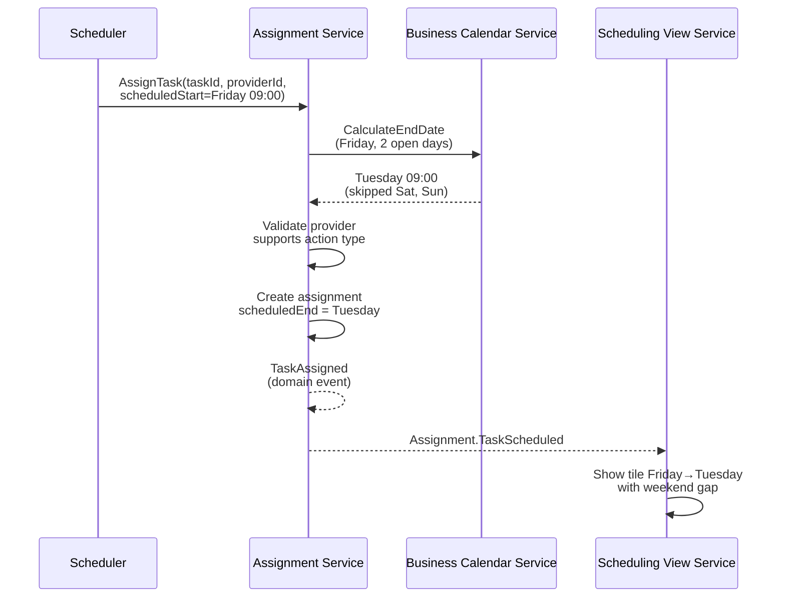

# Sequence Design — Flux Print Shop Scheduling System

This document provides both **textual** and **Mermaid‑based** sequence specifications for key interactions in the Station → Job → Task assignment and scheduling workflow.

Each sequence describes:
- **Trigger** — what starts the interaction
- **Participants** — components involved in the sequence
- **Validation & state transitions**
- **Domain events** emitted internally
- **Integration events** published for other services
- **Outcome** — the resulting system state
- **Visual representation** — a Mermaid sequence diagram aligned with the textual steps

---

## 1. Task Assignment (Drag & Drop)

**Trigger:** Scheduler drags a task tile from the left panel and drops it on a station column at a specific time.

**Participants:**
- Production Scheduler (user)
- Frontend (React + Validation Package)
- Assignment Service (PHP/Symfony)
- Validation Service (Node.js, isomorphic)
- Station Management Service
- Job Management Service
- Scheduling View Service

**Sequence:**
1. Scheduler drags task tile over the scheduling grid.
2. **Frontend** runs client-side validation via `@flux/schedule-validator`:
   - Checks station availability
   - Checks no station conflicts
   - Checks group capacity
   - Checks task precedence
   - Provides real-time feedback (< 10ms)
3. Scheduler drops tile at Station "Komori G37", 09:00.
4. **Frontend** sends `AssignTask(taskId, stationId, scheduledStart)` to **Assignment Service**.
5. **Assignment Service** calls **Validation Service** for authoritative validation:
   - Station exists and is Available
   - No scheduling conflicts
   - Group capacity not exceeded
   - Task sequence respected
   - Approval gates satisfied (BAT, Plates)
6. If valid:
   - Assignment Service creates assignment
   - Calculates `scheduledEnd` = `scheduledStart` + task duration
   - Updates Schedule aggregate
7. Assignment Service emits domain event `TaskAssigned`.
8. Assignment Service publishes integration event **`Assignment.TaskScheduled`**.
9. **Scheduling View Service** receives event and updates read models.
10. **Frontend** receives updated snapshot and re-renders grid.

**Outcome:**
Task is assigned to station with timing, visible on the grid.

**Exceptions:**
- **StationConflict:** Double-booking detected → Show conflicting assignments
- **GroupCapacityConflict:** MaxConcurrent exceeded → Show capacity warning
- **PrecedenceConflict:** Task sequence violated → Snap to valid position or show warning
- **ApprovalGateConflict:** BAT or Plates not ready → Block with explanation


---

## 2. Job Creation with DSL Tasks

**Trigger:** User creates a new print job with tasks defined via DSL.

**Participants:**
- Production Planner (user)
- Job Management Service
- DSL Parsing Service (embedded)
- Station Management Service
- Scheduling View Service

**Sequence:**
1. Planner opens job creation modal.
2. Planner enters job details: reference "45113 A", client "Fibois Grand Est", workshopExitDate "2025-12-15".
3. Planner enters task DSL:
   ```
   [Komori G37] 20+180 "tirage principal"
   [Massicot] 15
   ST [Clément] Pelliculage 2JO
   ```
4. **DSL Parsing Service** parses each line:
   - Validates syntax
   - Resolves station/provider names against **Station Management Service**
   - Returns structured task data or parse errors
5. Planner saves job.
6. **Job Management Service** creates Job aggregate:
   - Status = Draft
   - Adds tasks with sequence order
   - Validates task requirements
7. Job Service emits `JobCreated` and `TaskAddedToJob` events.
8. Job Service publishes **`JobManagement.TaskStructureChanged`**.
9. **Scheduling View Service** receives event and updates job list.

**Outcome:**
Job created with parsed tasks ready for scheduling.


---

## 3. Approval Gate Update (BAT Approval)

**Trigger:** Proof (BAT) is approved by client, unblocking task scheduling.

**Participants:**
- Production Coordinator (user)
- Job Management Service
- Assignment Service
- Scheduling View Service

**Sequence:**
1. Coordinator receives client approval for proof.
2. Coordinator updates job: `proofApprovedAt = now()`.
3. **Job Management Service** validates:
   - `proofSentAt` was set (proof was sent)
   - Sets `proofApprovedAt` timestamp
4. Job Service emits domain event `ProofStatusUpdated`.
5. Job Service publishes **`JobManagement.ApprovalGateChanged`**:
   - gateType = "Proof"
   - isBlocking = false
6. **Assignment Service** receives event:
   - Revalidates any pending assignments for this job
   - Clears ApprovalGateConflicts
7. **Scheduling View Service** updates job status indicator.

**Outcome:**
Job's tasks can now be scheduled without BAT blocking.


---

## 4. Station Schedule Exception

**Trigger:** Manager adds a schedule exception (e.g., maintenance) to a station.

**Participants:**
- Production Manager (user)
- Station Management Service
- Assignment Service
- Scheduling View Service
- Notification Service (future)

**Sequence:**
1. Manager adds exception for "Komori G37" on "2025-12-20" as "Closed" with reason "Maintenance".
2. **Station Management Service** validates:
   - Station exists
   - Exception date is valid
   - No duplicate exception for same date
3. Station Service updates Station aggregate:
   - Adds ScheduleException to exceptions list
4. Station Service emits domain event `ScheduleExceptionAdded`.
5. Station Service publishes **`StationManagement.StationScheduleUpdated`**:
   - changeType = "ExceptionAdded"
   - affectedPeriod = full day
6. **Assignment Service** receives event:
   - Finds assignments on affected station/date
   - Validates each against new availability
   - Detects AvailabilityConflicts
7. For each conflict:
   - Assignment Service creates ScheduleConflict record
   - Publishes **`Assignment.ConflictDetected`**
8. **Scheduling View Service** updates grid:
   - Shows gray hatched overlay on unavailable day
   - Highlights conflicting tiles

**Outcome:**
Station marked unavailable, conflicts detected and shown.


---

## 5. Task Recall (Unassign)

**Trigger:** Scheduler recalls a scheduled task back to the unassigned state.

**Participants:**
- Production Scheduler (user)
- Assignment Service
- Job Management Service
- Scheduling View Service

**Sequence:**
1. Scheduler hovers over faded tile in left panel (assigned task indicator).
2. Scheduler clicks "Recall" button.
3. **Frontend** sends `UnassignTask(taskId)` to **Assignment Service**.
4. Assignment Service validates:
   - Assignment exists
   - Task is not already executing
5. Assignment Service removes assignment:
   - Deletes TaskAssignment from Schedule
   - Updates task status back to Ready
6. Assignment Service emits domain event `TaskUnassigned`.
7. Assignment Service publishes **`Assignment.TaskScheduled`** (with action=unassigned).
8. **Scheduling View Service** updates:
   - Removes tile from grid
   - Shows full-opacity tile in left panel
9. Affected conflicts (if any) are automatically cleared.

**Outcome:**
Task returns to unscheduled state, tile removed from grid.


---

## 6. Late Job Detection

**Trigger:** Schedule snapshot generation detects jobs at risk of missing deadlines.

**Participants:**
- Scheduling View Service
- Assignment Service

**Sequence:**
1. **Scheduling View Service** generates schedule snapshot.
2. For each job:
   - Calculate expected completion time (last task's scheduledEnd)
   - Compare with job's workshopExitDate
   - If completion > deadline: mark as late
3. For each late job:
   - Calculate delay in hours/days
   - Add to `lateJobs` collection in snapshot
4. Snapshot includes late job warnings:
   - jobId, reference, workshopExitDate, expectedCompletion, delayHours
5. **Frontend** displays late jobs in right panel "Late Jobs" section.
6. Visual indicator on job tiles shows deadline risk.

**Outcome:**
Late jobs identified and highlighted for scheduler attention.


---

## 7. Outsourced Task Scheduling

**Trigger:** Scheduler assigns an outsourced task to a provider.

**Participants:**
- Production Scheduler (user)
- Assignment Service
- Business Calendar Service
- Scheduling View Service

**Sequence:**
1. Scheduler drags outsourced task (e.g., "Pelliculage 2JO") to provider column.
2. Scheduler drops at Friday 09:00.
3. **Frontend** sends `AssignTask(taskId, providerId, scheduledStart)`.
4. **Assignment Service** queries **Business Calendar Service**:
   - Calculate end date: Friday + 2 open days = Tuesday
   - Excludes Saturday, Sunday
5. Assignment Service validates:
   - Provider supports action type
   - No blocking dependencies
6. Assignment Service creates assignment:
   - `scheduledStart` = Friday 09:00
   - `scheduledEnd` = Tuesday 09:00 (2 open days later)
7. Assignment Service emits `TaskAssigned`.
8. Grid shows tile spanning Friday to Tuesday (with weekend gap indication).

**Outcome:**
Outsourced task scheduled with business calendar duration.



---

## 8. Real-time Conflict Resolution

**Trigger:** System detects scheduling conflict requiring user action.

**Participants:**
- Assignment Service
- Scheduling View Service
- Production Scheduler (user)

**Sequence:**
1. Conflict detected (e.g., StationConflict from overlapping assignments).
2. **Assignment Service** publishes **`Assignment.ConflictDetected`**:
   - conflictType = "StationConflict"
   - affectedTaskIds = [task-001, task-002]
   - description = "Station Komori double-booked 09:00-10:30"
   - severity = "High"
3. **Scheduling View Service** updates UI:
   - Highlights affected tiles with red border
   - Shows conflict in right panel "Conflicts" section
   - Generates suggestions (alternative times/stations)
4. Scheduler reviews conflict and suggestions.
5. Scheduler resolves by either:
   - Rescheduling one task to different time
   - Moving task to different station
   - Recalling one of the conflicting tasks
6. On resolution, conflicts automatically cleared.

**Outcome:**
Conflict resolved, schedule returns to valid state.


---

## Notes

- These specifications use a **text-first structure** supplemented by **Mermaid sequence diagrams** for clarity
- They express ordering, participants, validations, and events
- Exception handling is explicitly documented where relevant
- The sequences focus on the core scheduling functionality of the Flux Print Shop system
- **Isomorphic validation** ensures consistent rules on client and server
- All timestamps use ISO-8601 format in UTC
- The Assignment Service is the heart of the system, coordinating all scheduling operations
