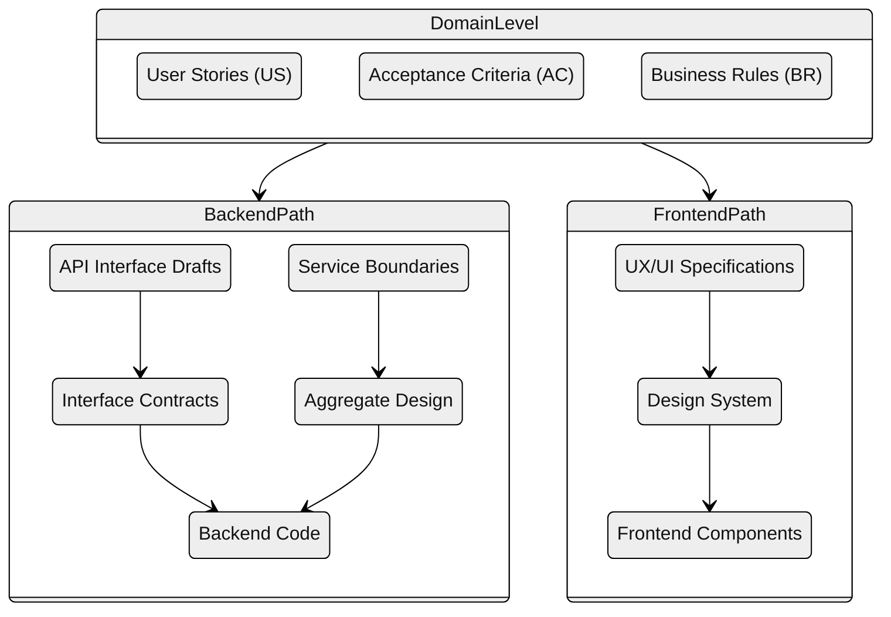
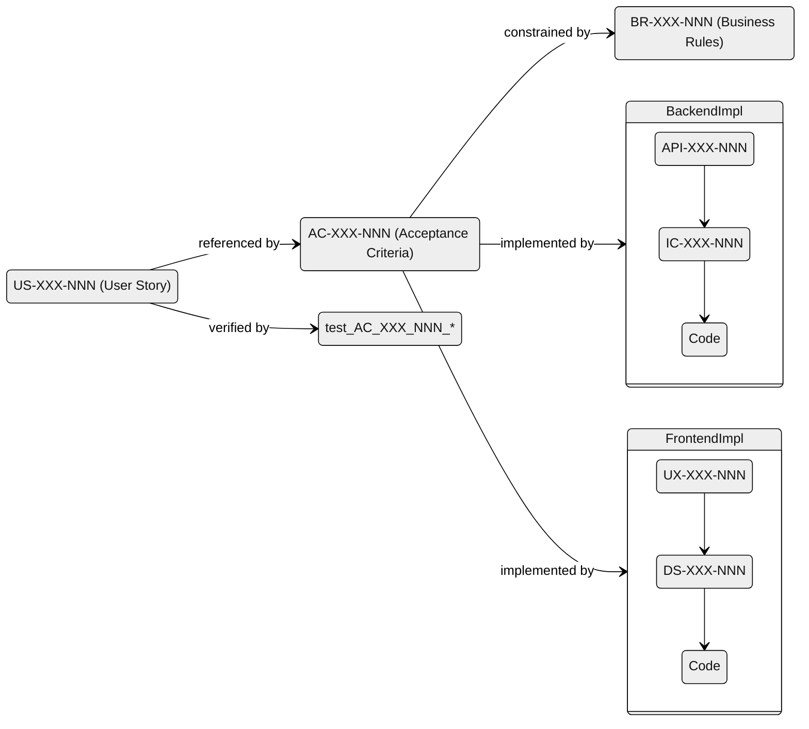

---
tags:
  - meta
  - standards
---

# Document Structure

This document defines the structure, cross-references, content formats, links, and maintenance rules for project documentation.

---

## 1. Document Structure

### 1.1 YAML Front Matter

Every documentation file must include YAML front matter with tags:

```yaml
---
tags:
  - specification
  - requirements
---
```

### 1.2 ID Naming Convention

Each identifiable item uses a consistent ID format: `PREFIX-CATEGORY-NNN`

| Prefix | Document | Example |
|--------|----------|---------|
| US | User Stories | US-STATION-001 |
| AC | Acceptance Criteria | AC-STATION-001 |
| BR | Business Rules | BR-STATION-001 |
| WF | Workflow Definitions | WF-ASSIGN-001 |
| DM | Domain Model | DM-STATION-001 |
| API | API Interface Drafts | API-STATION-001 |
| IC | Interface Contracts | IC-STATION-001 |
| AGG | Aggregate Design | AGG-STATION-001 |
| SB | Service Boundaries | SB-STATION-001 |
| UX | UX/UI Specifications | UX-PANEL-001 |
| DS | Design System | DS-COLOR-001 |

### 1.3 ID Heading Format

IDs must be defined as h4 headings to enable Obsidian anchor links:

```markdown
### Register a Station
#### US-STATION-001
```

This allows linking with short anchors: `[US-STATION-001](user-stories.md#us-station-001)`

---

## 2. Cross-Reference Rules

### 2.1 Reference Format

Each item should include a References line immediately after the ID heading:

```markdown
#### AC-STATION-001
> **References:** [US-STATION-001](user-stories.md#us-station-001), [BR-STATION-001](../domain-model/business-rules.md#br-station-001)
```

### 2.2 Document Hierarchy

References flow from high-level to low-level documents:



Cross-cutting references:
- Domain Model (DM) - referenced by technical documents
- Workflow Definitions (WF) - referenced by API and implementation docs

### 2.3 Cardinality Rules

| Relationship | Cardinality | Rule |
|--------------|-------------|------|
| US → AC | 1:n | Every US must have at least one AC |
| AC → US | n:1 | Every AC must reference exactly one US |
| AC → BR | n:m | ACs may reference multiple BRs |
| API → AC | n:m | APIs reference relevant ACs |
| IC → API | 1:1 | Each IC implements one API |
| AGG → DM | 1:n | Aggregates reference domain entities |
| SB → AGG | 1:n | Services own multiple aggregates |
| UX → AC | n:m | UX specs reference relevant ACs |
| UX → US | n:m | UX specs reference user stories |
| DS → UX | 1:n | Design system elements used by UX specs |

---

## 3. Content Standards

### 3.1 User Stories Format

```markdown
### {Title}
#### US-{CATEGORY}-{NNN}
> **References:** [BR-*](path#anchor)

> As a **{role}**, I want **{goal}**, so that **{benefit}**.

**Acceptance Criteria:**
- Criterion 1
- Criterion 2
```

### 3.2 Acceptance Criteria Format

```markdown
### AC-{CATEGORY}-{NNN}: {Title}
> **References:** [US-*](path#anchor), [BR-*](path#anchor)

**Given** {precondition}
**When** {action}
**Then** {expected result}
```

### 3.3 Business Rules Format

```markdown
### BR-{CATEGORY}-{NNN}: {Title}

{Rule description}

**Constraints:**
- Constraint 1
- Constraint 2
```

### 3.4 UX/UI Specification Format

```markdown
### {Title}
#### UX-{CATEGORY}-{NNN}
> **References:** [US-*](path#anchor), [AC-*](path#anchor)

**Component:** {Component name}
**Location:** {Where in the UI}

**Behavior:**
- Behavior 1
- Behavior 2

**Visual:**
- Visual requirement 1
- Visual requirement 2

**States:**
- Default state
- Hover state
- Active state
- Disabled state
```

### 3.5 Design System Format

```markdown
### {Title}
#### DS-{CATEGORY}-{NNN}

**Type:** {color | typography | spacing | component}

**Value:** {specification value}

**Usage:**
- Usage context 1
- Usage context 2
```

---

## 4. Link Conventions

### 4.1 Internal Links

Use relative paths with lowercase anchors:

```markdown
[US-STATION-001](user-stories.md#us-station-001)
[BR-STATION-001](../domain-model/business-rules.md#br-station-001)
```

### 4.2 Anchor Format

Anchors are auto-generated from h4 headings in lowercase:
- `#### US-STATION-001` → `#us-station-001`
- `#### BR-GATE-001` → `#br-gate-001`

---

## 5. Maintenance Rules

### 5.1 Adding New Items

1. Assign the next available ID in the category
2. Add h4 heading with the ID
3. Add References line with relevant links
4. Update referenced documents if needed (e.g., add AC reference to US)

### 5.2 Removing Items

1. Search for all references to the item
2. Update or remove references
3. Remove the item
4. Document the removal in CHANGELOG if significant

### 5.3 Validation Checklist

- [ ] Every US has at least one AC
- [ ] Every AC references exactly one US
- [ ] All internal links are valid
- [ ] IDs follow naming convention
- [ ] YAML front matter present

---

## 6. Spec-to-Spec Traceability

### 6.1 Traceability Chain

Every specification should be traceable through the hierarchy:



### 6.2 Verification Checklist

Before any implementation, verify the spec chain:

#### Domain Level
- [ ] US exists with clear user need
- [ ] AC exists with Given/When/Then
- [ ] AC has `> **References:** [US-XXX-NNN]` line
- [ ] All relevant BRs identified
- [ ] AC references all relevant BRs

#### Technical Level (Backend)
- [ ] API spec exists if external interface
- [ ] API spec references AC
- [ ] IC spec exists if internal contract
- [ ] IC spec references API or AC

#### Technical Level (Frontend)
- [ ] UX spec exists for UI components
- [ ] UX spec references AC and/or US
- [ ] DS tokens defined for visual elements
- [ ] DS references UX where applicable

### 6.3 Traceability Matrix Template

Use this template to verify complete traceability:

| US | AC | BR | Backend Spec | Frontend Spec | Code | Test |
|----|----|----|--------------|---------------|------|------|
| US-XXX-001 | AC-XXX-001 | BR-XXX-001 | API-XXX-001 | - | `file:line` | `test_AC_XXX_001` |
| US-XXX-001 | AC-XXX-002 | BR-XXX-002 | - | UX-XXX-001 | `file:line` | `test_AC_XXX_002` |

### 6.4 Verification Commands

**Find all specs referencing a US:**
```bash
grep -rn "US-STATION-001" docs/
```

**Find all specs referencing an AC:**
```bash
grep -rn "AC-STATION-001" docs/
```

**Verify AC references US:**
```bash
grep -A2 "AC-STATION-001" docs/requirements/acceptance-criteria.md | grep "US-"
```

### 6.5 Common Traceability Issues

| Issue | Problem | Solution |
|-------|---------|----------|
| AC without US reference | No user context | Add `> **References:** [US-XXX-NNN]` |
| Technical spec without AC | No verifiable behavior | Create AC first |
| Orphan BR | BR not referenced by any AC | Either link to AC or remove |
| Missing tech spec | Gap between AC and code | Create API/IC or UX/DS spec |
