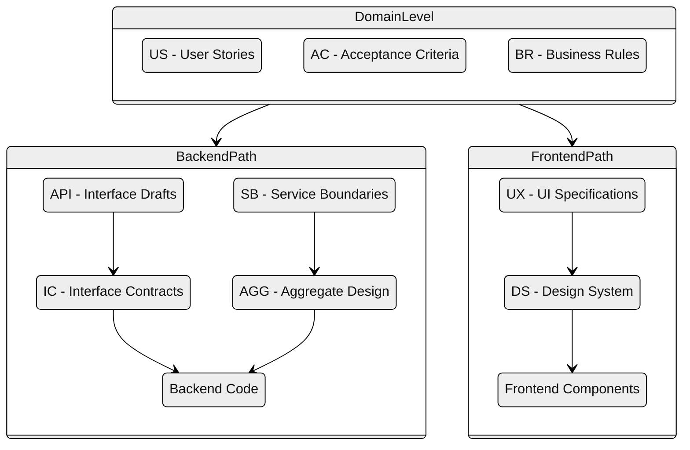

---
tags:
  - meta
  - standards
---

# Documentation Standards

This folder contains the documentation standards and conventions for the Flux project.

## Documents

| Document | Description |
|----------|-------------|
| [AI-Assisted Development Workflow](ai-assisted-development-workflow.md) | **Start here** - Strict step-by-step workflow for AI-assisted development |
| [Document Structure](document-structure.md) | ID naming, cross-references, content formats, links, maintenance |
| [Source Code Traceability](source-code-traceability.md) | @spec annotations, layer-specific references, coverage goals |
| [Spec-First Development](spec-first-development.md) | Philosophy, workflow, prompt templates, bug handling |
| [Change Governance](change-governance.md) | Top-down change principle, change categories, anti-patterns |

## Quick Reference

### ID Prefixes

| Prefix | Document |
|--------|----------|
| US | User Stories |
| AC | Acceptance Criteria |
| BR | Business Rules |
| WF | Workflow Definitions |
| DM | Domain Model |
| API | API Interface Drafts |
| IC | Interface Contracts |
| AGG | Aggregate Design |
| SB | Service Boundaries |
| UX | UX/UI Specifications |
| DS | Design System |

### Document Hierarchy

### Change Categories

| Category | Trigger Required |
|----------|------------------|
| A - Domain (Spec-First) | US, AC, or BR (mandatory) - backend and frontend features |
| B - Visual Polish | DS-* or PO approval - non-behavioral visual changes only |
| C - Technical | Justification in commit - infrastructure, security, refactoring |

See [Change Governance](change-governance.md) for details.
