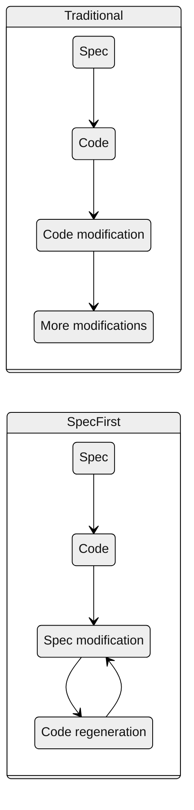
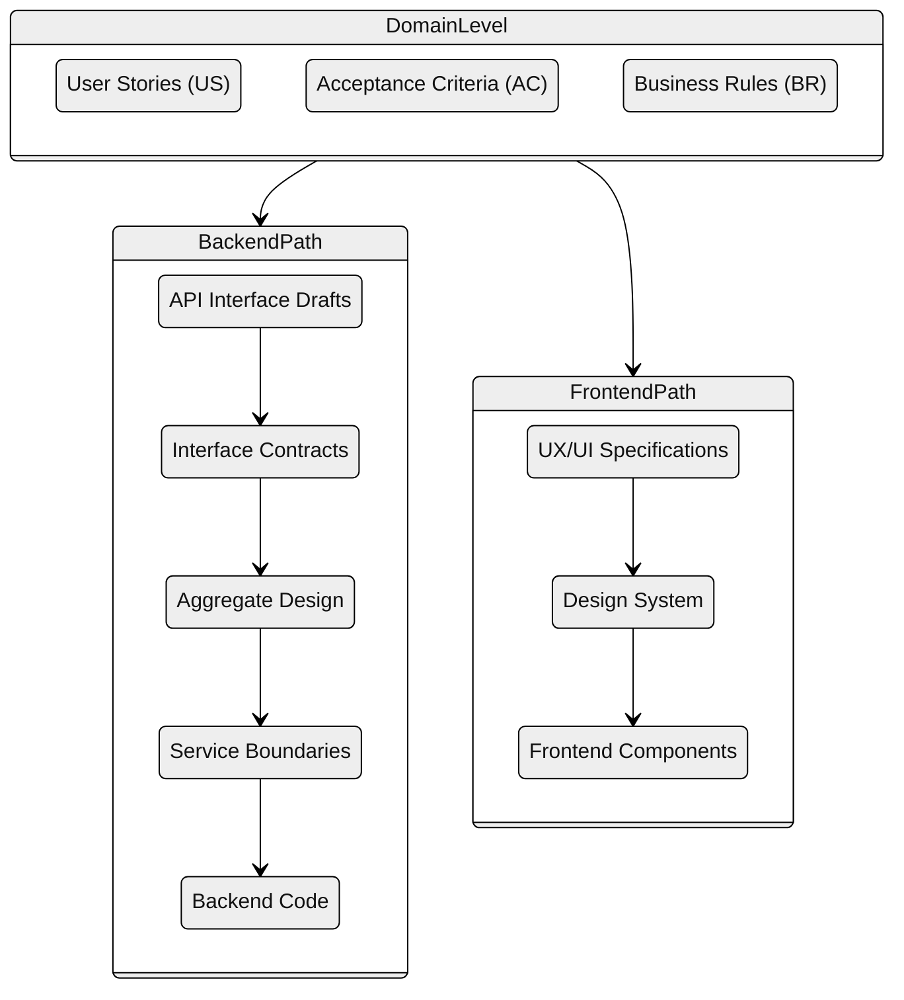
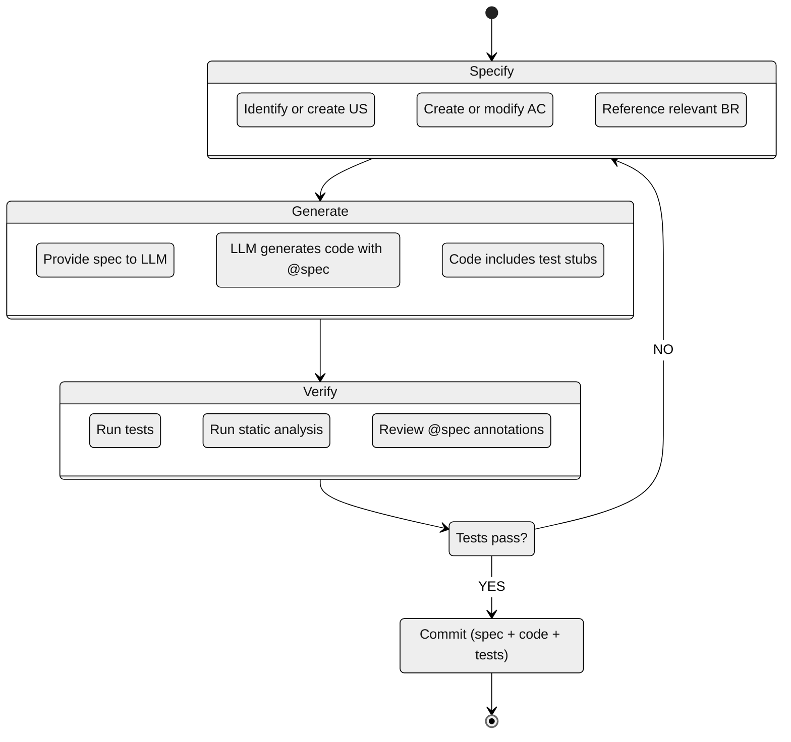

---
tags:
  - meta
  - standards
---

# Spec-First Development

This document defines the spec-first development philosophy and workflow.

---

## 1. Philosophy

In Spec-First Development, the **specification is the source of truth**, and code is a **generated artifact**. This is analogous to how compiled binaries are generated from source code.



**Core principle:** When behavior needs to change, modify the specification first, then regenerate the code. Never modify generated code directly.

---

## 2. Why Spec-First?

| Benefit | Explanation |
|---------|-------------|
| Domain-level thinking | Humans work at "what" level, not "how" |
| Documentation = specification | Never outdated, it IS the source |
| Leverages LLM strengths | Good at spec→code, weak at understanding large codebases |
| No code drift | Implementation cannot diverge from intent |
| Platform agnostic | Same spec → PHP, TypeScript, Go... |
| Lower token usage | Specs are more compact than code |
| Built-in modularity | Complex apps naturally break into component specs |

---

## 3. Specification Hierarchy

For this project, the specification hierarchy is:



### Primary Specs for Code Generation

| Path | Primary Spec | Constraints | Generated Artifact |
|------|--------------|-------------|-------------------|
| Backend | AC | BR | PHP code (services, entities) |
| Frontend | UX | DS | TypeScript/React components |

**AC is the primary specification for backend code generation** because:
- Right granularity for methods/functions
- Given/When/Then maps directly to tests
- Links up to US (intent) and down to BR (constraints)

**UX is the primary specification for frontend code generation** because:
- Defines component behavior and states
- Visual requirements map to styling
- Links up to US/AC (intent) and references DS (constraints)

---

## 4. Development Workflow



---

## 5. Mandatory Checklists

### 5.1 Before Code Generation (SPECIFY phase)

- [ ] User Story (US) exists or created
- [ ] Acceptance Criteria (AC) exists or created
- [ ] AC references parent US
- [ ] All relevant Business Rules (BR) identified
- [ ] AC references relevant BRs
- [ ] Technical spec exists (API/IC for backend, UX/DS for frontend)

### 5.2 During Code Generation (GENERATE phase)

- [ ] Full spec provided to LLM (US, AC, BR, technical spec)
- [ ] @spec annotation requirement specified in prompt
- [ ] Test generation requirement specified in prompt
- [ ] Output location specified

### 5.3 After Code Generation (VERIFY phase)

- [ ] Code compiles/builds without errors
- [ ] Lint passes (ESLint, PHPStan)
- [ ] Type checks pass
- [ ] All tests pass
- [ ] @spec annotations present on business logic
- [ ] @spec IDs are valid (exist in specs)
- [ ] AC Given/When/Then verified in code
- [ ] BR constraints verified in code

### 5.4 Before Commit

- [ ] All VERIFY checks pass
- [ ] Commit message includes spec references
- [ ] Tests included in commit
- [ ] Spec documentation up to date

---

## 6. Workflow Rules

**DO:**
- Start every feature with US and AC definition
- Include relevant BR references in the AC
- Let LLM generate code from spec
- Write tests that verify AC criteria
- Commit spec and code together
- Request regeneration for corrections (don't manually fix)

**DO NOT:**
- Modify generated code directly (modify spec instead)
- Skip the specification step
- Generate code without @spec annotations
- Commit code without corresponding spec
- Manually fix AI-generated code without regeneration

---

## 7. Prompt Template for Code Generation

When requesting code generation from LLM:

```markdown
## Specification

**Acceptance Criteria:** AC-GATE-001
> Given a job with BAT status "pending"
> When a printing task is scheduled
> Then validation fails with "BAT approval required"

**Business Rules:**
- BR-GATE-001: BAT approval blocks printing tasks
- BR-GATE-002: BAT can be bypassed with explicit flag

**References:**
- User Story: US-GATE-001
- Related ACs: AC-GATE-002

## Request

Generate a PHP method that implements AC-GATE-001.
Include @spec annotation and PHPUnit test.
```

---

## 8. Handling Bugs

When a bug is discovered:

```
1. Identify which AC the bug violates
   └── If no AC exists, the spec is incomplete → create AC first

2. Determine root cause
   ├── Spec is wrong → Fix AC/BR, regenerate code
   ├── Spec is incomplete → Extend AC/BR, regenerate code
   └── Code doesn't match spec → Regenerate code (spec is correct)

3. Never fix code without updating spec (if spec was wrong)
```

---

## 9. Versioning

Specs and code are versioned together:

```
git commit -m "feat(gate): Add BAT approval validation

Spec: AC-GATE-001, BR-GATE-001
- Add BatApprovalValidator with @spec annotation
- Add PHPUnit test for Given/When/Then scenarios"
```

---

## 10. When to Regenerate vs Update

| Scenario | Action |
|----------|--------|
| New feature | Generate from spec |
| Bug in logic | Fix spec, regenerate |
| Performance issue | Add perf constraint to spec, regenerate |
| Refactoring | Update spec if interface changes, regenerate |
| Small typo in code | OK to fix directly (no spec impact) |
| Framework upgrade | Regenerate from same spec |

---

## 11. Metrics

Track spec-first compliance:

| Metric | Target |
|--------|--------|
| Code with @spec annotation | >80% of business logic |
| ACs with corresponding tests | 100% |
| Direct code modifications (without spec update) | <10% |
| Spec coverage of features | 100% |
