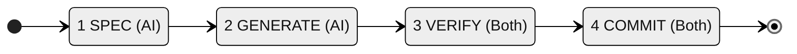

---
tags:
  - draft
  - workflow
  - commands
---

# Spec-First Commands Proposal

This document outlines proposed slash commands for the spec-first AI-assisted development workflow.

---

## Overview

The commands are organized according to the 4 phases of the AI-assisted development workflow:



**Key Principle:** Developers communicate in **natural language**. The `/create-spec` command triggers spec generation from natural language input.

---

## 1. Specification Phase Commands

### /create-spec

**Purpose:** Generate formal specifications from natural language requirement

**Usage:** `/create-spec "Szeretnék egy funkciót ami blokkolja a nyomtatást BAT jóváhagyás nélkül"`

---

**Step 1: Analyze & Propose**

1. Analyzes the natural language requirement
2. Searches existing specs for related items
3. Determines change category (based on Change Governance Sec. 9-10):
   - Category A (Domain/Spec-First) → continues with proposal
   - Category B (Visual Polish) → suggests DS reference instead, exits
   - Category C (Technical) → suggests commit justification instead, exits
4. Proposes which specs are needed (Decision Matrix):

| Change Type | Proposed Specs |
|-------------|----------------|
| New backend feature | US + AC + API/IC |
| New frontend feature | US + AC + UX |
| Business rule change | BR + AC |
| User interaction change | AC + UX |
| Data model change | AC + BR |

**Output:**
```markdown
## Spec Proposal

**Natural language input:**
> "Szeretnék egy funkciót ami blokkolja a nyomtatást BAT jóváhagyás nélkül"

**Classification:**
- Category: A - Domain (Spec-First)
- Change type: Business rule change + New backend feature
- Path: Backend

**Proposed specifications:**
- [ ] US (User Story) - new user capability
- [ ] AC (Acceptance Criteria) - verifiable behavior
- [ ] BR (Business Rule) - new constraint
- [ ] API (Interface Draft) - new endpoint

**Related existing specs found:**
- BR-JOB-001: Job lifecycle states
- US-PRINT-001: Print task scheduling

---
**Proceed with these specs? (yes / modify selection / cancel)**
```

**STOP - Waits for user confirmation**

---

**Step 2: Generate** (after approval)

1. Generates the approved specifications
2. Formats according to document-structure.md standards
3. Assigns next available IDs in each category

**Output:**
```markdown
## Generated Specification

### User Story
#### US-GATE-001
> As a **production manager**, I want **printing tasks to be blocked until BAT approval**,
> so that **we don't waste resources on unapproved jobs**.

### Acceptance Criteria
#### AC-GATE-001
> **References:** [US-GATE-001](#us-gate-001), [BR-GATE-001](#br-gate-001)

> **Given** a job with BAT status "pending"
> **When** a printing task is scheduled for that job
> **Then** validation fails with error "BAT approval required"

### Business Rule
#### BR-GATE-001
BAT approval is required before printing tasks can start.

**Constraints:**
- Jobs without BAT approval cannot have printing tasks scheduled
- BAT approval can be bypassed with explicit manager override flag

### API Interface Draft
#### API-GATE-001
POST /jobs/{id}/validate-bat - Validate BAT approval status

---
**Save these specs to docs/? (yes / modify / cancel)**
```

**STOP - Waits for save confirmation**

---

### /spec-check

**Purpose:** Verify traceability for one or more specification items

**Usage:**
- `/spec-check <ID>` - single spec
- `/spec-check <ID1>, <ID2>, ...` - multiple specs

**Examples:**
```
/spec-check US-GATE-001
/spec-check US-GATE-001, AC-GATE-001, BR-GATE-001
/spec-check AC-GATE-001, AC-GATE-002, AC-GATE-003
```

**Typical workflow after /create-spec:**
```
/create-spec "BAT jóváhagyás blokkolás"
  → Creates: US-GATE-001, AC-GATE-001, BR-GATE-001, API-GATE-001

/spec-check US-GATE-001, AC-GATE-001, BR-GATE-001, API-GATE-001
  → Validates all created specs at once
```

---

**Validation rules by spec type:**

| Type | Checks | Required | Optional |
|------|--------|----------|----------|
| US | AC references this US | min 1 AC | - |
| AC | References line, US ref, BR refs, technical spec | US | BR, API/UX |
| BR | Referenced by AC or technical spec | min 1 ref | - |
| API | AC reference, IC implementation | AC | IC |
| IC | API reference | API | - |
| UX | US/AC references, DS refs | AC or US | DS |
| DS | Referenced by UX | min 1 UX | - |

---

**Output examples:**

**US check:**
```
## US-GATE-001 Traceability Report

**Spec found:** docs/requirements/user-stories.md:45
> As a production manager, I want printing tasks to be blocked...

**References TO this US:**
├── AC-GATE-001 ✅
├── AC-GATE-002 ✅
└── UX-GATE-001 ✅

**Status: Complete ✅**
```

**AC check:**
```
## AC-GATE-001 Traceability Report

**Spec found:** docs/requirements/acceptance-criteria.md:120
> Given a job with BAT status "pending"...

**References FROM this AC:**
├── US: US-GATE-001 ✅
├── BR: BR-GATE-001 ✅, BR-GATE-002 ✅
└── API: API-GATE-001 ✅

**References TO this AC:**
├── Code: src/Service/BatValidator.php:42 (@spec AC-GATE-001) ✅
└── Test: tests/BatValidatorTest.php:15 ✅

**Status: Complete ✅**
```

**BR check:**
```
## BR-GATE-001 Traceability Report

**Spec found:** docs/domain-model/business-rules.md:78
> BAT approval is required before printing tasks can start.

**References TO this BR:**
├── AC-GATE-001 ✅
├── AC-GATE-002 ✅
└── Code: src/Service/BatValidator.php:42 (@spec BR-GATE-001) ✅

**Status: Complete ✅**
```

**Incomplete example:**
```
## US-PRINT-003 Traceability Report

**Spec found:** docs/requirements/user-stories.md:145
> As a printer operator, I want to see ink levels...

**References TO this US:**
└── (none found) ❌

**Status: Incomplete ❌**
- Missing: At least one AC must reference this US

**Suggested fix:**
- Create AC-PRINT-003 with Given/When/Then for this user story
```

**Multiple specs summary:**
```
## Spec Check Summary

| ID | Status | Issues |
|----|--------|--------|
| US-GATE-001 | ✅ Complete | - |
| AC-GATE-001 | ✅ Complete | - |
| BR-GATE-001 | ✅ Complete | - |
| API-GATE-001 | ⚠️ Incomplete | Missing IC implementation |

**Overall: 3/4 complete**

---
**Show details for API-GATE-001? (yes / no)**
```

---

### /spec-status

**Purpose:** Overview of specification health across the documentation

**Usage:**
- `/spec-status` - full scan (slow)
- `/spec-status <scope>` - filtered scan (fast)

**Scope options:**

| Scope | Example | What it checks |
|-------|---------|----------------|
| Prefix | `/spec-status US` | Only User Stories |
| Prefix | `/spec-status AC` | Only Acceptance Criteria |
| Prefix | `/spec-status BR` | Only Business Rules |
| Category | `/spec-status GATE` | All specs with GATE category |
| Path | `/spec-status backend` | Backend specs (API, IC, AGG, SB) |
| Path | `/spec-status frontend` | Frontend specs (UX, DS) |
| Directory | `/spec-status docs/requirements/` | Only specific directory |

---

**Step 1: Scan & Validate**

Scans specification documents (filtered by scope if provided) and validates against these rules:

**1.1 ID Format Rules** (document-structure.md Sec. 1.2)

| Rule | Pattern | Example |
|------|---------|---------|
| ID format | `PREFIX-CATEGORY-NNN` | US-GATE-001 |
| Valid prefixes | US, AC, BR, WF, DM, API, IC, AGG, SB, UX, DS | |
| Heading format | ID must be h4 heading | `#### US-GATE-001` |

**1.2 Cardinality Rules** (document-structure.md Sec. 2.3)

| Relationship | Rule | Validation |
|--------------|------|------------|
| US → AC | 1:n | Every US must have at least one AC referencing it |
| AC → US | n:1 | Every AC must reference exactly one US |
| AC → BR | n:m | ACs may reference multiple BRs (optional) |
| API → AC | n:m | APIs should reference relevant ACs |
| IC → API | 1:1 | Each IC should reference one API |
| UX → AC | n:m | UX specs should reference relevant ACs |
| UX → US | n:m | UX specs should reference user stories |
| DS → UX | 1:n | DS elements should be referenced by UX specs |

**1.3 Reference Format Rules** (document-structure.md Sec. 2.1)

| Rule | Validation |
|------|------------|
| References line | Must have `> **References:**` after ID heading |
| Link format | `[ID](path#anchor)` with lowercase anchor |
| Anchor format | Auto-generated from h4: `US-GATE-001` → `#us-gate-001` |

**1.4 Orphan Detection**

| Spec Type | Orphan Condition |
|-----------|------------------|
| US | No AC references this US |
| BR | No AC or technical spec references this BR |
| API | No IC implements this API |
| UX | No frontend component references this UX |
| DS | No UX spec references this DS element |

**1.5 Traceability Chain Validation** (document-structure.md Sec. 6)

```
US-XXX-NNN
    ↓ (must have at least one)
AC-XXX-NNN
    ↓ (should reference relevant)
BR-XXX-NNN
    ↓ (must have one of)
API/IC or UX/DS
```

**Output:**
```
## Specification Status Report

### Summary
| Type | Total | Valid | Issues |
|------|-------|-------|--------|
| User Stories (US) | 15 | 14 | 1 |
| Acceptance Criteria (AC) | 42 | 39 | 3 |
| Business Rules (BR) | 28 | 26 | 2 |
| API Specs | 18 | 18 | 0 |
| UX Specs | 12 | 11 | 1 |
| Design System (DS) | 8 | 8 | 0 |

### Issues Found

**Cardinality Violations:**
- ❌ US-PRINT-003: No AC references this US (orphan)
- ❌ AC-SCHED-012: Missing US reference (required)
- ❌ AC-SCHED-015: References non-existent US-SCHED-099

**Reference Format Errors:**
- ❌ AC-GATE-002: Missing References line after ID heading
- ❌ BR-JOB-005: Invalid anchor format (uppercase)

**Orphan Specs:**
- ⚠️ BR-LEGACY-001: No AC or technical spec references this BR
- ⚠️ BR-LEGACY-002: No AC or technical spec references this BR

**Broken Links:**
- ❌ AC-UI-003: Links to UX-PANEL-099 which doesn't exist

### Health Score: 87%
(123 valid / 141 total checks)

---
**Fix issues? (show details / auto-fix where possible / ignore)**
```

---

**Step 2: Details** (optional, if requested)

Shows detailed information for each issue with suggested fixes.

**Output:**
```
## Issue Details

### US-PRINT-003 (Orphan US)
**Problem:** No Acceptance Criteria references this User Story
**Location:** docs/requirements/user-stories.md:145
**Content:**
> As a printer operator, I want to see ink levels, so that I can plan refills.

**Suggested fix:**
- Create AC-PRINT-003 with Given/When/Then for this user story
- Or mark US as deprecated if no longer needed

---
**Next issue? (next / skip / done)**
```

---

## 2. Generation Phase Commands

### /generate-from-spec

**Purpose:** Generate code from AC with proper annotations

**Usage:** `/generate-from-spec AC-GATE-001`

**What it does:**
1. Reads the AC and all referenced specs (US, BR, API/IC or UX/DS)
2. Generates implementation code with @spec annotation
3. Generates unit test based on Given/When/Then
4. Presents code for review

**Output:**
- Source file with @spec annotation
- Test file with test case for AC
- Summary of what was generated

---

### /generate-test

**Purpose:** Generate test from AC Given/When/Then

**Usage:** `/generate-test AC-GATE-001`

**What it does:**
1. Reads the AC
2. Extracts Given/When/Then scenarios
3. Generates PHPUnit or Jest test
4. Names test after AC ID

**Output:**
```php
/**
 * @spec AC-GATE-001
 */
public function test_AC_GATE_001_bat_approval_required(): void
{
    // Given: a job with BAT status "pending"
    // When: a printing task is scheduled
    // Then: validation fails with "BAT approval required"
}
```

---

## 3. Verification Phase Commands

### /verify-traceability

**Purpose:** Verify @spec annotations in codebase

**Usage:** `/verify-traceability`

**What it does:**
1. Scans codebase for @spec annotations
2. Validates each spec ID exists in documentation
3. Reports invalid or missing annotations
4. Calculates coverage metrics

**Output:**
```
Traceability Verification Report
├── Files with @spec: 45
├── Total @spec annotations: 128
├── Valid IDs: 125 ✅
├── Invalid IDs: 3 ❌
│   ├── src/Service/TaskService.php:42 - AC-TASK-999 (not found)
│   ├── src/Entity/Job.php:18 - BR-JOB-005 (not found)
│   └── src/Controller/StationController.php:55 - API-STAT-010 (not found)
└── Coverage: 92%
```

---

### /verify-ac

**Purpose:** Verify code implements AC correctly

**Usage:** `/verify-ac AC-GATE-001`

**What it does:**
1. Reads the AC Given/When/Then
2. Finds code with @spec AC-GATE-001
3. Analyzes if code covers all scenarios
4. Reports compliance

**Output:**
```
AC-GATE-001 Compliance Report
├── Given: "job with BAT status pending"
│   └── Handled in: BatApprovalValidator.php:25 ✅
├── When: "printing task is scheduled"
│   └── Handled in: BatApprovalValidator.php:32 ✅
├── Then: "validation fails with BAT approval required"
│   └── Handled in: BatApprovalValidator.php:38 ✅
└── Status: Compliant ✅
```

---

## 4. Commit Phase Commands

### /commit-with-spec

**Purpose:** Create commit with proper spec references

**Usage:** `/commit-with-spec`

**What it does:**
1. Analyzes staged changes
2. Extracts @spec annotations from changed files
3. Generates commit message with spec references
4. Creates the commit

**Output:**
```
feat(gate): Add BAT approval validation

Implements BAT approval check before printing tasks can start.

Spec: AC-GATE-001, BR-GATE-001, API-GATE-001

- Add BatApprovalValidator with @spec annotation
- Add PHPUnit test for Given/When/Then scenarios

🤖 Generated with [Claude Code](https://claude.com/claude-code)

Co-Authored-By: Claude Opus 4.5 <noreply@anthropic.com>
```

---

## 5. Full Workflow Commands

### /implement-release (existing)

Full backend release workflow with all phases.

### /implement-ui-release (existing)

Full frontend release workflow with all phases.

### /spec-first-workflow

**Purpose:** Step-by-step spec-first implementation for a single feature

**Usage:** `/spec-first-workflow AC-GATE-001`

**What it does:**
1. Runs /spec-check to verify traceability
2. STOP - Wait for approval
3. Runs /generate-from-spec to create code
4. STOP - Wait for approval
5. Runs /verify-ac to check compliance
6. STOP - Wait for approval
7. Runs /commit-with-spec to commit

---

## Implementation Priority

| Priority | Command | Phase | Complexity | Value |
|----------|---------|-------|------------|-------|
| 1 | /create-spec | 1-SPEC | High | Critical |
| 2 | /spec-check | 1-SPEC | Medium | High |
| 3 | /generate-from-spec | 2-GENERATE | High | High |
| 4 | /verify-traceability | 3-VERIFY | Medium | High |
| 5 | /spec-status | 1-SPEC | Medium | Medium |
| 6 | /commit-with-spec | 4-COMMIT | Low | Medium |
| 7 | /verify-ac | 3-VERIFY | High | Medium |
| 8 | /generate-test | 2-GENERATE | Medium | Medium |
| 9 | /spec-first-workflow | Full | Medium | High |

**Note:** `/create-spec` is the most critical command as it accepts natural language input and generates formal specifications (US, AC, BR).

---

## Notes

- All commands should follow the strict workflow defined in `docs/documentation-standards/ai-assisted-development-workflow.md`
- Commands with STOP points require explicit user approval before continuing
- Commands should use TodoWrite to track progress
- Output should be in the user's language (Hungarian for this project)
