# Le moteur d'ordonnancement Rust, exécuté à la main

> **But de ce document** : te faire exécuter **toi-même, avec papier et crayon**, un run complet de l'algorithme qui vit dans `services/scheduling-engine/`. À la fin tu sauras :
>
> - Ce que chaque structure de données contient et à quel moment elle est écrite ou lue.
> - Quelle formule applique chaque sous-étape, avec les valeurs numériques exactes.
> - Pourquoi telle décision a été prise à tel moment (urgence, magnétisme, contention…).
> - Comment l'algo se « corrige » quand il échoue à placer dans les temps (FBI → Moore → LNS).
>
> Les termes du jargon d'ordonnancement sont **définis entre parenthèses à leur première apparition** et rassemblés dans le [glossaire final](#glossaire).
>
> Format du doc : on pose un scénario fil-rouge minuscule (2 stations, 1 opératrice, 3 tasks) puis on déroule chaque étape avec les tableaux de la grille au fur et à mesure. Les mécanismes non visités par le fil rouge (péremption, découpage, temps masqué, pin, itérations FBI multiples, Moore, LNS) sont traités ensuite en mini-scénarios isolés.

---

## 0. Ce qu'il faut avoir sous les yeux

### 0.1 Unités et conversions

Le moteur raisonne en **ticks** (*unité atomique de temps, égale à `tick_minutes` — typiquement 15 minutes en prod ; 60 dans notre scénario*) pour éviter les flottants.

- `tick_minutes` : longueur d'un tick (par station ; le moteur prend le **min**).
- `num_ticks` : nombre de ticks dans la grille. Initial = `horizon_days * 24 * 60 / tick_minutes`, grossit de 7 jours à chaque fois qu'on dépasse.
- **tick 0** = minuit du `start_date` (la date du jour calendaire au démarrage).
- Donc pour `tick_minutes=60`, tick 8 = 08:00, tick 17 = 17:00, tick 24 = minuit J+1.

Conversion minutes ↔ ticks utilisée partout dans le code :

```
fn minutes_to_ticks(minutes, tick_minutes) = ceil(minutes / tick_minutes)
fn ticks_to_minutes(ticks, tick_minutes)    = ticks * tick_minutes
```

### 0.2 Les 4 types de « papier » qu'on manipule

Tu auras besoin de garder 4 choses à jour visuellement :

#### a) Le tableau des actions (liste qui change au fil de l'exécution)

Une ligne par *action* (*équivalent interne d'une task enrichi de colonnes qui évoluent pendant le calcul*). Colonnes qu'on mettra à jour :

| idx | task_id | job | station | setup | run | art | eat | last | pred | gap | start | end | ops_assignés | chain_rem | work_acc |
|-----|---------|-----|---------|-------|-----|-----|-----|------|------|-----|-------|-----|--------------|-----------|----------|

Certaines colonnes sont calculées une seule fois (`task_id`, `station`, `setup`, `run`, `pred`, `gap`, `chain_rem`), d'autres évoluent (`art`, `eat`, `last`, `start`, `end`, `ops_assignés`, `work_acc`).

#### b) La grille station × tick (`station_ticks`)

Pour chaque station, une ligne de cellules `num_ticks`. Chaque cellule est vide ou contient un numéro d'action (ou la valeur témoin `MAX`, qu'on lit comme « cellule figée » : maintenance, épinglage ou assignation à ne pas bouger).

```
Station S0 : [ . | . | . | . | . | 0 | 0 | 0 | . | . | . | . ... ]   ← action 0 occupe ticks 5..8
Station S1 : [ . | . | . | . | . | . | . | . | . | 2 | 2 | . ... ]   ← action 2 occupe ticks 9..11
```

Le point `.` = libre ; les chiffres = l'idx d'action.

#### c) La grille opérateur × tick (`operator_stations` + `operator_attention`)

Pour chaque opérateur, la liste des stations sur lesquelles il est à chaque tick. On stocke **au maximum deux** stations par tick (la limite du *temps masqué*). Dans les exemples simples on note `.` (idle), `S0`, `S1` ou `S0+S1` (pair masqué).

Le `operator_attention` est un reliquat fractionnaire (0.0 à 1.0) qu'on additionne à chaque `assign_operator` — il sert de garde mineur dans `find_operators_for_station`, mais la source de vérité pour savoir « est-il libre ? » est `operator_stations`.

#### d) Les caches du forward pass

Trois petits dictionnaires qu'on maintient pendant la boucle :

- `job_remaining_art` — une **table** (job → ART restant en ticks). Démarre à la somme des ART initiaux, descend du `original_art` de chaque action au moment où elle finit.
- `station_pending_count` — une **liste** avec un nombre par station : combien d'actions ne sont pas encore démarrées sur cette station. **Calculé une seule fois** au début de la boucle.
- `last_action_per_station` — une **liste** avec une case par station : vide au début, puis « numéro de la dernière action finie sur cette station ». Sert au *calage bonus*.

---

## 1. Le vocabulaire d'ordonnancement, en vrac

Pose-les à côté de toi. Tu reviendras les voir.

- **Action** — *objet interne du moteur = une task enrichie de colonnes qui évoluent pendant le calcul* (`art`, `eat`, accumulateur, opérateurs, etc.).
- **ART** (*Action Remaining Time*) — ticks de travail restants pour terminer l'action.
- **EAT** (*Elapsed Action Time*) — ticks déjà écoulés depuis `start_tick`, qu'il y ait eu production ou non.
- **Setup / run** — une action passe par deux phases : d'abord le *setup* (calage physique de la machine, fixe), puis le *run* (production à vitesse variable selon les opérateurs).
- **Calage** — terme domaine : préparer la machine (imposer les plaques d'une presse offset). Le *setup_ticks* c'est le calage.
- **Péremption du calage** — si la machine reste idle trop longtemps après avoir été calée, l'encre sèche / les registres bougent : il faut re-caler avant de reprendre.
- **LAST** — *tick au plus tard auquel une action peut commencer pour que le plan ALAP soit faisable*. Sortie du backward pass.
- **ALAP** (*As Late As Possible*) — stratégie de placement à rebours.
- **Slack** — *marge de manœuvre* : « au-plus-tard je peux démarrer *moins* maintenant *moins* le travail qu'il me reste à faire ». En formule : `slack = last - t - art`. Si positif, j'ai de la marge ; si négatif, je suis déjà en retard sur mon LAST.
- **EDD** (*Earliest Due Date*) — trier par deadline croissante.
- **Deadline priority / tier** — 0=impératif, 1=important, 2=standard, 3=flexible.
- **Tier weights** — `[4.0, 2.0, 1.0, 0.5]`. Un impératif pèse 8× un flexible dans la plupart des scores.
- **Proficiency** — maîtrise d'un opérateur sur une station, 0.0 à > 1.0.
- **Productivity** — taux de progression par tick. Solo : = proficiency. Paire masquée : = valeur déclarée dans le `concurrent_group`.
- **Chain_remaining_art** — `own_art + somme_art(successeurs)`. Utilisé pour le score *chain_pressure*.
- **Makespan** — durée totale du plan, entre minuit du start_date et le dernier `end_tick`.
- **Chunk** — morceau d'une action trop longue (> `max_chunk_minutes`). Découpée par `pre_split`.
- **Chunk-mini** — seuil minimum pour démarrer un chunk : `max(k × setup, p × task_total)`.
- **Précédence** (*precedence*) — contrainte « finit avant que commence ». Trois niveaux : intra-element (`sequence_order`), cross-element (`prerequisite_element_ids`), cross-job (`required_job_ids`).
- **Temps masqué** (*masked time*) — un opérateur tient 2 stations simultanément via un `concurrent_group` déclaré.
- **Épinglage** (*pin*) — l'utilisateur fixe `task.is_pinned + pinned_start_tick`. Le moteur honore.
- **FBI** (*Feedback-Based Iteration*) — boucle backward / pre_split / forward qui se répète en boostant les priorités des jobs en retard.
- **Moore** — échappatoire après FBI quand il reste des *late jobs*, renégocie les priorités.
- **LNS** (*Large Neighborhood Search*) — amélioration par *destroy* / *destabilize* / *repair* / *accept*.
- **Virtual reservation** — projection en avant, avant le scoring, des cellules que les actions actives vont vouloir.

---

## 2. Le pipeline global en une page

> **Vue métier, en 5 étapes** :
>
> 1. **Je reçois** la liste des jobs, machines, opérateurs et contraintes.
> 2. **Je calcule au plus tard** (backward) : pour chaque tâche, quel est le moment le plus tardif acceptable où elle doit commencer pour tenir sa deadline.
> 3. **Je place au plus tôt** (forward) : je déroule le planning du matin vers le soir, en mettant à chaque créneau la tâche la plus urgente. Si des retards apparaissent, je relance FBI (étape 2+3) avec les priorités boostées.
> 4. **Plans B et C** : s'il reste des retards, Moore renégocie ciblé (2 essais, 15 s), puis LNS explore des scénarios alternatifs (jusqu'à 60 s).
> 5. **Je mets en forme la réponse** : fusion des chunks, fusion des segments opérateurs, recalcul des stats, et c'est parti vers l'UI.

Vue en diagramme : de l'entrée `ComputeRequest` au résultat `ScheduleResult`, en passant par les étapes successives FBI → Moore → LNS → post-processing.

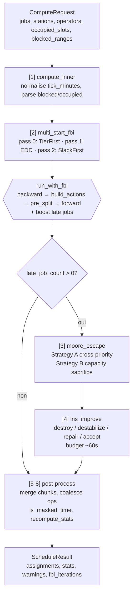

---

## 3. Le scénario « fil rouge »

On va faire tourner le moteur sur ce petit monde. **Prends une feuille et reproduis les tableaux**.

### 3.1 Paramètres globaux

- **start_date** : Lundi **2026-04-27** (minuit).
- **tick_minutes** : 60. Donc tick 0 = lundi 00:00, tick 8 = lundi 08:00, tick 17 = lundi 17:00, tick 24 = mardi 00:00, tick 32 = mardi 08:00.
- **horizon_days** : 1. Donc `num_ticks = 24` au démarrage (la grille grandira si besoin).
- **now_tick** : 8 (on démarre le calcul un lundi à 08:00, le moteur ne placera rien avant).
- **Options** : `fbi_max_iterations = 1` (on se concentre sur une seule itération pour la clarté), `multi_start = false`, `skip_lns = true`. On regardera les autres passes en mini-exemples à part.

### 3.2 Stations (2)

| Idx | ID        | `is_press` | `drying_time` | `peremption` | `max_chunk` | `chunk_mini_setup_mult` | `chunk_mini_task_pct` | `max_operators` |
|----|-----------|------------|---------------|--------------|-------------|-------------------------|-----------------------|-----------------|
| 0  | Presse    | **oui**    | 60 min (1 tick) | 120 min (2 ticks) | 600 min (10 ticks) | 2.0 (défaut)            | 0.5 (défaut)          | 1               |
| 1  | Plieuse   | non        | 0             | 120 min      | 600 min     | 2.0                     | 0.5                   | 1               |

`is_press=true` sur Presse signifie que **quand une task sort de cette station pour aller vers une autre, on ajoute `drying_time` comme gap** (*le temps de séchage de l'encre*). C'est le seul moyen d'avoir un gap non nul dans notre scénario.

### 3.3 Opérateurs (1)

| Idx | Nom   | Skills                         | Operating schedule | Absences | `concurrent_groups` |
|-----|-------|--------------------------------|--------------------|----------|---------------------|
| 0   | Alice | Presse prof 1.0, Plieuse 1.0   | M-F 08:00–17:00    | aucune   | aucun               |

Alice est la **seule** opératrice. Elle fait Presse ET Plieuse mais sans concurrent_group → **pas de temps masqué** : elle ne peut être que sur une station à la fois.

Comme elle n'a qu'un seul `OperatingSchedule` et pas de rotation, elle est dispo tous les lundis de 08:00 à 17:00 exclus (c'est-à-dire ticks 8 à 16 inclus, **pas** le tick 17 puisque la borne de fin est exclue).

### 3.4 Jobs (2)

```
Job A  —  id: "job-A"  —  deadline: Lundi 17:00 (tick 17)  —  priority: 1 (important)
  └── Element "A-e1"
       ├── Task "T1-A"  sur Presse    setup=0   run=120 min   seq=0
       └── Task "T2-A"  sur Plieuse   setup=0   run=60  min   seq=1  (dépend de T1-A)

Job B  —  id: "job-B"  —  deadline: Lundi 16:00 (tick 16)  —  priority: 1 (important)
  └── Element "B-e1"
       └── Task "T3-B"  sur Presse    setup=0   run=120 min   seq=0
```

T1-A et T3-B se battent pour la Presse. Même priorité. T3-B a la deadline la plus serrée (tick 16 < 17). T1-A est en tête d'une chaîne (→ T2-A) donc pèsera plus en *chain_pressure*.

Schéma : hiérarchie Job → Element → Task du scénario fil rouge, avec les 3 niveaux de précédence (intra-element, cross-element, cross-job).

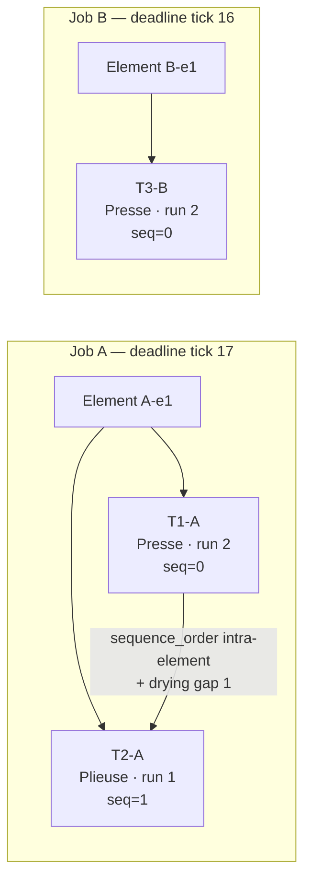

Conversions `minutes → ticks` (avec `tick_minutes = 60`, ceil) :
- T1-A : setup 0, run 2 → **total 2 ticks**, `original_art = 2`.
- T2-A : setup 0, run 1 → **total 1 tick**, `original_art = 1`.
- T3-B : setup 0, run 2 → **total 2 ticks**, `original_art = 2`.

---

## 4. Étape 1 — Le backward pass (calcul des LAST)

> **Analogie métier** : imagine un chef d'atelier expérimenté qui ouvre son planning en commençant **par la deadline** et remonte vers le présent. Pour chaque tâche, il se dit : *« Pour livrer à 17h, cette tâche doit être finie au plus tard à X, donc la précédente doit être finie à X - temps de séchage, donc on ne peut pas la démarrer plus tard que Y. »* C'est exactement ce que fait le backward pass : il ne place pas pour de vrai, il **annote** chaque tâche avec son « au-plus-tard » (le LAST). Ce LAST servira ensuite au *forward pass* de boussole d'urgence.

Fichier : `src/engine/backward_pass.rs`. On appelle `compute_last_values(...)` avec `BackwardOrdering::TierFirst` (par défaut quand on lance `multi_start = false`).

### 4.1 Construction des `BackwardAction`

Le backward pass construit **sa propre représentation** séparée des actions du forward. Pour chaque task on crée une `BackwardAction`, avec les **liens de successeur** (l'inverse du `predecessor_idx` du forward).

Pour chaque task, on regarde la `deadline_priority` de son job et on la range dans une « boîte » par niveau de priorité. Ensuite on parcourt ces boîtes tier par tier (0 → 3). Dans notre scénario, tous les jobs sont **tier 1**, donc tout passe dans un seul passage.

```
BackwardAction 0 :
  task_id = "T1-A", job = "job-A", station_idx = 0
  setup_ticks = 0, run_ticks = 2, total_ticks = 2
  deadline_ticks = 17
  deadline_priority = 1
  successor_idx = Some(1)           ← T2-A a sequence_order > T1-A
  successor_gap_ticks = 1            ← Presse is_press=true, drying 60min = 1 tick
  remaining_chain_work = 2 + 1 = 3   ← (calculé après qu'on ait tous les liens)

BackwardAction 1 :
  task_id = "T2-A", job = "job-A", station_idx = 1
  setup = 0, run = 1, total = 1
  deadline = 17
  successor_idx = None               ← terminal dans son élément
  successor_gap_ticks = 0            ← Plieuse pas press
  remaining_chain_work = 1

BackwardAction 2 :
  task_id = "T3-B", job = "job-B", station_idx = 0
  setup = 0, run = 2, total = 2
  deadline = 16
  successor_idx = None
  successor_gap_ticks = 0
  remaining_chain_work = 2
```

Pas de `prerequisite_element_ids` ni `required_job_ids` dans notre scénario, donc `additional_successors` reste vide.

### 4.2 L'horizon effectif du backward

Le code calcule :

```
max_deadline_ticks = max(17, 17, 16) = 17
effective_horizon = max(horizon_ticks (24), max_deadline_ticks + 1 (18)) = 24
```

On garde 24 ticks.

### 4.3 Initialisation de la grille backward

Le backward a **sa propre** grille `ScheduleGrid`, séparée de celle du forward. Elle commence vide (pas de `blocked_ranges` ni `occupied_slots` dans notre scénario).

```
Grille backward, tick :    0  1  2  3  4  5  6  7  8  9 10 11 12 13 14 15 16 17 18 19 20 21 22 23
Station 0 (Presse):        .  .  .  .  .  .  .  .  .  .  .  .  .  .  .  .  .  .  .  .  .  .  .  .
Station 1 (Plieuse):       .  .  .  .  .  .  .  .  .  .  .  .  .  .  .  .  .  .  .  .  .  .  .  .

Opérateur 0 (Alice):       .  .  .  .  .  .  .  .  .  .  .  .  .  .  .  .  .  .  .  .  .  .  .  .
```

### 4.4 Boucle d'éligibilité

Chaque tour : on rassemble les `BackwardAction` **éligibles** du tier courant.

Une action est éligible si :
- Son `successor_idx` est soit `None`, soit placée.
- Ses `additional_successors` sont toutes placées.

Comme on traite tier 1 et qu'on n'a pas encore placé grand-chose :

**Tour 1** — action 0 a un successeur `Some(1)` non placé → **pas éligible**. Actions 1 et 2 sont terminales → **éligibles**.

### 4.5 Resserrement de deadline

Pour chaque action éligible :
```
effective_deadline = min(own_deadline,
                         successor.last_tick - successor_gap)
                     ... et pour chaque additional_successor ...
```

Actions 1 et 2 sont terminales → pas de resserrement. `effective_deadline(1) = 17`, `effective_deadline(2) = 16`.

### 4.6 Tri intra-tier

Avec `IntraTierSort::Deadline` (équivalent EDD classique) : on trie par `deadline_ticks` ascendant → **action 2 (deadline 16) avant action 1 (deadline 17)**.

### 4.7 `place_backward` de l'action 2 (T3-B)

Algorithme conceptuel : on part de la deadline et on recule tick par tick. Chaque tick où on peut caler la station + un opérateur qualifié, on consomme de la productivité jusqu'à `work_remaining ≤ 0`.

État initial :
- `t = min(deadline, horizon) = min(16, 24) = 16`
- `work_remaining = setup + run = 2.0`
- `station_idx = 0, setup_ticks = 0, run_ticks = 2`
- `peremption_ticks = 2` (mais **inactive** parce que `setup_ticks == 0` → `apply_peremption_on_skip` sort immédiatement).

**Itération 1 :** `t` passe de 16 à **15** (on décrémente AVANT de tester).
- `grid.is_station_free(0, 15)` → oui.
- `in_run_phase = work_remaining > setup_ticks = 2.0 > 0 = vrai`.
- `find_operators_for_station(grid, 15, station 0, preferred=[], max=1, is_setup=false)` :
  - Qualifiés sur station 0 : Alice (prof 1.0).
  - Idle à t=15 : Alice (rien n'est écrit). `operator_is_idle(0, 15) = true`.
  - Result : `[Alice]`.
- Productivité : solo, load=1 après cette écriture virtuelle → prof de Alice sur S0 = **1.0**. (Note : le code calcule la productivité *directement depuis `operator_skills`* ici, PAS via `productivity_at_tick`, pour éviter la dépendance à un état grille pas encore écrit.)
- `grid.assign_station(0, 15, 2)` → **S0[15] = 2**.
- `grid.assign_operator(0, 15, 0, 0.0)` → **Alice[15] = {S0}**.
- `earliest_productive = 15`.
- `work_remaining = 2.0 - 1.0 = 1.0`.

**Itération 2 :** `t = 14`.
- S0[14] libre, Alice idle à 14. Picked. Work = 1.0 - 1.0 = 0.0.
- `earliest_productive = 14`.

**Fin de boucle** (`work_remaining <= 0.001`).

Retour : `last_tick(T3-B) = 14`.

État grille backward après :

```
Tick :                     0  1  2  3  4  5  6  7  8  9 10 11 12 13 14 15 16 17 18 19 20 21 22 23
S0 (Presse) :              .  .  .  .  .  .  .  .  .  .  .  .  .  .  2  2  .  .  .  .  .  .  .  .
S1 (Plieuse) :             .  .  .  .  .  .  .  .  .  .  .  .  .  .  .  .  .  .  .  .  .  .  .  .
Alice :                    .  .  .  .  .  .  .  .  .  .  .  .  .  . S0 S0  .  .  .  .  .  .  .  .
```

### 4.8 `place_backward` de l'action 1 (T2-A)

État initial :
- `t = min(17, 24) = 17`
- `work_remaining = 1.0`
- `station_idx = 1`, `peremption` désactivée (setup=0).

**Itération 1 :** `t = 16`.
- S1[16] libre. Alice **idle** à t=16 (elle n'est sur S0 qu'aux ticks 14-15) → load=0.
- Picked. Prof Plieuse = 1.0.
- Écriture : S1[16] = 1, Alice[16] = {S1}.
- Work = 1.0 - 1.0 = 0. earliest = 16.

Retour : `last_tick(T2-A) = 16`.

### 4.9 Tour 2 de la boucle d'éligibilité

Maintenant T2-A (idx 1) est placée. T1-A (idx 0) a `successor_idx = Some(1)` → placée. Plus de `additional_successors`. **T1-A éligible**.

**Resserrement** :
```
effective_deadline(T1-A) = min(own deadline 17,
                               successor.last_tick - successor_gap)
                         = min(17, 16 - 1)
                         = 15
```

Le backward **met à jour** `deadline_ticks` de T1-A, qui passe de 17 à 15. **C'est exactement le mécanisme qui empêche T1-A de finir après le début de T2-A** (en ajoutant la fenêtre de séchage de 1 tick).

Vue en diagramme : propagation ALAP de la deadline du job vers les prédécesseurs via `successor.last - gap`.

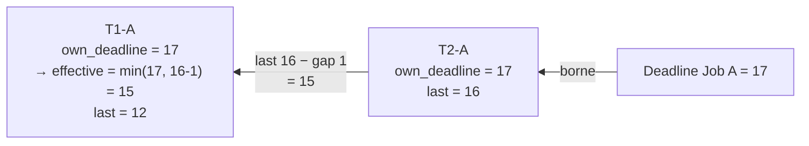

Chaque rollback ALAP doit cascader vers les consumers : si T2-A recule, T1-A doit ré-évaluer son effective_deadline.

### 4.10 `place_backward` de l'action 0 (T1-A)

État initial :
- `t = min(15, 24) = 15`
- `work_remaining = 2.0` (setup=0, run=2).

**Itération 1 :** `t = 14`.
- S0[14] **occupée par T3-B** (la cellule contient le numéro 2 = T3-B). `grid.is_station_free(0, 14) = false`.
- Skip. `apply_peremption_on_skip` est appelé mais `setup_ticks == 0` → la fonction ressort aussitôt sans rien faire, consecutive_skipped n'est pas incrémenté.

**Itération 2 :** `t = 13`.
- S0[13] libre. Alice idle à 13. Picked. Work = 2.0 - 1.0 = 1.0.

**Itération 3 :** `t = 12`.
- S0[12] libre. Alice idle. Picked. Work = 0. earliest = 12.

Retour : `last_tick(T1-A) = 12`.

### 4.11 Sortie du backward pass

```
LAST values :
  T1-A  →  12
  T2-A  →  16
  T3-B  →  14
```

> **Intuition** : le LAST nous dit *« si je pars de la fin et que je recule en respectant toutes les contraintes, voici le tick le plus tard auquel je pourrais commencer sans rater la deadline »*. Plus le LAST est petit, plus l'action est urgente.

---

## 5. Étape 2 — `build_actions`

Après le backward, on convertit les tasks en `Action` (du forward). C'est un autre vecteur qui partage le `task_id` mais indexe différemment.

Ordre dans `build_actions` : jobs dans l'ordre d'arrivée (`Job A`, `Job B`), puis éléments, puis tasks triées par `sequence_order`.

```
Action 0 :
  task_id = "T1-A", job = "job-A", station_idx = 0
  setup_ticks = 0, run_ticks = 2, art = 2, original_art = 2, task_total_ticks = 2
  predecessor_idx = None
  predecessor_gap_ticks = 0
  last = 12          ← récupéré du backward
  deadline_priority = 1
  job_deadline_tick = 17
  chain_remaining_art = 3   ← on additionne le travail de cette task + de toutes celles qui en dépendent (T1 + T2)
  eat = 0, end_tick = None, start_tick = None, work_accumulator = 0.0
  is_pinned = false, pinned_start_tick = None

Action 1 :
  task_id = "T2-A", job = "job-A", station_idx = 1
  setup_ticks = 0, run_ticks = 1, art = 1, original_art = 1, task_total_ticks = 1
  predecessor_idx = Some(0)
  predecessor_gap_ticks = 1   ← drying du prédécesseur (Presse is_press)
  last = 16
  deadline_priority = 1
  job_deadline_tick = 17
  chain_remaining_art = 1

Action 2 :
  task_id = "T3-B", job = "job-B", station_idx = 0
  setup_ticks = 0, run_ticks = 2, art = 2, original_art = 2, task_total_ticks = 2
  predecessor_idx = None
  predecessor_gap_ticks = 0
  last = 14
  deadline_priority = 1
  job_deadline_tick = 16
  chain_remaining_art = 2
```

> **Question pour tester ta compréhension** : pourquoi `predecessor_gap_ticks` sur T1-A est 0 alors qu'on a un `is_press` ? Réponse : le gap s'applique *après* le prédécesseur press, c'est-à-dire au successeur. T1-A est *producteur* de séchage, pas *consommateur*. C'est T2-A qui hérite du gap de 1 tick (sa **pred** est press).

---

## 6. Étape 3 — `pre_split`

Pour chaque action : si `(setup + run) * tick_minutes > max_chunk_minutes`, on découpe. Dans notre scénario :

| Action | `total * tick_minutes` | `max_chunk_minutes` | Découpage ? |
|--------|-----------------------|---------------------|-------------|
| 0 (T1-A) | 2 × 60 = 120 min | 600 min | **non** |
| 1 (T2-A) | 1 × 60 = 60 min | 600 min | non |
| 2 (T3-B) | 2 × 60 = 120 min | 600 min | non |

Rien à faire. (On verra le pre_split en action au §12.)

---

## 7. Étape 4 — Initialisation du forward pass

### 7.1 La grille forward

Neuve. 24 ticks × 2 stations, 24 ticks × 1 opérateur. Tout à `.` / `None`.

### 7.2 Pré-blocage

Pas de `blocked_ranges` ni `occupied_slots` dans notre scénario. Rien à pré-bloquer.

### 7.3 `pre_place_pinned_actions`

Aucune action n'a `is_pinned = true`. Skip. (Voir §14 pour un exemple concret.)

### 7.4 Calcul des caches

```
station_has_qualified_op[0] = vrai  (Alice prof S0 = 1.0)
station_has_qualified_op[1] = vrai  (Alice prof S1 = 1.0)
→ aucune action n'a `art` forcé à 0.

job_remaining_art :
  "job-A" → 2 (T1-A) + 1 (T2-A) = 3
  "job-B" → 2 (T3-B) = 2

station_pending_count (actions non démarrées, art>0, par station) :
  S0 : 2 (T1-A et T3-B)
  S1 : 1 (T2-A)
max_pending = 2

last_action_per_station : [None, None]
earliest_retry[] = [0, 0, 0]
```

### 7.5 Temps : `t = now_tick = 8`

On n'ira jamais avant. C'est l'ancrage anti-passé.

---

## 8. Étape 5 — La boucle forward tick par tick

> **Analogie métier** : après le backward pass, on a une *carte d'urgence*. Maintenant on déroule le planning **du matin vers le soir** : à chaque créneau de 15 min (= 1 tick), on choisit quelle tâche démarrer parmi celles qui sont *prêtes* (prédécesseurs finis, station libre). Celle qui a **le plus de pression** (urgence × priorité × chaîne à tirer × machine bouchée) gagne. Si deux tâches veulent la même presse, la moins prioritaire attend le tick suivant. Une tâche qui doit démarrer mais n'a personne de qualifié se met en *stall* (= en file d'attente).
>
> **Pourquoi tick par tick et pas « tâche par tâche »** : parce que deux tâches peuvent partager un opérateur au même moment (temps masqué). Si on traitait une tâche jusqu'à son terme avant la suivante, la deuxième verrait l'opérateur comme « seul sur sa station » — erreur. On fait donc tout le tick en deux temps : (1) décider qui prend quoi, (2) calculer la productivité maintenant que toutes les affectations sont posées.

Voici le squelette qu'on va répéter :

```
TANT QUE total_art > 0 :
  [A] VIRTUAL RESERVATION
      pour chaque action ACTIVE (start set, end non set, art > 0) :
        marquer ses art cellules futures sur la grille station
  [B] SCORING
      pour chaque action ÉLIGIBLE TO START (filtre multi-critères) :
        calculer score (somme de 7 composantes pondérées)
      tri descendant
  [C] CANDIDATES = [déjà actives triées par start_tick] + [scored]
  [D] PHASE 1A (magnétisme)
      pour chaque action déjà active :
        si ses ops préférés sont tous idle & dispo → assign_action_at_tick
  [E] PHASE 1A.5 (magnétisme de naissance de chunk)
      pour chaque nouvelle candidate qui est un chunk >=2
      dont le prédécesseur vient de finir à t :
        hériter ses ops, assign_action_at_tick
  [F] PHASE 1B (assignation normale)
      pour chaque candidate non handled :
        reset accumulateurs si nouvelle
        apply_chunk_re_setup (§12.4)
        assign_action_at_tick
  [G] PHASE 2 (productivité)
      pour chaque outcome assigné :
        productivité = Σ productivity_at_tick(op, ...)
        work_accumulator += productivité
        art -= floor(work_accumulator) ; accumulator -= ce floor
        eat += 1
        si art == 0 → end_tick = t+1, émettre ComputedAssignment
  [H] AVANCE t
      active_count = actions(start set, end non set, art > 0)
      si active_count == 0 ET next_skip_t > t+1 → t = next_skip_t
      sinon → t += 1
```

Vue en diagramme : la boucle tick-major, avec les 3 phases d'assignation (1A magnétisme, 1A.5 chunk-birth, 1B normale) et la sortie `total_art = 0`.

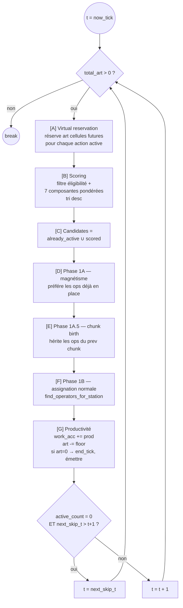

Schéma : les 3 phases d'assignation s'enchaînent pour donner à chaque candidate une chance de démarrer.

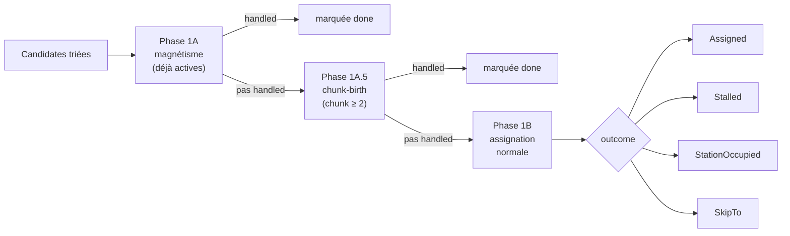

On démarre avec **t = 8**.

### 8.0 bis Les constantes magiques du scoring

Avant de dérouler le tick 8, voici **la carte complète** des constantes numériques qui apparaissent dans les formules de score. Pas de mystère : chacune est un **coefficient d'équilibrage** calibré à la main dans le code Rust (`forward_pass.rs`). Elles sont fixes, pas apprises, pas configurables à chaud (il faut recompiler).

| Constante | Valeur | Où | À quoi ça sert |
|-----------|--------|----|----|
| `TIER_WEIGHT[tier]` | `[4.0, 2.0, 1.0, 0.5]` | Tiers 0-3 | Un impératif (tier 0) pèse **8×** un flexible (tier 3). Chiffres calibrés pour que toute action impérative en retard dépasse toute action flexible, quelle que soit la deadline. |
| `raw_urgency` max | **10 000** | `slack ≤ 0` | Plancher-plafond. Une task dont le slack est négatif (déjà en retard sur son LAST) démarre à 10 000 + `|slack|` — garantit qu'elle bat **toujours** une task à `slack ≥ 0` (max 1000). |
| `raw_urgency` scale | **1000** | `slack > 0` | Échelle de la partie continue : score linéaire de 0 (slack ≥ horizon) à ~1000 (slack → 0). |
| `job_boost` facteur | **50** | `job_slack < 0` | Coefficient d'urgence au niveau *job entier* (somme de ses tasks). `50 × |job_slack| × tier_w`. |
| `proximity_bonus` max | **45** | `0 ≤ job_slack < 1 jour` | Bonus croissant quand le job approche de sa deadline. Calibré à 45 (< 50 de `job_boost`) pour que **tout job à slack=-1 batte toujours tout job à slack=0** du même tier (évite inversion). |
| `calage_bonus` | **100** (binaire) | Prédécesseur sur la station = même job ? | +100 si continuité de job sur la station, 0 sinon. Rend le planning *naturellement* continu par job. |
| `chain_pressure` cap | `min(chain_ratio-1, 5) × 100` | Tête de longue chaîne | Max ~500 points. Ratio du travail aval sur le propre travail de la task. Rend les tasks « tête de chaîne » prioritaires car un retard y cascade. |
| `contention_bonus` | `ratio × 200` | Station chargée | Max 200 points. `ratio = nb_actions_pending_sur_station / max_pending`. Pousse vers les stations goulots. |
| `compatibility_bonus` | `score_sim × 10` | Station différente du calage (different job) | `BONUS_SCALE = 10`. Le score de similarité va jusqu'à 7 sur les Offsets, donc bonus ≤ 70. Récompense la transition « même format papier » entre jobs différents. |
| `station_boost` | `boost × 0.1` | Infrastructure | Inactif en prod (dict toujours vide). |

**Lecture pratique d'un score** : au tick 8, T1-A arrive à 2149. Décomposition :
- 1832 viennent de l'urgence pondérée (slack=2 → raw=916, ×2 car tier 1).
- 67 de la proximité (job_slack=6 ticks, donc 0.75 × 45 × 2).
- 50 de la chain_pressure (T1-A tire T2-A derrière elle).
- 200 de la contention (la Presse est le goulot).

**On peut deviner la hiérarchie implicite** :
1. `weighted_urgency` domine très tôt (x1000 + tier_w).
2. `job_boost` et `proximity_bonus` raffinent quand le job entier est en danger.
3. `chain_pressure`, `contention`, `calage`, `compat` sont des *tiebreakers* à la centaine près.

Quand `multi_start` active les passes perturbées, les **poids multiplicatifs** `score_weights[0..7]` tirent aléatoirement dans `[0.5, 1.5]` pour secouer cet équilibre et voir si un autre plan émerge. Sinon (mode défaut), les poids sont tous à 1.0.

### 8.1 Tick 8 (lundi 08:00)

**État au début** :

```
Tick :             . . . . . . . . 8  9  10 11 12 13 14 15 16 17 ...
S0 :               . . . . . . . . .  .  .  .  .  .  .  .  .  .
S1 :               . . . . . . . . .  .  .  .  .  .  .  .  .  .
Alice :            . . . . . . . . .  .  .  .  .  .  .  .  .  .

Actions :
  0  T1-A  art=2  start=-  end=-
  1  T2-A  art=1  start=-  end=-  pred=0 gap=1
  2  T3-B  art=2  start=-  end=-
```

#### [A] Virtual reservation

Aucune action n'a `start_tick` → rien à faire.

#### [B] Scoring

**Action 0 — T1-A** :
- `art=2`, start non set, `earliest_retry[0]=0 ≤ 8` OK.
- `predecessor_idx = None` ✓.
- `additional_predecessors = []` ✓.
- `grid.is_station_free(0, 8) = true` ✓.
- **Chunk-mini** :
  - `setup_floor = ceil(2.0 * 0) = 0`
  - `slack_preview = 12 - 8 - 2 = 2 ≥ 0` (pas de relaxation B)
  - `task_floor = ceil(0.5 * 2) = 1`
  - `chunk_mini_ticks = min(10, max(0, 1)) = 1`
  - `needed = min(art=2, 1) = 1`
  - `available_work_window(grid, ..., station 0, t=8, needed=1)` : scanne cellule 8. S0[8] libre, Alice dispo → run=1. 1 ≥ 1 ✓.
- Éligible. Calcul du score :
  - `slack = 12 - 8 - 2 = 2`. Positif. `raw_urgency = (1 - 2/24) * 1000 = 916.67` → **916** (le code passe en entier par **coupure à l'entier inférieur**, pas arrondi).
  - `tier_w = TIER_WEIGHT[1] = 2.0`. `weighted_urgency = 916 * 2 = 1832`.
  - `job_remaining_art["job-A"] = 3`. `job_slack = 17 - 8 - 3 = 6`. Positif.
  - `ticks_per_day = 24*60/60 = 24`. `6 < 24` → proximity active. `ratio = 1 - 6/24 = 0.75`. `proximity = 0.75 * 45 * 2.0 = 67.5 → 67`.
  - `job_boost = 0` (job_slack positif).
  - `calage_bonus = 0` (last_action_per_station[0] = None).
  - `chain_pressure` : `chain_remaining_art(3) > art(2)`. `chain_ratio = 3/2 = 1.5`. `(1.5 - 1.0) * 100 = 50`.
  - `contention_bonus` : `station_pending_count[0] = 2`, `max_pending = 2`, ratio = 1.0, bonus = **200**.
  - `compatibility_bonus = 0` (pas de prev action).
  - `station_boost = 0`.
  - **Score = 1832 + 0 + 67 + 0 + 50 + 200 + 0 + 0 = 2149**.

**Action 1 — T2-A** :
- `predecessor_idx = Some(0)`. `actions[0].end_tick = None` → `pred.end + gap ≤ t` faux. **Pas éligible**.

**Action 2 — T3-B** :
- Éligible (tous les filtres passent, chunk_mini identique).
- Score :
  - `slack = 14 - 8 - 2 = 4`. `raw_urgency = (1 - 4/24) * 1000 = 833`. `weighted = 1666`.
  - `job_slack = 16 - 8 - 2 = 6`. `proximity = 67`.
  - `chain_pressure = 0` (chain_rem == art).
  - `contention_bonus = 200`.
  - **Score = 1666 + 67 + 0 + 0 + 0 + 200 + 0 + 0 = 1933**.

**`scored` trié descendant** :
```
[ (Action 0, score 2149), (Action 2, score 1933) ]
```

#### [C] Candidates

`already_active = []`. `candidates = [0, 2]` (dans l'ordre du tri).

#### [D] Phase 1A

`already_active = []`, rien à faire.

#### [E] Phase 1A.5

Aucune action n'est un chunk. Rien.

#### [F] Phase 1B — Action 0 (T1-A)

- `was_new = true`. Reset accumulateurs (déjà à 0, mais on le fait formellement).
- `apply_chunk_re_setup` : pas un chunk, la fonction ne fait rien.
- `assign_action_at_tick(action_idx=0, t=8)` :
  - `station_idx = 0`, `attrs.max_operators = 1`.
  - `group_idx = None` (pas de station group).
  - `grid.station_action_at(0, 8) = None` → pas de `StationOccupied`.
  - `setup_ticks = 0`, `in_setup = 0 < 0 = false` → **run phase**.
  - `preferred = actions[0].assigned_operators = []`. Pas un chunk, pas d'héritage.
  - `find_operators_for_station(grid, 8, 0, ..., &[], 1, is_setup=false)` :
    - Qualifiés : `[(Alice, 1.0)]`.
    - Priority A (idle) : Alice load=0 à t=8, available → candidate.
    - Pas de préférés (liste vide) → tie-break par proficiency desc : Alice.
    - `result = [Alice]`, 1 op.
    - is_setup false → on passe à Priority B, mais `result.len() == max_operators` → break.
  - `operators = [Alice]`.
  - **Shift-end guard** : `action.start_tick is None` → appliquer le guard. Alice dispo à t+1=9 ? Oui. Keep.
  - Écritures grille :
    - `grid.assign_station(0, 8, 0)` → **S0[8] = 0**.
    - `grid.assign_operator(0, 8, 0, 0.0)` → **Alice[8] = {S0}**.
  - `action.assigned_operators = [Alice]`.
  - Retour : `Assigned([Alice])`.
- `was_new` + Assigned → `action.start_tick = 8`.

#### [F] Phase 1B — Action 2 (T3-B)

- `was_new = true`. Reset.
- `assign_action_at_tick(action_idx=2, t=8)` :
  - `station_idx = 0`.
  - `grid.station_action_at(0, 8) = Some(0)` (T1-A que l'on vient de placer). `occupant = 0 ≠ 2` → retour **`StationOccupied`**.
- Pas de `Assigned`. `start_tick` reste `None`.

> Ce cas *« la candidate #2 veut la même station que la candidate #1 qui vient d'être servie »* est normal et prévu par le commentaire `/* rare — only if the algorithm failed to coordinate */`. En pratique ça arrive à chaque fois qu'un tri descendant fait converger deux candidates sur la même ressource.

#### [G] Phase 2

Pour chaque outcome dans `tick_outcomes` :

**T1-A (Assigned [Alice])** :
- `productivity_at_tick(Alice, station 0, 8, grid, ...)` :
  - `operator_stations[Alice][8] = [S0, None]`. `count = 1`, `on_station = true`.
  - `count == 1` → branche solo : prof Alice sur S0 = **1.0**.
- `tick_operator_log.push((8, [Alice]))` — **le log est écrit avant l'avance** (cf. `advance_action_at_tick` l. 1727 dans le code).
- `work_accumulator = 0.0 + 1.0 = 1.0`.
- `work_done = floor(1.0) = 1`. `work_accumulator = 1.0 - 1.0 = 0.0`.
- `art = 2 - 1 = 1`. `eat = 0 + 1 = 1`.
- `total_productivity += 1.0`, `ticks_counted = 1`.
- `art ≠ 0` → pas fini.

**T3-B (StationOccupied)** : rien à faire côté productivité.

#### [H] Avance

`active_count = 1` (T1-A). Pas de skip. `t = 9`.

**État à la fin du tick 8** :

```
Tick :             . . . . . . . . 8  9  10 11 12 13 14 15 16 17 ...
S0 :               . . . . . . . . 0  .  .  .  .  .  .  .  .  .
S1 :               . . . . . . . . .  .  .  .  .  .  .  .  .  .
Alice :            . . . . . . . . S0 .  .  .  .  .  .  .  .  .

Actions :
  0  T1-A  art=1  start=8   end=-  ops=[Alice]  eat=1  work_acc=0.0
  1  T2-A  art=1  start=-   end=-
  2  T3-B  art=2  start=-   end=-
```

### 8.2 Tick 9

**[A] Virtual reservation**

T1-A est active (start=8, end=None, art=1). `station=0`, `art=1`.
Scan à partir de `t+1 = 10` :
- `offset=0`, `future_t=10`. S0[10] libre ✓. Alice dispo à 10 ✓. `grid.assign_station(0, 10, 0)` → **S0[10] = 0 (réservation virtuelle)**. `reserved = 1 = art` → break.

Grille après VR :
```
S0 :    . . . . . . . . 0  .  0' .  .  .  .  .  .  .       ← 0' = réservation
```

(Les autres actions n'ont pas `start_tick` → skip dans la boucle VR.)

**[B] Scoring**

- Action 0 : `start_tick` set → skip (déjà active).
- Action 1 : pred pas fini → skip.
- Action 2 : `grid.is_station_free(0, 9) = true` (cellule 9 pas touchée). Chunk-mini : window from 9 de taille 1. S0[9] libre, Alice dispo. OK. Éligible.
  - `slack = 14 - 9 - 2 = 3`. `raw = (1-3/24)*1000 = 875`. `weighted = 1750`.
  - `job_slack_B = 16 - 9 - 2 = 5`. `proximity = (1-5/24)*45*2 = 71.25 → 71`.
  - chain=0, contention=200, compat=0.
  - **Score = 1750 + 71 + 200 = 2021**.

`scored = [(Action 2, 2021)]`. `already_active = [0]`.

**[D] Phase 1A**

Action 0 : `preferred = [Alice]` (depuis tick 8). Alice à t=9 : dispo ET load=0 ✓. `all_locked_in = true`.
- `assign_action_at_tick(0, 9)` :
  - `grid.station_action_at(0, 9) = None` ✓.
  - `eat=1, setup_ticks=0` → `in_setup = false`.
  - `preferred = [Alice]` (déjà set).
  - `find_operators_for_station(grid, 9, 0, ..., &[Alice], 1, is_setup=false)` → Priority A : Alice idle, préférée, prof 1.0 → pick. `result = [Alice]`.
  - Shift-end : non-new, skip.
  - `grid.assign_station(0, 9, 0)` → **S0[9] = 0**.
  - `grid.assign_operator(0, 9, 0, 0.0)` → **Alice[9] = {S0}**.
  - `Assigned([Alice])`. `handled_in_phase_1a = {0}`.

**[E] Phase 1A.5** — aucun chunk. Skip.

**[F] Phase 1B**

`candidates = [2]` (Action 0 filtrée par `handled_in_phase_1a`).
- Action 2 : `was_new = true`. Reset.
  - `assign_action_at_tick(2, 9)` :
    - `station_idx = 0`. `grid.station_action_at(0, 9) = Some(0)` (T1-A qu'on vient d'écrire). `occupant ≠ 2` → **`StationOccupied`**.
- Pas d'assignation. `start_tick` reste `None`.

**[G] Phase 2**

- T1-A (Assigned [Alice]) :
  - `productivity = 1.0`. `work_acc = 1.0`. `work_done = 1`. `art = 1 - 1 = 0`. `eat = 2`. `total_productivity = 2.0`, `ticks_counted = 2`.
  - `art == 0` → **`end_tick = 10`**. Fin !

- T3-B (StationOccupied) : rien.

**Émissions** : T1-A newly_done → `build_assignment_for` :
- `start_t = 8`, `end_t = 10`, `setup_end = None` (setup_ticks=0).
- `build_operator_assignments([(8, [Alice]), (9, [Alice])], ...)` : ticks contigus, même op, même attention (1.0 puisque load=1 partout). Un seul segment : Alice 8→10, attention 1.0.
- `effective_productivity = 2.0 / 2 = 1.0`.
- `scheduled_start = format_minutes(8 * 60, 2026-04-27) = "2026-04-27T08:00:00"`.
- `scheduled_end = "2026-04-27T10:00:00"`.
- `last_action_per_station[0] = Some(0)`.
- `job_remaining_art["job-A"] -= 2` → 1.

**[H] Avance**

`active_count = 0` (T1-A vient de finir ; T3-B stalled ; T2-A pas démarré). Pas de `SkipTo`. `t = 10`.

**État fin tick 9** :

```
Tick :             . . . . . . . . 8  9  10 11 12 13 14 15 16 17 ...
S0 :               . . . . . . . . 0  0  0' .  .  .  .  .  .  .     ← 0' est la VR stale
S1 :               . . . . . . . . .  .  .  .  .  .  .  .  .  .
Alice :            . . . . . . . . S0 S0 .  .  .  .  .  .  .  .

Actions :
  0  T1-A  art=0  start=8   end=10  ← done, assignment émise
  1  T2-A  art=1  start=-   end=-
  2  T3-B  art=2  start=-   end=-

Assignments : [ T1-A on S0, 08:00–10:00, Alice 08:00–10:00 attn 1.0 ]
```

> **À noter** : la cellule S0[10] a été **réservée virtuellement** à l'étape [A] du tick 9 parce qu'à ce moment T1-A était active avec art=1. T1-A a complété à l'étape [G] sans avoir besoin de la cellule 10 (elle a écrit directement S0[9] en Phase 1A et terminé là). **La réservation virtuelle reste inscrite sur S0[10] et n'est pas nettoyée**. Elle va bloquer toute nouvelle candidate à la cellule 10. On verra ça au tick 10.

### 8.3 Tick 10

**[A] Virtual reservation** : aucune action active → skip.

**[B] Scoring**

- Action 1 (T2-A) : `predecessor_idx = Some(0)`. `actions[0].end_tick = Some(10)`. `10 + 1 (gap) = 11 ≤ 10` faux. **Pas éligible**.
- Action 2 (T3-B) : `grid.is_station_free(0, 10) = false` (cellule = `Some(0)`, réservation stale). **Filter échoue**. Pas éligible.

`scored = []`. `already_active = []`.

**[C-G]** rien à faire.

**[H] Avance** : `active_count = 0`, pas de skip. `t = 11`.

> **Attention à ne pas confondre** : « tick perdu » désigne un tick **de scheduling**, pas un tick **de production réelle**. Concrètement : pendant ce tick-là, le moteur ne démarre pas de nouvelle task, mais **la presse n'est pas inactive pour autant** — elle continue à tourner sur T1-A si T1-A n'avait pas encore fini, ou reste libre avant la prochaine task programmée. C'est le prix de la *réservation virtuelle* non nettoyée : une cellule marquée « prise par T1-A » qui finalement ne l'a pas utilisée. C'est un « faux frais » structurel (≤ 1 tick par action active qui finit plus tôt que prévu), borné et absorbé par le slack et les LAST. **Rien de cassé** — juste une optimisation qu'on pourrait récupérer en cleanupant les cellules de VR à la fin d'une action.

### 8.4 Tick 11

**[A] VR** : rien.

**[B] Scoring**

- Action 1 (T2-A) : `actions[0].end_tick = Some(10)`. `10 + 1 = 11 ≤ 11` ✓. `grid.is_station_free(1, 11) = true` ✓. Chunk-mini : needed = min(1, 1) = 1. S1[11] libre, Alice dispo → window=1. OK.
  - `slack = 16 - 11 - 1 = 4`. `raw = (1-4/24)*1000 = 833`. `weighted = 1666`.
  - `job_slack_A = 17 - 11 - 1 = 5`. `proximity = (1-5/24)*45*2 = 71`.
  - `chain=0`. `contention` : S1 pending = 1, ratio = 0.5, bonus = 100. `calage_bonus` : `last_action_per_station[1] = None` → 0. compat=0.
  - **Score T2-A = 1666 + 71 + 100 = 1837**.

- Action 2 (T3-B) : `grid.is_station_free(0, 11) = true` ✓. Chunk-mini needed=1. S0[11] libre, Alice dispo → window=1. OK.
  - `slack = 14 - 11 - 2 = 1`. `raw = (1-1/24)*1000 = 958`. `weighted = 1916`.
  - `job_slack_B = 16 - 11 - 2 = 3`. `proximity = (1-3/24)*45*2 = 78.75 → 78`.
  - `chain=0`. `contention = 200`. `calage_bonus` : `last_action_per_station[0] = Some(0)` (T1-A). `actions[0].job_id = "job-A" ≠ "job-B"` → **0**. `compat=0` (pas de rules dans notre scénario).
  - **Score T3-B = 1916 + 78 + 200 = 2194**.

`scored = [ (2, 2194), (1, 1837) ]`. T3-B gagne.

**[D-E]** rien.

**[F] Phase 1B**

- Action 2 (T3-B) : `was_new`. Reset.
  - `assign_action_at_tick(2, 11)` :
    - S0[11] free ✓. `in_setup = 0 < 0 = false`. Run phase.
    - preferred empty.
    - `find_operators` : Alice idle à 11, dispo. `result = [Alice]`.
    - Shift-end : is_new ; Alice dispo à 12 ? Oui. Keep.
    - `S0[11] = 2`, `Alice[11] = {S0}`. `action.assigned_operators = [Alice]`.
    - `Assigned([Alice])`. `start_tick = 11`.

- Action 1 (T2-A) : `was_new`. Reset.
  - `assign_action_at_tick(1, 11)` :
    - S1[11] free ✓. `in_setup = 0 < 0 = false`.
    - preferred empty.
    - `find_operators(preferred=[], max=1, is_setup=false)` :
      - Qualifiés S1 : Alice (prof 1.0).
      - Priority A idle : Alice à t=11 load=**1** (on vient de lui affecter S0). Pas idle.
      - Priority B pair : load=1 ✓, `other_station = S0`, `pair = {S0, S1}`. Est-ce que ça matche un groupe de Alice ? `operator_groups[Alice] = []` → **non**.
      - Result empty.
    - `operators.is_empty() && num_operators > 0` → **Stall** path.
    - `idle_ticks[T2-A] += 1` = 1.
    - `grid.assign_station(1, 11, 1)` → **S1[11] = 1** (on marque la station prise par nous-mêmes pour garder la place).
    - `apply_peremption_rule` : `idle_ticks=1 < peremption_ticks=2` → retourne `false` (pas de péremption à ce tick). Note : avec `setup_ticks=0`, si `idle_ticks` finissait par atteindre le seuil, la branche post-setup s'exécuterait mais `art += 0` ne changerait rien — effet neutre, inoffensif.
    - Check `any_qualified_available` : Alice prof S1 > 0 ET `is_available(Alice, 11) = true`. Oui → on ne fait PAS SkipTo. Retour **`Stalled`**.
  - Outcome `Stalled`. `was_new` et pas `Assigned` → `start_tick` reste `None`.

**[G] Phase 2**

- T3-B (Assigned [Alice]) : productivité solo S0 = 1.0. `work_acc=1.0`, `work_done=1`. `art=1`, `eat=1`. `total_productivity=1.0`, `ticks_counted=1`.
- T2-A (Stalled) : rien.

**[H] Avance** : `active_count = 1` (T3-B). `t = 12`.

**État fin tick 11** :

```
Tick :             . . . . . . . . 8  9  10 11 12 13 14 15 16 17 ...
S0 :               . . . . . . . . 0  0  0' 2  .  .  .  .  .  .
S1 :               . . . . . . . . .  .  .  1  .  .  .  .  .  .
Alice :            . . . . . . . . S0 S0 .  S0 .  .  .  .  .  .

Actions :
  0  T1-A  art=0  start=8  end=10  (done)
  1  T2-A  art=1  start=-  end=-  idle_ticks=1
  2  T3-B  art=1  start=11 end=-  ops=[Alice]  eat=1
```

> Note : S1[11] = 1 est une « réservation de stall ». T2-A a réservé la station sans y produire de travail (pas d'opérateur). Ça empêche qu'une autre action se place sur S1[11] en parallèle. À t=12, T2-A relancera son tour, retrouvera Alice toujours bloquée sur S0 (elle fait T3-B), et stall encore.

### 8.5 Tick 12

**[A] VR**

T3-B active (art=1). Scan à partir de 13 :
- S0[13] libre ✓, Alice dispo à 13 ✓. Reserve. **S0[13] = 2**. `reserved=1`.

```
S0 :    ...  0  0  0' 2  .  2' .  ...
                        ↑     ↑
                      actual  VR
```

**[B] Scoring**

- Action 1 (T2-A) : `grid.is_station_free(1, 12)` ? S1[12] = None (on n'a écrit S1[11], pas 12). ✓. Chunk-mini=1, window=1. OK.
  - `slack = 16 - 12 - 1 = 3`. `raw = 875`. `weighted = 1750`.
  - `job_slack_A = 17 - 12 - 1 = 4`. `proximity = (1-4/24)*45*2 = 75`.
  - `chain=0, contention=100, calage=0, compat=0`.
  - **Score = 1925**.

**[D] Phase 1A**

T3-B préférés = [Alice]. Alice à t=12 : load=0 (on est à 12, pas 11). Dispo 12 ? Oui. all_locked_in ✓.
- `assign_action_at_tick(2, 12)` :
  - `S0[12] = None` ✓.
  - `in_setup = false`.
  - `preferred = [Alice]`.
  - `find_operators` : Alice idle, préférée → pick.
  - `S0[12] = 2`, `Alice[12] = {S0}`.
  - Assigned. `handled_1a = {2}`.

**[F] Phase 1B**

`candidates = [1]`.
- T2-A : `was_new` (start toujours None). Reset.
  - `assign_action_at_tick(1, 12)` :
    - `grid.station_action_at(1, 12) = None` ✓.
    - `find_operators` : Alice load=1 (on vient de la placer sur S0). Priority A empty. Priority B : load=1, `other_station = S0`, pair {S0, S1}, groupes Alice vides → empty.
    - Stalled.

**[G] Phase 2**

- T3-B : prod=1.0. `art=0`, `eat=2`. **end_tick=13**. Done !
- T2-A : rien.

**Émission T3-B** : `start=11, end=13, Alice 11→13 attn 1.0`. `last_action_per_station[0] = 2`. `job_remaining_art["job-B"] -= 2` → 0.

**[H] Avance** : `active_count = 0`. `t = 13`.

**État fin tick 12** :

```
Tick :             . . . . . . . . 8  9  10 11 12 13 14 15 16 17 ...
S0 :               . . . . . . . . 0  0  0' 2  2  2' .  .  .  .
S1 :               . . . . . . . . .  .  .  1  .  .  .  .  .  .
Alice :            . . . . . . . . S0 S0 .  S0 S0 .  .  .  .  .

Actions :
  0  T1-A  done
  1  T2-A  art=1  start=- end=- idle_ticks grows
  2  T3-B  art=0  start=11 end=13 (done)

Assignments : [ T1-A 08-10 Alice, T3-B 11-13 Alice ]
```

### 8.6 Tick 13

**[A] VR** : aucune action active. Skip.

**[B] Scoring**

- T2-A : `actions[0].end_tick = 10`, `10 + 1 = 11 ≤ 13` ✓. `is_station_free(1, 13)` ? S1[13] = None ✓. Chunk-mini=1, window=1 OK. Éligible.
  - `slack = 16-13-1 = 2`. `raw = (1 - 2/24) * 1000 = 916.67 → 916` (coupure à l'entier inférieur). `weighted = 916 * 2 = 1832`.
  - `job_slack_A = 17-13-1 = 3`. `proximity = (1-3/24)*45*2 = 78`.
  - `calage = 0` (last_action_per_station[1] = None). `chain=0, contention=100, compat=0`.
  - **Score = 1832 + 78 + 100 = 2010**.

**[F] Phase 1B**

- T2-A : `was_new`. Reset.
  - `assign_action_at_tick(1, 13)` :
    - S1[13] free ✓. `in_setup = false`.
    - `find_operators` : Alice idle à 13 (son dernier tick sur S0 était 12). load=0. prof S1=1.0. pick.
    - Shift-end : dispo 14 ? Oui. Keep.
    - `S1[13] = 1`, `Alice[13] = {S1}`. `assigned_operators = [Alice]`.
    - Assigned. **`start_tick = 13`**.

**[G] Phase 2**

- T2-A : prod=1.0. `art=0`, `eat=1`. **end_tick=14**. Done !

**Émission T2-A** : `start=13, end=14, Alice 13→14 attn 1.0`. `last_action_per_station[1] = 1`. `job_remaining_art["job-A"] -= 1` → 0.

**[H] Avance** : `active_count = 0`. `t = 14`.

### 8.7 Tick 14 et après

`total_art = 0`. **Break**. Fin du forward pass.

```
Assignments finales :
  T1-A  S0  08:00 → 10:00  [Alice 08–10 attn 1.0]
  T3-B  S0  11:00 → 13:00  [Alice 11–13 attn 1.0]
  T2-A  S1  13:00 → 14:00  [Alice 13–14 attn 1.0]
```

Vue Gantt du résultat final : on voit bien le tick 10 perdu (VR stale), le chevauchement zéro entre assignments d'Alice, et la chaîne T1-A → (drying) → T2-A sur les deux stations.

```mermaid
gantt
    title Scénario fil rouge — résultat final (lundi 2026-04-27)
    dateFormat HH:mm
    axisFormat %H:%M
    section Presse
    T1-A Job A       :a1, 08:00, 2h
    VR stale perdue  :crit, 10:00, 1h
    T3-B Job B       :a2, 11:00, 2h
    section Plieuse
    T2-A Job A       :a3, 13:00, 1h
    section Alice
    T1-A             :op1, 08:00, 2h
    idle             :done, 10:00, 1h
    T3-B             :op2, 11:00, 2h
    T2-A             :op3, 13:00, 1h
```

Vérification des deadlines :
- Job A : T1-A end=10, T2-A end=14. `max = 14 ≤ 17` ✓.
- Job B : T3-B end=13 ≤ 16 ✓.

**Aucun late job**. FBI n'a pas besoin de boucler, Moore et LNS sont skippés (on a `skip_lns = true` et `late_job_count = 0`).

---

## 9. Étape 6 — Post-processing

### 9.1 `merge_chunk_assignments`

Comme aucune action n'était un chunk (aucune task ne contenait `_chunk_` dans son id), chaque assignment passe tel quel. La seule vraie opération ici est `coalesce_operator_segments` sur chaque assignment : si un même opérateur a travaillé plusieurs segments d'affilée avec la même attention, on les **fusionne en un seul segment continu**. On a 1 opérateur par assignment avec un seul segment continu, donc rien à fusionner.

### 9.2 Cross-reference d'opérateurs

`cross_reference_operators` : pour chaque paire d'assignments dont les fenêtres se chevauchent, si un opérateur est dans l'un et pas dans l'autre, on l'ajoute à l'autre. Nos 3 assignments ne se chevauchent pas (8-10, 11-13, 13-14) → rien à faire.

### 9.3 `is_masked_time` + correction d'attention

Pour chaque assignment, on construit le dictionnaire `op → liste des (i, from, to)` des assignments incluant cet op. Puis :

- Pour chaque opérateur de chaque assignment, on vérifie :
  - a-t-il du travail concurrent sur une **autre** assignment qui chevauche ?
  - a-t-il un chevauchement avec un **sibling** dans la même assignment ?
- Si **aucun des deux** → attention = 1.0 (= exclusif pendant sa fenêtre).

Dans notre cas : Alice est sur 3 assignments non-chevauchantes → les 3 gardent `attention = 1.0`.

`is_masked_time` : ici faux partout (`masked_time_enabled = false` sur les deux stations).

### 9.4 `recompute_stats_from_assignments`

On recalcule à partir des assignments finales :

```
job_max_end_minutes :
  "job-A" → max(10*60, 14*60) = 840 min (14:00)
  "job-B" → 13*60 = 780 min (13:00)

job_deadlines :
  "job-A" → 17*60 = 1020 min
  "job-B" → 16*60 = 960 min

deadline_violations = 0
late_task_count = 0
total_lateness_minutes = 0
late_jobs = ∅
weighted_lateness_minutes = 0
weighted_late_job_count = 0
makespan = max(840, 780) = 840 min  → 14 heures depuis minuit

calage_bonus (§17) : calcul plus bas.

late_job_count = 0
```

Calage bonus — on regroupe les assignments par station triées par start :
- **S0** : [T1-A @ 08:00, T3-B @ 11:00]. Bonus : T1-A (premier, pas de prev) = 0. T3-B : prev = T1-A ; job_id différent → 0.
- **S1** : [T2-A @ 13:00]. Bonus : 0.
- bonuses = [0, 0, 0]. sum=0, mean=0, median=0.

Final ScheduleStats :
```
makespan_minutes = 840
total_tasks = 3
scheduled_tasks = 3
deadline_violations = 0
late_task_count = 0
total_lateness_minutes = 0
late_job_count = 0
weighted_lateness_minutes = 0
weighted_late_job_count = 0
late_job_ids = []
calage_bonus_sum = 0
calage_bonus_mean = 0.0
calage_bonus_median = 0.0
```

Résultat final retourné :

```json
{
  "assignments": [
    { "task_id": "T1-A", "station_id": "presse",
      "scheduled_start": "2026-04-27T08:00:00",
      "scheduled_end":   "2026-04-27T10:00:00",
      "setup_end": null, "is_degraded": false, "effective_productivity": 1.0,
      "is_masked_time": false, "recalages": [],
      "operators": [{ "operator_id": "alice", "from": "...T08:00:00", "to": "...T10:00:00", "attention": 1.0 }]
    },
    { "task_id": "T2-A", "station_id": "plieuse", "start": "...T13:00:00", "end": "...T14:00:00", ... },
    { "task_id": "T3-B", "station_id": "presse",  "start": "...T11:00:00", "end": "...T13:00:00", ... }
  ],
  "stats": { "makespan_minutes": 840, "late_job_count": 0, ... },
  "warnings": [],
  "fbi_iterations": 1,
  "compute_time_ms": <mesure>,
  "tick_minutes": 60
}
```

---

# Partie 2 — Les mécanismes non visités, en mini-scénarios

Le fil rouge n'a pas montré la péremption, le découpage, le temps masqué, les pin, plusieurs itérations FBI, Moore ou LNS. On va les voir **isolément**, en repartant de la même géométrie (Alice + 2 stations) mais en changeant un paramètre à la fois.

## 10. Péremption du calage

Vue en diagramme : cycle de vie d'une Action avec les transitions déclenchées par la péremption. `setup` peut être annulé (rewind complet) ou le `run` interrompu (re-calage requis).

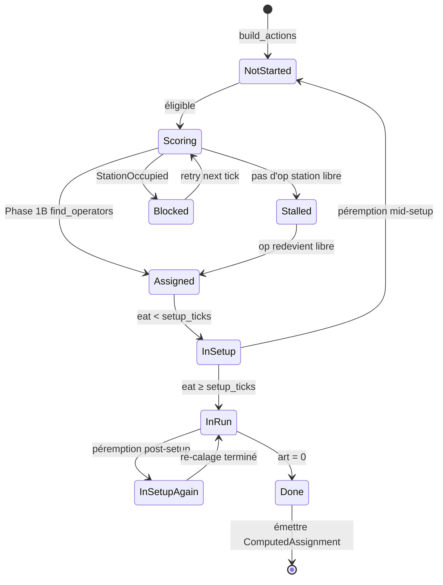

### 10.1 Variante mid-setup

Configuration : `setup_ticks = 4, run_ticks = 6, peremption_ticks = 3`. `eat = 2` (mi-setup), `idle_ticks` grimpe à 3.

`apply_peremption_rule` dans `forward_pass.rs:1483` :
```
si 0 < eat (2) < setup_ticks (4) :
  a.art += a.eat   →  a.art = art + 2
  a.eat = 0
  a.work_accumulator = 0
  a.idle_ticks = 0
  a.peremption_count += 1
  return true
```

Interprétation : on a commencé à monter la presse (2 ticks de calage sur 4), trop de temps est passé, la machine s'est refroidie, **on a perdu ces 2 ticks, il faut recommencer**.

Pédagogiquement :

```
Avant : art=8, eat=2, idle_ticks=3, peremption_count=0
            (2 ticks de setup faits + 6 run à faire = 8 restant)
Après : art=10, eat=0, idle_ticks=0, peremption_count=1
            (4 setup + 6 run = 10 restant)
```

### 10.2 Variante post-setup

Configuration : `setup_ticks = 4, run_ticks = 6, peremption_ticks = 3`. `eat = 7` (setup fait, 3 ticks de run faits), `idle_ticks = 3`.

```
si eat (7) >= setup_ticks (4) ET eat < setup + run (10) :
  a.art += setup_ticks   →  a.art = art + 4
  a.eat = 0
  a.work_accumulator = 0
  a.idle_ticks = 0
  a.peremption_count += 1
  a.pending_recalage = true
  return true
```

```
Avant : art=3, eat=7, setup=4, run=6 (3 ticks de run restant)
Après : art=7, eat=0 (on se RE-cale), pending_recalage=true
```

Interprétation : on a commencé à imprimer, le calage s'est défait physiquement (encre, registration), on garde le travail de run déjà fait (art ne grandit que de setup_ticks, pas de run_ticks+setup_ticks), mais **on doit refaire le calage avant de reprendre**. Au premier tick productif après, `pending_recalage = true` déclenche l'ouverture d'un segment dans `recalage_segments`. Quand `eat` atteint à nouveau `setup_ticks` (re-calage terminé), le segment est fermé, et `advance_action_at_tick` pousse `(start, t+1)` dans `recalage_segments`.

Résultat visible dans `ComputedAssignment.recalages` :
```json
"recalages": [
  { "start": "2026-04-27T14:00:00", "end": "2026-04-27T15:00:00" }
]
```

### 10.3 Garde anti-runaway

`MAX_PEREMPTION_RETRIES = 3`. Au-delà, `apply_peremption_rule` renvoie `false` sans rien changer à l'action : **l'action reste candidate** au scoring et au placement, mais la règle ne peut plus forcer de nouveau re-setup. C'est un plafond sur le **coût de re-calage**, pas un retrait de l'action de la file.

### 10.4 Pourquoi le backward **n'applique** la péremption qu'en post-setup

Dans `place_backward`, `apply_peremption_on_skip` ne rajoute du travail que si `work_remaining <= setup_ticks` (autrement dit, on est *déjà* dans la phase post-setup, qui en backward correspond à *atteindre* le setup au fond). Et si `setup_ticks == 0`, rien ne se passe. Sémantiquement : si tu dois poser des plaques avant de produire, et qu'une longue fenêtre idle se glisse entre deux ticks productifs, il faudra re-poser les plaques — le coût est réel.

---

## 11. Le découpage : `pre_split` en action

### 11.1 Scénario

Remplace T1-A par : `setup = 60min (1 tick), run = 480 min (8 ticks) → total 9 ticks`. Presse a `max_chunk = 240 min = 4 ticks`.

Règle : `total > max_chunk` (9 > 4) → **split**.

```
num_chunks = ceil(9 / 4) = 3

chunk 1 (chunk_n = 1, is_first = true, is_last = false) :
  setup_ticks = 1 (original)
  run_in_chunk = 4 - 1 = 3    ← le setup prend 1 tick du chunk, reste 3 pour le run
  total = 4
  predecessor_idx = pred d'origine (remap) = None
  task_id = "T1-A" (garde l'id original)

chunk 2 (middle) :
  setup_ticks = 0
  run_in_chunk = 4
  total = 4
  predecessor_idx = Some(idx_chunk_1)
  task_id = "T1-A_chunk_2"

chunk 3 (last) :
  setup_ticks = 0
  remainder = 9 - 4 - 4 = 1
  run_in_chunk = 1
  total = 1
  predecessor_idx = Some(idx_chunk_2)
  task_id = "T1-A_chunk_3"
```

Le vecteur d'actions passe de 3 éléments (T1-A, T2-A, T3-B) à 5 : `[chunk_1, chunk_2, chunk_3, T2-A, T3-B]`. Les indices de prédécesseurs sont **remappés** via `original_to_last_chunk` :

- T2-A avait `predecessor_idx = Some(0)` (T1-A original). Dans le nouveau vecteur, T1-A est devenue 3 chunks. Le remap pointe sur le **dernier chunk** → `predecessor_idx = Some(idx_chunk_3)`. La raison : T2-A attend que tout T1-A soit terminé, pas juste chunk 1.

### 11.2 Le `apply_chunk_re_setup` pendant l'exécution du forward

Quand un chunk 2+ démarre, `apply_chunk_re_setup` regarde la station en arrière pour voir si une action d'un **autre job** a occupé la station entre le chunk précédent et ce chunk :

```
si chunk_n > 1 ET chunk.setup_ticks == 0 :
  scan station_ticks en arrière depuis start_t
  prev_action = première cellule non vide
  si prev_action.job_id != ma_job_id :
    # une autre task a "perdu" mon calage entre-temps
    original_setup = setup_ticks du chunk 1 (on remonte la chaîne des predecessor_idx)
    self.setup_ticks = original_setup
    self.art += original_setup
```

Dans la chaîne de travail de la presse, c'est le cas : si entre chunk 1 et chunk 2 de T1-A on a laissé tourner T3-B sur la même presse, alors chunk 2 doit re-caler.

---

## 12. Temps masqué (concurrent groups)

### 12.1 Scénario

Ajoutons un 2ᵉ opérateur Bob avec skills S0=1.0 et S1=1.0, et déclarons un concurrent group :

```
Bob.concurrent_groups = [
  { station_ids: ["presse", "plieuse"],
    effective_productivity: { "presse": 0.85, "plieuse": 0.90 } }
]
```

Gardons 2 jobs indépendants : T_A sur presse, T_B sur plieuse, tous les deux setup=0, run=2 ticks, priority 2, deadlines lundi 17h.

### 12.2 Ce que ça change dans `find_operators_for_station`

Vue en diagramme : logique de priorités pour sélectionner les opérateurs. Priority A cherche les idle, Priority B cherche une paire concurrent_group. Le shift-end guard filtre les opérateurs qui partent juste après.

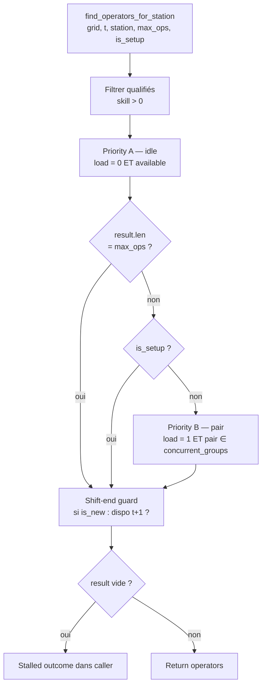

Au tick 8, les deux tasks sont éligibles. Disons on traite T_A en premier :

- `find_operators(grid, 8, 0, preferred=[], max=1, is_setup=false)` :
  - Qualifiés S0 : Alice (1.0), Bob (1.0).
  - Priority A idle : both. Sort proficiency desc tied → random. Disons Alice gagne.
  - result = [Alice].
- `S0[8] = T_A`, `Alice[8] = {S0}`.

Puis T_B :

- `find_operators(grid, 8, 1, preferred=[], max=1, is_setup=false)` :
  - Qualifiés S1 : Alice, Bob.
  - Priority A idle à 8 : Bob (Alice est sur S0). `result = [Bob]`.
  - is_setup false, pass à Priority B ; result.len() == max_operators → break.
- `S1[8] = T_B`, `Bob[8] = {S1}`.

Jusque-là pas de temps masqué (chacun son job).

### 12.3 Le cas où Bob **pair**

Imaginons maintenant **2 tasks sur les 2 stations mais qu'Alice est occupée ailleurs et seul Bob est libre**. Cas classique : T_A sur presse démarre au tick 8 avec Alice ; T_B sur plieuse démarre au tick 8 avec Bob.

Au tick 9, T_A est toujours active (Alice sur S0). T_B finit et libère Bob. Une nouvelle task T_C arrive sur S1, setup=0 run=2.

- `find_operators(grid, 9, 1, ..., max=1, is_setup=false)` :
  - Priority A idle : Bob (load=0 à 9 puisqu'il a fini T_B). → pick Bob.

Pas de pairing parce qu'Alice est toujours occupée ailleurs : Bob vient en solo.

Maintenant le **vrai scénario de pair** : T_A et T_C démarrent tous les deux au tick 8, mais on n'a que Bob de dispo (Alice en congés).

- T_A scoring gagne d'abord. `find_operators(grid, 8, 0, max=1, is_setup=false)`. Priority A idle : Bob. Setup=0 donc in_setup=false mais on traite le tick 0 (eat=0 < setup=0 est faux, so on est en run phase) - wait, avec setup=0 la phase est directement run. `is_setup_phase` passed to function = false. → Bob picked solo.
- `S0[8] = T_A`, `Bob[8] = {S0}`, `assigned_operators = [Bob]`.
- T_C : `find_operators(grid, 8, 1, max=1, is_setup=false)` :
  - Priority A idle : personne (Bob load=1, Alice absente).
  - Priority B pair : Bob load=1, other_station=S0, pair {S0, S1}. `operator_groups[Bob]` contient `{S0, S1}` → match. **Bob picked in pair**.
- `S1[8] = T_C`, `Bob[8] += S1 = {S0, S1}`. `Bob.operator_stations_at(8) = [Some(S0), Some(S1)]`.

Productivités au tick 8 :
- `productivity_at_tick(Bob, S0, 8, grid, groups, skills)` : load=2, pair=[S0,S1]. Trouve le group `{S0,S1}` avec productivity `[0.85, 0.90]`. `productivity_for(S0) = 0.85`. → **0.85**.
- `productivity_at_tick(Bob, S1, 8, grid, groups, skills)` : même groupe, `productivity_for(S1) = 0.90`. → **0.90**.

Chaque action avance à sa productivité propre. T_A fera 0.85 par tick au lieu de 1.0 ; elle aura besoin de `2 / 0.85 ≈ 2.35` ticks au lieu de 2 (work_accumulator accumule 0.85 par tick ; après 3 ticks on a 2.55 > 2, donc ça finit au tick 11 au lieu de 10).

### 12.4 Pourquoi le setup bloque le pairing

Dans `find_operators_for_station` :
```
if is_setup_phase {
    return result;  // on sort avant Priority B
}
```

Intuition métier : quand on monte les plaques, impossible de faire autre chose simultanément. Une fois le calage fait et la machine tournante, l'opérateur peut surveiller une autre.

### 12.5 Phase de post-processing `is_masked_time`

Après le forward pass, `compute_inner` parcourt les assignments :
```
is_masked_time = station.masked_time_enabled
                 AND has_run_phase (setup_end != scheduled_end)
```

Et si `is_masked_time == true`, on **retire** les opérateurs dont la fenêtre `to ≤ setup_end` (ils n'étaient présents que pour le calage, pas le run masqué).

---

## 13. Les pins

### 13.1 Scénario

Ajoute `T_pinned` sur la Plieuse, `setup=0, run=1, is_pinned=true, pinned_start_tick=15`.

### 13.2 Comportement

**Backward pass** : `place_backward_pinned` saute le calcul ALAP et pose directement le résultat :
```
last_tick = pinned_start_tick = 15
grid.assign_station(S1, 15, MAX)  ← valeur témoin, pas le numéro d'action
```

La valeur-témoin `MAX` (= « cellule figée ») empêche d'autres actions de revendiquer le slot pendant le backward. Les prédécesseurs verront `last_tick = 15`, donc leur `effective_deadline` sera resserrée à `15 - gap`.

**Forward pass** : `pre_place_pinned_actions` tourne **avant** la boucle principale.
- Réserve `[15, 16)` sur la grille avec l'idx de l'action (pas MAX) : `S1[15] = idx_T_pinned`.
- Cherche des opérateurs : `find_operators_for_station(15, S1, ..., is_setup = false)`. Si aucun (Alice en congés ? hors horaires ?), fallback : choisir n'importe quel opérateur qualifié dans l'ordre de proficiency desc. Ajouter à `assigned_operators` + à la grille + à `tick_operator_log`.
- Set `start_tick = 15, end_tick = 16, art = 0, eat = 1`.
- **Émet immédiatement** la `ComputedAssignment`.

Dans la boucle principale, l'action a `art = 0` → skip complet.

### 13.3 Conséquences sur le reste

Les successeurs voient `T_pinned.end_tick = 16` et pourront démarrer à `16 + gap`. Les autres actions ne peuvent pas s'intercaler sur la cellule 15 de S1.

---

## 14. FBI itération ≥ 2 (mid-FBI boost)

Reprenons notre scénario fil-rouge mais avec `tick_minutes = 30` et un horizon plus serré qui rend T3-B **impossible à finir à temps** en 1 itération.

Vue en diagramme : convergence de la boucle FBI, avec boost des late jobs entre deux itérations. Le boost ne touche que le backward ; le forward lit les priorités originales.

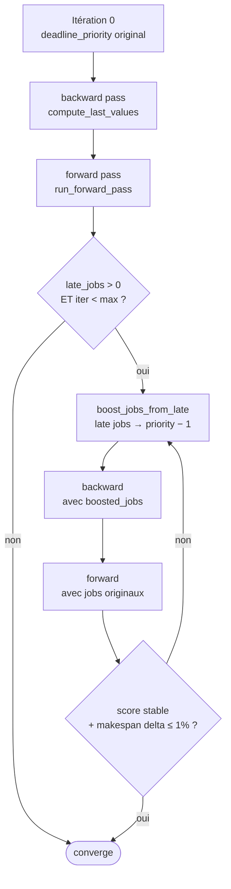

### 14.1 Fin de l'itération 1

Supposons `stats.late_job_ids = ["job-B"]`.

Code pertinent (`fbi.rs`) :
```rust
if !best_stats.late_job_ids.is_empty() {
    let late_set = ... ;
    boosted_jobs = jobs.iter().map(|j| {
        let mut j2 = j.clone();
        if late_set.contains(j.id.as_str()) {
            j2.deadline_priority = j.deadline_priority.saturating_sub(1);
        }
        j2
    }).collect();
}
```

Concrètement : Job B (priority initiale 1) devient priority 0 **pour l'itération 2**. Les autres jobs gardent leur priorité.

### 14.2 Itération 2 du backward pass

`compute_last_values(boosted_jobs, ...)` :
- Job B est maintenant **tier 0**. Processing order : `tier 0 → tier 1 → tier 2 → tier 3`. Donc T3-B est placée **avant** T1-A et T2-A.
- Elle place sans rencontrer d'occupation (la grille backward est vierge), récupère des cellules très tardives.
- T1-A et T2-A voient la grille déjà occupée par T3-B aux ticks backward choisis, et doivent reculer plus loin → LAST(T1-A) et LAST(T2-A) potentiellement plus petits.

### 14.3 Itération 2 du forward pass

Au forward, le **`action.deadline_priority`** utilisé par les `TIER_WEIGHT` reste celui du `jobs` original (pas boosted) parce que `build_actions` est appelée avec `jobs` (non boosted) — la ligne 174 : `let mut actions = build_actions(jobs, ...)`. **Seul le backward voit les priorités boostées**, pour calculer des LAST plus serrés.

Effet global : Job B a un LAST plus précoce sur T3-B au forward pass, donc un `weighted_urgency` plus élevé, donc il sera placé plus tôt dans la boucle tick-major.

### 14.4 Convergence

À chaque itération on compare :
```
score = (weighted_late_job_count, weighted_lateness_minutes, makespan_minutes)
```

Si iter 2 améliore strictement → on garde. Sinon on conserve iter 1.

Condition d'arrêt : `|makespan - prev_makespan| ≤ 0.01 × prev_makespan` (inégalité **large**, cf. `fbi.rs:302-303`) **ET** `lateness stable` (weighted_late_count == prev ET weighted_lateness == prev).

---

## 15. Moore — l'échappatoire

> **Analogie métier** : FBI a fini et il reste **des jobs en retard**. Moore joue le rôle du *chef d'atelier qui appelle son directeur* : « Monsieur X va sortir en retard, mais si on reporte Monsieur Y (qui a de la marge), on peut sauver X. OK pour reporter Y ? » Le moteur renégocie les priorités et relance un plan complet pour voir si ça passe mieux. Il le fait 2 fois maximum et en moins de 15 secondes — le but est d'amortir une *situation limite*, pas de faire tourner une journée.

Lancé dans `compute_inner` si :
```
late_job_count > 0
AND elapsed < 15_000 ms
AND jobs.len() > 1
```

Budget : 2 tentatives max.

Vue en diagramme : Moore essaie d'abord A (cross-priority), puis B (capacity sacrifice) en fallback si A ne trouve pas de bloqueur.

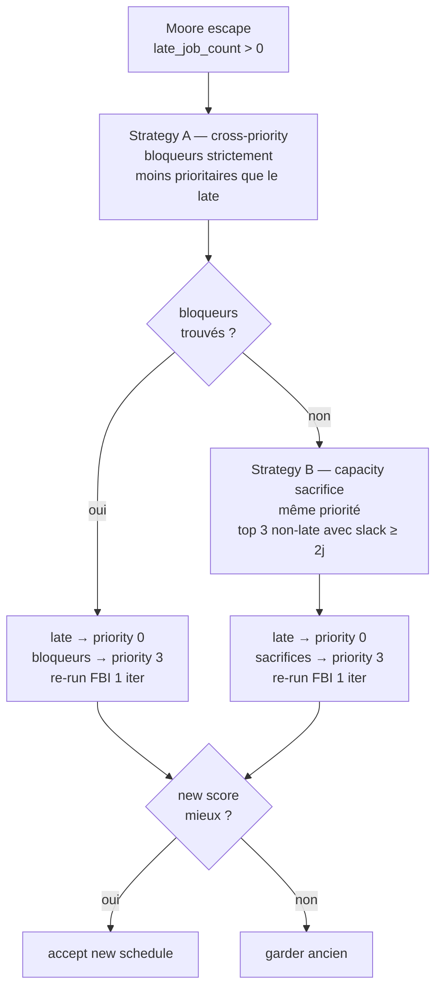

### 15.1 Stratégie A — cross-priority

Supposons Job A priority 1 et Job B priority 2. Job B est **late**. Moore cherche des bloqueurs strictement moins prioritaires que B sur ses stations. Ici, Job A est *plus* prioritaire (priority 1 < 2), donc **pas un bloqueur**. Strategy A ne trouve rien.

### 15.2 Stratégie B — capacity sacrifice

Fallback : même priorité partout.
```
my_stations = stations utilisées par le job late
job_capacity = somme des ART des autres (non-late) jobs sur my_stations
filtrage : seuls les candidats avec slack perso ≥ 2 jours sont admis
tri : capacité desc
top 3 → sacrifice_candidates
```

Les sacrifices sont rétrogradés à `priority = 3` (flexible), le job late est promu à `priority = 0` (impératif). On relance FBI (1 itération, ordering TierFirst). On compare le nouveau triplet `(late_jobs, weighted_lateness, makespan)` à l'ancien **dans cet ordre** (on regarde d'abord `late_jobs` ; en cas d'égalité on regarde `weighted_lateness` ; en cas d'égalité encore, `makespan`). Si le nouveau est strictement meilleur, on garde.

### 15.3 Micro-exemple Strategy B

```
Avant :
  Job A  priority=1  stations={S0}  art=10  → non-late (deadline large)
  Job B  priority=1  stations={S0}  art=10  → late (deadline serrée)

Stratégies A : bloqueurs strictement moins prioritaires que B → aucun (même priority). Fail.

Stratégies B :
  my_stations (B) = {S0}
  non-late sur S0 : A (capacity=10, ART), slack = (deadline_A - end_A) en ticks, check ≥ 2 jours.
  Supposons OK.
  sacrifice_candidates = [A]  (top 3, un seul ici)
  modified_jobs :
    A.priority = 3 (flexible)
    B.priority = 0 (impératif)
  run_with_fbi_ordering(modified, ... TierFirst ...) → backward prend B avant A (tier 0 first).
  Si new score ≤ old → accept.
```

---

## 16. LNS — la recherche à large voisinage

> **Analogie métier** : Moore a échoué à zéro-er les retards. LNS, c'est l'équivalent d'un *responsable planning qui essaie 30 scénarios alternatifs à la suite* : « et si on remettait ces 5 jobs en premier et ceux-là en dernier ? ». À chaque essai, il recalcule le planning entier et garde le meilleur. Il s'arrête au bout de 60 secondes ou quand le user relance un calcul. Contrairement à Moore, il ne cherche pas une négociation ciblée : il brasse **beaucoup** de configurations aléatoires pour voir si une meilleure émerge par hasard (d'où « *Large Neighborhood Search* »).

Lancé après Moore si `late_job_count > 0 AND !skip_lns AND elapsed < 55_000 ms AND jobs.len() > 1`.

Vue en diagramme : boucle destroy / destabilize / repair / accept avec annulation par token global.

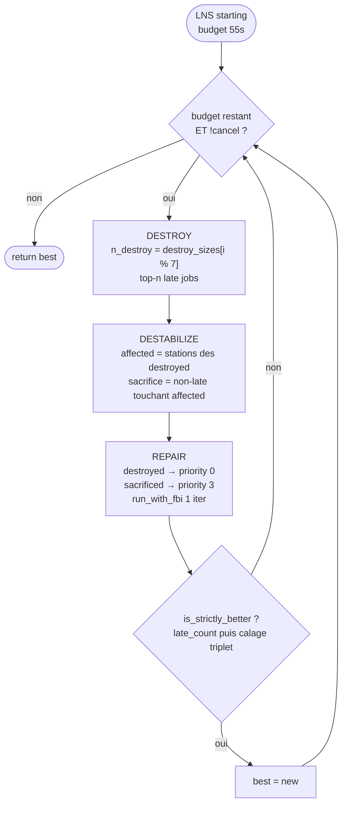

### 16.1 Une itération

```
destroy_sizes = [5, 10, 15, 20, 8, 12, 25]   (cycle)
iter in 0.. tant que budget restant :
  n_destroy = destroy_sizes[iter % 7]  (borné par #late)
  destroyed = top-n_destroy late jobs par lateness desc
  affected_stations = union(stations[destroyed])
  sacrifice_candidates = non-late jobs qui touchent affected_stations
  n_sacrifice = random dans [15, 30]  (borné par #candidates)
  sacrificed = Fisher-Yates partiel sur candidates
  modified_jobs : destroyed → priority 0, sacrificed → priority 3
  (new_a, new_act, new_s, _) = run_with_fbi_ordering(modified, ..., 1 itération, TierFirst)
  si is_strictly_better(new_s, best) → accept
```

Chaque itération est une **évaluation exacte** (forward pass complet), pas un voisinage approximatif.

### 16.2 `is_strictly_better`

```
primaire : late_job_count. Strictement plus petit → accept. Strictement plus grand → reject.

secondaire (primaire égal) : triplet (calage_bonus_sum, calage_bonus_mean, calage_bonus_median).
  Si au moins un est strictement plus grand ET aucun strictement plus petit → accept.
```

Intuition : à nombre de lates égal, on préfère le schedule avec **plus de continuité de job par station**.

### 16.3 Exemple court

```
État courant : 5 lates. best_stats = { late=5, calage_sum=300 }.
iter 0 : n_destroy=5. Force les 5 lates en priority 0. Sacrifice 20 non-late à priority 3. Re-run.
         new_s : { late=3, calage_sum=250 }.
         3 < 5 → accept. best = new.
iter 1 : n_destroy=10 mais seulement 3 lates. Donc 3. Etc.
```

### 16.4 Annulation via token global

Chaque itération :
```
if cancel.load(Ordering::Relaxed) { break; }
```

Permet à une requête LNS entrante d'interrompre proprement la précédente. Le best trouvé est retourné intact.

---

## 17. Similarity bonus (§§13 du doc court)

Décomposons sur un exemple Offset :

```
Rules (station Offset R1..R4) :
  R1 : [inking]                         points=4   group=None
  R2 : [paper_type, paper_format]       points=3   group="paper"
  R3 : [paper_format]                   points=2   group="paper"
  R4 : [paper_format]  FormatDescending points=1   group="paper"

Criteria :
  paper_type, paper_format, inking
```

Supposons précédente task sur S_offset : `{ papier: "Couché mat:135", format: "A3", impression: "CMYK" }`.
Candidate : `{ papier: "Couché mat:135", format: "A4", impression: "CMYK" }`.

- `paper_type` : "Couché mat" == "Couché mat" → MATCHED.
- `paper_format` : "A3" != "A4" → UNMATCHED.
- `inking` : "CMYK" == "CMYK" → MATCHED.

Fire rules :
- R1 (AllMatch `inking`) → MATCHED → fire. points=4.
- R2 (AllMatch `paper_type, paper_format`) : `paper_format` UNMATCHED → don't fire.
- R3 (AllMatch `paper_format`) : UNMATCHED → don't fire.
- R4 (FormatDescending) : `long_side("A3")=420, long_side("A4")=297`. 420 > 297 → fire. points=1.

Group resolution :
- Non-groupées : R1 (4). sum=4.
- Groupe "paper" : {R4: 1}. best = 1.

Total = 4 + 1 = **5**.

`compatibility_bonus = 5 * BONUS_SCALE (10) = 50`.

---

## 18. Les garde-fous

- **Forward pass deadline** : 30 s. Si dépassé, on sort avec les placements faits jusque-là (late jobs possibles).
- **Outer tick cap** : `max_outer_t = 100_000` ticks (= ~1041 jours à `tick_minutes=15` ou ~4167 jours à `tick_minutes=60`). Filet de sécurité très généreux contre runaway — en pratique on sort bien avant via le `forward_pass_deadline` (30 s) ou `total_art <= 0`.
- **Horizon dynamique** : `grid.grow(7 jours)` quand t approche `num_ticks`. `operator_availability.extend(7 jours)` en parallèle.
- **`MAX_PEREMPTION_RETRIES = 3`** : cap sur les re-calages forcés par péremption.
- **Shift-end guard** : une nouvelle action ne démarre pas avec un opérateur qui part à la fin du tick (dispo au tick t mais pas t+1).
- **Chunk-mini + relaxation B** : setup_floor jamais relâché ; task_floor relâché quand slack < 0.
- **Tier-preempt** : une candidate plus prioritaire et déjà en retard peut traverser des cellules occupées par une task moins prioritaire dans `available_work_window` (le scoring filter).

---

## 19. Les logs qu'on peut attendre

Pour notre scénario fil-rouge, les logs stderr (stderrs ou trace) diraient quelque chose comme :

```
[MULTI-START] pass 0 (baseline TierFirst): late_jobs=0 w_late=0 lateness=0 makespan=840
[MULTI-START] best: late_jobs=0 w_late=0 lateness=0 makespan=840 (total 1 FBI iterations)
[ASSIGN] task=T1-A station=presse masked=false ops=[alice@1]
[ASSIGN] task=T3-B station=presse masked=false ops=[alice@1]
[ASSIGN] task=T2-A station=plieuse masked=false ops=[alice@1]
```

Avec un `late_job_count > 0`, on verrait en plus :

```
[MOORE-B] attempt 1: boost job-B demote [job-A] → late_jobs=0 (was 1)
[LNS] starting: 1 late jobs, 2 total jobs, budget 55000ms
[LNS] iter 0: destroy=1 sacrifice=15 → 0 late (best=1) calage(sum 300, mean 60.0, med 50.0)
[LNS] improved: 1 → 0 late jobs (1 iterations, 1240ms)
```

---

## 20. Récap minute par minute

Résumé exécutif de notre scénario fil-rouge, pour vérification croisée :

```
08:00 (t=8)   T1-A démarre sur Presse avec Alice (scoring: 2149 > 1933)
              T3-B perd le tie → StationOccupied, stall silencieux
09:00 (t=9)   T1-A continue, VR réserve S0[10]
              T3-B encore StationOccupied
10:00 (t=10)  T1-A finit → end=10. Assignment émise.
              Cellule S0[10] stale (reservation) → T3-B filter échoue.
              Tick "perdu" sans placement.
11:00 (t=11)  T3-B éligible (S0[11] libre). Score 2194 > T2-A 1837.
              T3-B démarre avec Alice. T2-A veut Plieuse mais Alice busy → Stall.
12:00 (t=12)  T3-B continue (VR réserve S0[13]). T2-A stall encore.
13:00 (t=13)  T3-B finit → end=13. T2-A éligible (pred T1-A end=10, +gap 1 = 11 ≤ 13).
              T2-A démarre sur Plieuse avec Alice.
14:00 (t=14)  T2-A finit → end=14. total_art=0 → break.

Makespan : 14 - 0 (minuit) = 14h = 840 min.
Aucun late. FBI converge immédiatement.
```

---

## Glossaire

**Action** — objet interne du moteur représentant une task, avec des colonnes de progression qui évoluent au cours du calcul (`art`, `eat`, `start_tick`, `end_tick`, opérateurs affectés, accumulateur de travail, etc.). Créée par `build_actions`, modifiée tout au long du forward pass.

**ALAP** (*As Late As Possible*) — stratégie de placement qui part de la deadline et recule vers le présent. Base du backward pass.

**ART** (*Action Remaining Time*) — ticks de travail encore à produire pour compléter une action. Démarre à `setup_ticks + run_ticks`, décrémente au forward quand `work_accumulator` franchit 1.0.

**Attention** — fraction du temps de l'opérateur consacrée à une station (1.0 solo, 0.5 si pair masqué). Utilisée pour l'affichage ; la grille a un compteur séparé `operator_attention` (legacy) qui additionne les fractions.

**Backward pass / passe arrière** — phase qui calcule les LAST en plaçant les actions à rebours depuis leur deadline, en accumulant l'occupation opérateur sur une grille dédiée.

**Calage** — terme domaine : préparation mécanique d'une machine (pose des plaques, calibrage). Le `setup_ticks` d'une action correspond à son calage initial.

**Calage bonus** — bonus de score +100 au forward quand la candidate partage le même job que la dernière action terminée sur la station. Encourage la continuité de job par station.

**Chain_remaining_art** — somme des ART de la task courante + toutes ses successeurs. Utilisée pour la composante *chain_pressure* du score.

**Chunk** — fragment d'une action dont la durée totale dépasse `max_chunk_minutes`. Premier chunk garde `task_id` original ; chunks 2+ ont setup 0 et `_chunk_N` dans le task_id.

**Chunk-mini** — politique qui interdit de démarrer un chunk dans une fenêtre plus courte que `max(k × setup, p × task_total)`. `k` et `p` sont paramétrables par station.

**Compatibility bonus** — score ajouté quand la candidate et le prédécesseur sur la station (d'un job différent) ont des specs compatibles selon les règles de la station (papier, format, impression).

**Concurrent group** — paire de stations qu'un opérateur peut tenir en parallèle, avec une productivité dédiée par station du duo. Fondement du modèle de temps masqué.

**Contention bonus** — score proportionnel au nombre d'actions en attente sur la station de la candidate.

**Deadline priority / tier** — échelle 0..3 : 0=impératif, 1=important, 2=standard, 3=flexible. Tier weights `[4.0, 2.0, 1.0, 0.5]`.

**EAT** (*Elapsed Action Time*) — ticks écoulés depuis `start_tick` (incrémenté d'un à chaque tick productif ou stall). Distincte de la réduction d'ART qui n'intervient que lorsque `work_accumulator` franchit 1.0.

**EDD** (*Earliest Due Date*) — règle de tri par deadline ascendante. `BackwardOrdering::EarliestDeadline` l'applique globalement ; `TierFirst` l'applique intra-tier.

**Effective deadline** — deadline resserrée par le backward pass en tenant compte des successeurs : `min(own_deadline, succ.last_tick - gap)`.

**FBI** (*Feedback-Based Iteration*) — boucle backward/pre_split/forward qui se répète en boostant à chaque fois les priorités des jobs qui ressortent en retard.

**Forward pass / passe avant** — phase qui place effectivement les actions sur la grille tick par tick.

**Grid / grille** — structure 2D (`ScheduleGrid`) mémorisant pour chaque station et chaque opérateur l'occupation par tick.

**Horizon** — nombre de ticks raisonnés. Initial = `horizon_days × 24 × 60 / tick_minutes` ; grossit par `grow(7 jours)` au besoin.

**LAST** — tick au plus tard auquel une action doit démarrer pour que le plan ALAP soit faisable. Calculé par le backward.

**LNS** (*Large Neighborhood Search*) — méthode empirique qui améliore un plan existant en essayant de nombreuses alternatives : on « casse » une partie du plan (destroy), on déstabilise des voisinages (destabilize), on recalcule (repair), et on garde si c'est strictement mieux (accept).

**Magnétisme** — propriété qui fait préférer, pour un nouveau tick, l'opérateur déjà en place sur l'action au tick précédent, plutôt qu'un opérateur inactif ou plus compétent. Évite les clignotements. *Analogie* : au restaurant, on préfère garder le même serveur tout au long du service plutôt que de changer de serveur entre deux plats — même si le second serveur est « théoriquement » plus rapide.

**BackwardAction** — structure interne du backward pass, jumelle d'une `Action` mais avec des liens vers les **successeurs** au lieu des **prédécesseurs**. Sépare l'état du backward (qui remonte) de l'état du forward (qui avance).

**Boost (FBI mid-iter)** — on « remonte » d'un cran la priorité d'un job qui est sorti en retard à l'itération précédente (impératif au lieu d'important, etc.). On ne peut pas descendre en dessous de 0 (impératif). Sert *uniquement* au backward de l'itération suivante pour lui calculer un LAST plus serré. La vraie priorité affichée au client ne change pas.

**is_strictly_better (LNS)** — prédicat d'acceptation d'une itération LNS. Compare primairement `late_job_count` (plus petit = mieux) ; en cas d'égalité, compare le triplet `(calage_bonus_sum, mean, median)` (au moins un strictement plus grand, aucun strictement plus petit). En clair : on ne recule jamais sur les retards et on préfère un schedule plus « continu par job » à nombre de retards égal.

**saturating_sub** — « soustraction bornée » : on enlève 1 sans jamais descendre en dessous de 0. Utilisée pour le *boost* : demander « baisse d'un cran » sur un job déjà impératif (tier 0) le laisse à 0 au lieu de passer à -1.

**VR** (*virtual reservation*) — projection anticipée, avant le scoring, des cellules futures que les actions actives vont vouloir. Voir **Réservation virtuelle**.

**Makespan** — durée totale du plan (en minutes), entre l'origine (minuit du start_date) et le dernier `end_tick`.

**Masked time / temps masqué** — modèle où un opérateur tient deux stations en parallèle avec une productivité réduite spécifique par station.

**Moore escape** — post-FBI, stratégie ad-hoc qui renégocie les priorités (A : cross-priority, B : same-priority capacity sacrifice) et relance FBI.

**now_tick** — tick courant (`ceil(now / tick_minutes)`). Borne inférieure du forward pass pour ne pas placer dans le passé.

**Occupied slot** — slot `(station, operators, start, end)` issu d'assignations existantes qu'on veut préserver lors d'un recompute incrémental.

**Operator availability** — tableau `data[op][tick]` résolvant base schedule (ISO-week, défaut M-F 8-17) puis superposant les absences.

**Peremption / péremption** — expiration du calage après un nombre consécutif de ticks d'inactivité (`peremption_ticks`). Déclenche soit un rewind mi-setup, soit un re-calage post-setup (`pending_recalage` → `current_recalage_start` → `recalage_segments`).

**Pin / épinglage** — flag utilisateur `is_pinned + pinned_start_tick` qui bloque l'action à un tick précis ; pré-placée par `pre_place_pinned_actions` avant la boucle principale.

**Precedence / précédence** — contrainte temporelle entre tasks. Trois niveaux : intra-element (`sequence_order`), cross-element (`prerequisite_element_ids`), cross-job (`required_job_ids`).

**Productivity** — taux de progression par tick. Solo : proficiency de l'opérateur sur la station. Paire : valeur du `PreparedConcurrentGroup` par station du pair.

**Proficiency** — maîtrise d'un opérateur sur une station (0.0 à > 1.0).

**Proximity bonus** — bonus de score déclenché quand le job entre dans sa dernière journée avant deadline. Calibré (45 × tier_w) pour rester sous `job_boost` de 1 tick après zéro slack.

**Recalage** — fenêtre `(start, end)` pendant laquelle un opérateur a dû re-caler après une péremption post-setup. Remontée dans `ComputedAssignment.recalages`.

**Réservation virtuelle** — projection en avant, avant le scoring, des cellules que les actions déjà en cours vont vouloir. Empêche qu'une nouvelle candidate se glisse dans la trajectoire d'une active. Non nettoyée à la fin d'action → génère parfois un tick "perdu".

**Score weights** — sept coefficients multiplicatifs qui pondèrent les 7 composantes du score forward. Par défaut tous à 1.0 (poids identiques) ; les passes perturbées du multi-start les tirent aléatoirement dans `[0.5, 1.5]` pour diversifier les plans.

**SlackFirst** — ordering backward où l'intra-tier sort par `effective_deadline − remaining_chain_work` ascendant (critical path first).

**Similarity rule** — règle de scoring par station sur paires spec `(prev, curr)`, type `AllMatch` ou `FormatDescending`, groupée ou non. Évaluée par `compute_similarity_score`.

**Stalled** — outcome d'`assign_action_at_tick` quand l'action ne trouve pas d'opérateur mais que la station est libre : on marque la station comme tenue par l'action (réservation) sans produire de travail ; `idle_ticks++`.

**StationOccupied** — outcome d'`assign_action_at_tick` quand la cellule station est déjà prise par un **autre** idx d'action. L'action ne démarre pas, retry au prochain tick.

**SkipTo** — outcome d'`assign_action_at_tick` quand aucun opérateur qualifié n'est dispo pour la station sur un horizon proche ; la boucle externe peut sauter tout droit à `new_t`. `earliest_retry[i] = new_t`.

**Tier-preempt** — relaxation qui permet à une candidate plus prioritaire et déjà en retard de « traverser » une cellule occupée par une task moins prioritaire lors du scan de `available_work_window`.

**TierFirst** — ordering backward tier-par-tier (0 → 3), intra-tier sort EDD.

**Tick** — unité atomique de temps. Tous les calculs de positionnement utilisent des ticks (des nombres entiers). Les conversions vers minutes n'interviennent qu'à la construction et à l'émission des `ComputedAssignment`.

**TIER_WEIGHT** — `[4.0, 2.0, 1.0, 0.5]`. Facteur multiplicatif appliqué à `weighted_urgency` et `job_boost` selon le tier de l'action.

**Weighted urgency** — composante principale du score forward pass : `raw_urgency × tier_weight`. `raw_urgency` est une fonction affine du slack, saturée à `10000 + |slack|` quand slack ≤ 0.

**Work accumulator** — un nombre à virgule qui cumule la productivité tick par tick. Chaque fois qu'il franchit 1.0, on enlève **un** tick de travail à l'action (`art` diminue d'autant) et on garde la fraction restante pour le tick suivant. C'est ce qui permet aux productivités non entières (0.85, 0.90 en temps masqué) de « s'accumuler » proprement jusqu'à former un tick complet de travail.
