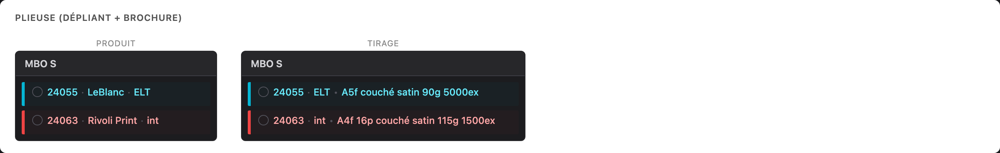
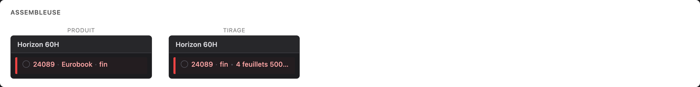
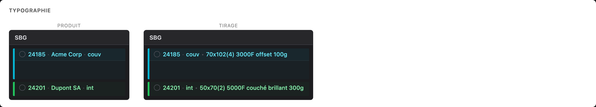
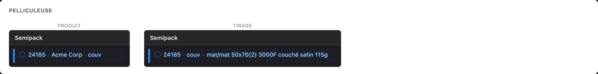

# Spécification : Contenu des tuiles par catégorie de stations

**Statut :** Brouillon
**Date :** 2026-02-23

---

## 1. Problématique

Actuellement, toutes les tuiles de la grille de planification affichent le même contenu, indépendamment du catégorie de stations auquel elles appartiennent :

```
[IcôneComplétion] {job.reference} · {job.client} · {element.name}
```

C'est insuffisant pour les opérateurs : l'information pertinente pour les décisions de planification varie considérablement d'un catégorie de stations à l'autre. Un opérateur de presse offset a besoin de voir le type de papier et l'impression, tandis qu'un opérateur de plieuse a besoin du format et de la pagination.

---

## 2. Objectif

Introduire deux **modes d'affichage** pour les tuiles — **Produit** et **Tirage** — basculables via raccourci clavier, permettant aux opérateurs de passer instantanément entre l'identification du job et les informations contextuelles de production.

---

## 3. Modes d'affichage

### 3.1 Mode Produit (par défaut)

Le comportement actuel. Toutes les tuiles affichent :

```
[IcôneComplétion] {reference} · {client} · {element.name}
```

Exemple : `○ 24185 · Acme Corp · couv`

Ce mode répond à la question : **"De quel job s'agit-il ?"**

### 3.2 Mode Tirage (nouveau)

Les tuiles affichent l'identifiant du job, le nom de l'élément, puis les **informations de production spécifiques au catégorie de stations** sur une seule ligne :

```
[IcôneComplétion] {reference} · {element.name} • {contenu spécifique à la catégorie}
```

Exemple : `○ 24185 · couv • Couché Satin 115g 64x90 Q/Q 5000ex`

Le `·` sépare l'identifiant du job du nom de l'élément. Le `•` sépare l'identification des informations de production.

Ce mode répond à la question : **"Quelles sont les caractéristiques de production de cette tâche ?"**

Le contenu spécifique à la catégorie varie selon le catégorie de stations (voir section 4).

### 3.3 Comportement de bascule

| Propriété | Valeur |
|-----------|--------|
| **Mode par défaut** | Produit |
| **Raccourci clavier** | `A` (pour "Affichage") |
| **Condition** | Ne se déclenche que si aucun champ input/textarea n'a le focus |
| **Persistance** | Session uniquement (retour à Produit au rechargement de la page) |
| **Indicateur visuel** | Petit label texte dans la zone d'en-tête montrant le mode courant (ex. `Affichage: Produit` ou `Affichage: Tirage`) |
| **Transition** | Bascule instantanée, pas d'animation nécessaire |

### 3.4 Aperçu visuel

> Voir le fichier compagnon : [`tile-preview.html`](tile-preview.html) pour l'aperçu interactif.

**Presse Offset — Produit vs Tirage :**


**Massicot — Produit vs Tirage :**


**Plieuse — Produit vs Tirage (dépliant + brochure) :**



**Encarteuse-Piqueuse — Produit vs Tirage :**


**Assembleuse-Piqueuse — Produit vs Tirage :**


**Assembleuse — Produit vs Tirage :**



**Typographie — Produit vs Tirage :**



**Pelliculeuse — Produit vs Tirage :**



---

## 4. Contenu du mode Tirage par catégorie de stations

En mode Tirage, chaque tuile affiche : `{reference} · {element.name} • {contenu spécifique à la catégorie}`

La partie spécifique à la catégorie est définie ci-dessous pour chaque catégorie.

### 4.1 Presse Offset (`cat-offset`)

```
{papier} {grammage} {formatFeuille} {impression} {quantite}ex
```

**Exemple complet :** `24185 · couv • Couché Satin 115g 64x90 Q/Q 5000ex`

| Champ | Source | Notes |
|-------|--------|-------|
| `papier` | `element.spec.papier` (partie type) | Nom du type de papier (ex. "Couché Satin", "Offset") |
| `grammage` | `element.spec.papier` (partie poids) | Extrait du DSL papier (ex. "115g") |
| `formatFeuille` | `element.spec.imposition` (partie dimensions) | Format de feuille (ex. "64x90") |
| `impression` | `element.spec.impression` | Spécification recto/verso (ex. "Q/Q") |
| `quantite` | `element.spec.quantite` | Nombre total d'exemplaires (ex. "5000") |

---

### 4.2 Massicot (`cat-cutting`)

```
{formatFini} {quantite}ex
```

**Exemple complet :** `24185 · couv • A6 5000ex`

| Champ | Source | Notes |
|-------|--------|-------|
| `formatFini` | `element.spec.format` | Format du produit fini |
| `quantite` | `element.spec.quantite` | Nombre total d'exemplaires |

---

### 4.3 Plieuse (`cat-folding`)

Le contenu dépend de la nature du job : **brochure** ou **dépliant** (voir logique de détection en section 5.1).

**Dépliant :**
```
{formatFini} {papier} {grammage} {quantite}ex
```

**Exemple complet :** `24055 · ELT • A5f couché satin 90g 5000ex`

**Brochure :**
```
{formatFini} {pagination}p {papier} {grammage} {quantite}ex
```

**Exemples complets :**
- `24063 · int • A4f 16p couché satin 115g 1500ex`
- `24071 · int • 240x320/240x160 16p offset 100g 5000ex`
- `24088 · int • A5f 32p couché satin 3000ex`

| Champ | Source | Notes |
|-------|--------|-------|
| `formatFini` | `element.spec.format` | Format du produit fini |
| `pagination` | `element.spec.pagination` | Nombre de pages (brochure uniquement) |
| `papier` | `element.spec.papier` (partie type) | Type de papier |
| `grammage` | `element.spec.papier` (partie poids) | Grammage |
| `quantite` | `element.spec.quantite` | Nombre total d'exemplaires |

---

### 4.4 Encarteuse-Piqueuse (`cat-booklet`)

```
{formatFini} {résumeCahiers}
```

**Exemples complets :**
- `24185 · fin • A4f 2x16p + couv`
- `24201 · fin • 240x320/240x160 16p`
- `24112 · fin • 240x320/240x160 3x16p + 8p + 4p + couv`
- `24310 · fin • A5f 2x16p + couv`

C'est le format le plus complexe. Il résume les **cahiers** (signatures) des éléments du job.

| Champ | Source | Notes |
|-------|--------|-------|
| `formatFini` | `element.spec.format` (depuis l'élément de couverture, ou le premier élément) | Format du produit |
| `résumeCahiers` | Calculé à partir des éléments du job | Voir section 5.2 |

---

### 4.5 Assembleuse-Piqueuse (`cat-saddle-stitch`)

```
{formatFini} {paginationTotale}p [+ couv]
```

**Exemples complets :**
- `24201 · fin • A4f 48p + couv`
- `24033 · fin • A5f 20p + couv`
- `24088 · fin • A5f 32p`

| Champ | Source | Notes |
|-------|--------|-------|
| `formatFini` | `element.spec.format` | Format du produit |
| `paginationTotale` | Somme de `pagination` sur tous les éléments intérieurs | Nombre total de pages |
| `+ couv` | Ajouté si un élément de couverture existe | |

---

### 4.6 Assembleuse (`cat-assembly`)

```
{nbFeuillets} feuillets {quantite}ex
```

**Exemple complet :** `24089 · fin • 4 feuillets 5000ex`

| Champ | Source | Notes |
|-------|--------|-------|
| `nbFeuillets` | `element.spec.pagination / 4` | **Calculé** : nombre de pages divisé par 4 |
| `quantite` | `element.spec.quantite` | Nombre total d'exemplaires |

---

### 4.7 Typographie (`cat-typo`)

```
{imposition} {qteFeuilles}F {papier} {grammage}
```

**Exemples complets :**
- `24185 · couv • 70x102(4) 3000F offset 100g`
- `24201 · int • 50x70(2) 5000F couché brillant 300g`

| Champ | Source | Notes |
|-------|--------|-------|
| `imposition` | `element.spec.imposition` | Format de feuille avec poses (ex. "70x102(4)") |
| `qteFeuilles` | `element.spec.qteFeuilles` | Nombre de feuilles |
| `papier` | `element.spec.papier` (partie type) | Type de papier |
| `grammage` | `element.spec.papier` (partie poids) | Grammage |

---

### 4.8 Pelliculeuse (`cat-pelliculeuse`)

```
{surfacage} {imposition} {qteFeuilles}F {papier} {grammage}
```

**Exemple complet :** `24185 · couv • mat/mat 50x70(2) 3000F couché satin 115g`

| Champ | Source | Notes |
|-------|--------|-------|
| `surfacage` | `element.spec.surfacage` | Pelliculage recto/verso (ex. "mat/mat", "brillant/") |
| `imposition` | `element.spec.imposition` | Format de feuille avec poses |
| `qteFeuilles` | `element.spec.qteFeuilles` | Nombre de feuilles |
| `papier` | `element.spec.papier` (partie type) | Type de papier |
| `grammage` | `element.spec.papier` (partie poids) | Grammage |

---

### 4.9 Autres catégories (inchangées)

**Conditionnement** (`cat-packaging`) et toute future catégorie : en mode Tirage, affichage Produit par défaut (`reference · client · element.name`).

---

## 5. Logique métier

### 5.1 Détection brochure vs. dépliant (pour Plieuse)

Une tâche de pliage appartient à un **dépliant** lorsque :
- Le job est **mono-élément**, OU
- Le flux de l'élément se compose uniquement de **presse + pliage** (pas de tâches d'assemblage en aval)

Une tâche de pliage appartient à une **brochure** lorsque :
- Le job est **multi-éléments**, ET
- D'autres éléments du job ont des tâches sur des stations d'assemblage (encarteuse-piqueuse ou assembleuse-piqueuse)

**Approche d'implémentation :** Examiner les éléments frères dans le même job. Si un élément frère a des tâches assignées aux stations `cat-booklet` ou `cat-saddle-stitch`, l'élément de pliage fait partie d'une brochure.

### 5.2 Calcul du résumé des cahiers (pour Encarteuse-Piqueuse)

Pour un job multi-éléments passant par l'encarteuse-piqueuse :

1. Identifier l'**élément de couverture** (élément dont le label contient "couv", ou l'élément dont les `prerequisiteElementIds` référencent tous les autres, ou l'élément dont les tâches n'incluent pas d'étape presse — à affiner)
2. Collecter tous les **éléments intérieurs** avec leur `spec.pagination`
3. Grouper les paginations identiques consécutives : `[16, 16, 16, 8, 4]` -> `3x16p + 8p + 4p`
4. Si la couverture existe, ajouter `+ couv`

### 5.3 Parsing du DSL papier

Le champ `element.spec.papier` utilise un format DSL : `{type}:{grammage}` (ex. `"Couché mat:135"`).

- **Extraction du type :** tout ce qui précède les deux-points
- **Extraction du grammage :** nombre après les deux-points, affiché comme `{valeur}g`
- S'il n'y a pas de deux-points, la chaîne entière est le type et le grammage peut provenir de `job.paperWeight`

### 5.4 Source de la quantité

La quantité (`quantite` / `ex`) provient du formulaire de création de job (JCF) et est stockée dans `element.spec.quantite`.

### 5.5 Calcul des feuillets (pour Assembleuse)

```
feuillets = Math.ceil(pagination / 4)
```

Où `pagination` provient de `element.spec.pagination`. Un feuillet est une feuille pliée une fois, produisant 4 pages.

---

## 6. Amélioration de l'infobulle

### 6.1 État actuel

Seules les tuiles bloquées affichent une infobulle (après 2s de survol) montrant les informations de blocage par prérequis.

### 6.2 Infobulle proposée

**Toutes les tuiles** bénéficient d'une infobulle enrichie au survol (délai raccourci, ex. 500ms) affichant des informations complètes quel que soit le mode d'affichage courant. L'infobulle montre toujours **les deux** informations Produit et Tirage :

| Section | Contenu |
|---------|---------|
| **En-tête** | `{job.reference} — {job.client}` |
| **Description** | `{job.description}` |
| **Échéance** | `Sortie atelier: {workshopExitDate}` |
| **Élément** | `{element.label ?? element.name}` |
| **Spécifications** | Tous les champs `ElementSpec` non nuls (format, papier, pagination, imposition, impression, surfacage, quantite, qteFeuilles) |
| **Prérequis** | Statut Papier / BAT / Plaques / Forme (si pas tous "none") |
| **Tâche** | Calage : {setupMinutes}min / Roulage : {runMinutes}min |
| **Planification** | `{scheduledStart} -> {scheduledEnd}` |

L'infobulle est un composant React personnalisé (pas le `title` natif du navigateur), stylisé de manière cohérente avec le thème sombre de l'application, et positionné pour éviter les débordements.

**L'infobulle des tuiles bloquées** devrait être fusionnée dans cette infobulle enrichie (affichant les avertissements de prérequis avec un style approprié).

---

## 7. Largeur des colonnes par catégorie de stations

### 7.1 État actuel

Toutes les colonnes de stations ont la même largeur : **240px** (normal) / **120px** (réduit).

### 7.2 Changement proposé

La largeur des colonnes est **fixe par catégorie de stations**, indépendante du mode d'affichage. Elle ne change pas lors de la bascule Produit/Tirage — seul le contenu des tuiles change.

Chaque catégorie se voit attribuer la largeur nécessaire pour accommoder le contenu le plus long entre les deux modes :

| Catégorie | Largeur | Justification |
|--------|---------|---------------|
| `cat-offset` | 340px | Tirage long (papier + grammage + format + impression + qté) |
| `cat-pelliculeuse` | 400px | Tirage le plus long (surfacage + imposition + feuilles + papier + grammage) |
| `cat-typo` | 340px | Tirage moyen-long (imposition + feuilles + papier + grammage) |
| `cat-booklet` | 400px | Le résumé des cahiers peut être long |
| `cat-saddle-stitch` | 280px | Tirage moyen |
| `cat-cutting` | 240px | Tirage court, Produit ~240px |
| `cat-folding` | 340px | Tirage moyen-long (variante brochure : pagination + papier) |
| `cat-assembly` | 240px | Tirage court, Produit ~240px |
| `cat-packaging` | 240px | Inchangé (repli sur mode Produit en Tirage) |

**Implémentation :** Ajouter une table de correspondance `columnWidth` par `categoryId`, utilisée par `StationColumn` à la place de la classe `w-60` codée en dur.

---

## 8. Analyse de disponibilité des données

### 8.1 Champs déjà disponibles

| Champ | Source | Disponible aujourd'hui ? |
|-------|--------|--------------------------|
| `job.reference` | `Job.reference` | Oui |
| `job.client` | `Job.client` | Oui |
| `element.spec.format` | `ElementSpec.format` | Oui (si renseigné) |
| `element.spec.papier` | `ElementSpec.papier` | Oui (si renseigné) |
| `element.spec.pagination` | `ElementSpec.pagination` | Oui (si renseigné) |
| `element.spec.imposition` | `ElementSpec.imposition` | Oui (si renseigné) |
| `element.spec.impression` | `ElementSpec.impression` | Oui (si renseigné) |
| `element.spec.surfacage` | `ElementSpec.surfacage` | Oui (si renseigné) |
| `element.spec.quantite` | `ElementSpec.quantite` | Oui (si renseigné) |
| `element.spec.qteFeuilles` | `ElementSpec.qteFeuilles` | Oui (si renseigné) |

### 8.2 Lacunes de données

1. **Détection de l'élément de couverture :** Pas de flag explicite pour identifier un élément de couverture. Doit être déduit du `element.name`/`element.label` (contient "couv") ou de la structure de l'élément.
2. **ID du catégorie de stations au niveau de la tuile :** Actuellement non transmis au composant `Tile`. Le `station.categoryId` doit être acheminé depuis `SchedulingGrid` -> `StationColumn` -> `Tile`.

### 8.3 Remplissage de l'ElementSpec

Cette fonctionnalité n'est utile que si les champs `ElementSpec` sont remplis lors de la création du job (JCF). Le JCF capture déjà ces champs — vérifier qu'ils sont systématiquement sauvegardés et chargés.

---

## 9. Approche d'implémentation

### 9.1 Vue d'ensemble de l'architecture

```
App (état displayMode + écouteur keydown)
  └── SchedulingGrid (reçoit displayMode)
        └── StationColumn (reçoit station.categoryId -> largeur, + displayMode pour les tuiles)
              └── Tile (reçoit categoryId + displayMode + element)
                    ├── Mode Produit : {reference} · {client} · {element.name} (inchangé)
                    ├── Mode Tirage : {reference} · {element.name} • {spécifique catégorie} (NOUVEAU)
                    └── TileTooltip (infobulle enrichie, toujours complète — NOUVEAU/AMÉLIORÉ)
```

### 9.2 Nouveaux composants / utilitaires

| Composant/Utilitaire | Rôle |
|----------------------|------|
| `useDisplayMode()` | Hook : gère l'état `'produit' \| 'tirage'` + écouteur keydown pour `A` |
| `tileLabelResolver.ts` | Fonction pure : `(categoryId, job, element, allElements, tasks) -> string` |
| `parsePapierDSL(papier: string)` | Extrait `{ type, grammage }` du DSL papier |
| `computeCahiersSummary(elements)` | Construit le résumé des cahiers pour l'encarteuse-piqueuse |
| `detectBrochureOrLeaflet(job, elements, tasks)` | Retourne `'brochure' \| 'leaflet'` |
| `getColumnWidth(categoryId)` | Retourne la largeur en pixels d'une colonne de station (fixe par catégorie) |
| `TileTooltip` (amélioré) | Composant d'infobulle enrichie pour toutes les tuiles |

### 9.3 Modifications des props

**Composant `Tile` — nouvelles props :**

```typescript
interface TileProps {
  // ... props existantes ...
  /** Mode d'affichage courant */
  displayMode: 'produit' | 'tirage';
  /** ID du catégorie de stations pour le contenu contextuel */
  categoryId: string;
  /** Données de l'élément pour accéder aux spécifications */
  element?: Element;
  /** Tous les éléments du job (pour détection cahiers/brochure) */
  jobElements?: Element[];
  /** Toutes les tâches (pour détection brochure) */
  allTasks?: Task[];
}
```

**`StationColumn` — nouvelles props :**

```typescript
interface StationColumnProps {
  // ... props existantes ...
  /** ID du catégorie de stations (depuis station.categoryId) */
  categoryId?: string;
  /** Mode d'affichage courant (transmis aux tuiles, n'affecte pas la largeur de la colonne) */
  displayMode?: 'produit' | 'tirage';
}
```

### 9.4 Étapes d'implémentation

1. **Créer le hook `useDisplayMode`** — état + écouteur keydown (ignorer quand un input a le focus)
2. **Créer `tileLabelResolver.ts`** — fonction pure avec tests unitaires pour chaque format de catégorie
3. **Créer `parsePapierDSL.ts`** — parser avec tests
4. **Créer `computeCahiersSummary.ts`** — algorithme avec tests
5. **Créer `detectBrochureOrLeaflet.ts`** — logique de détection avec tests
6. **Créer `getColumnWidth.ts`** — table de correspondance largeur par categoryId (fixe, indépendant du mode)
7. **Modifier le composant `Tile`** — rendu conditionnel Produit ou Tirage selon `displayMode`
8. **Modifier `StationColumn`** — accepter `categoryId` pour la largeur fixe, + `displayMode` à transmettre aux tuiles
9. **Modifier `SchedulingGrid`** — transmettre `categoryId`, `displayMode` et les données `element`
10. **Connecter `useDisplayMode`** — dans le composant parent App/page, passer au grid
11. **Ajouter l'indicateur de mode** — petit label texte dans l'en-tête montrant le mode courant
12. **Construire le composant `TileTooltip`** — infobulle enrichie pour toutes les tuiles
13. **Mettre à jour les fixtures** — s'assurer que les champs `ElementSpec` sont remplis dans les données de test

### 9.5 Stratégie de tests

- **Tests unitaires :** `tileLabelResolver`, `parsePapierDSL`, `computeCahiersSummary`, `detectBrochureOrLeaflet`, `getColumnWidth`, `useDisplayMode`
- **Tests de composants :** `Tile` affiche le bon contenu selon le mode et la catégorie
- **Tests d'intégration :** la touche `A` bascule toutes les tuiles simultanément
- **QA visuelle :** vérifier les largeurs de colonnes, la troncature du texte, le positionnement de l'infobulle

---

## 10. Améliorations futures (v1+)

- **Limites de format par machine :** Paramétrer la taille max de feuille par station, recalculer automatiquement `qteFeuilles` quand une tâche change de station (ex. presse 70x100 -> typo 50x70 = feuilles x2)
- **Contenu de tuile configurable par l'utilisateur :** Permettre aux utilisateurs de choisir quels champs afficher par catégorie via les paramètres
- **Mode compact :** Disposition alternative des tuiles pour les vues dézoomées montrant uniquement l'information la plus critique
- **Persistance du mode d'affichage :** Sauvegarder la préférence dans le localStorage ou les paramètres utilisateur
